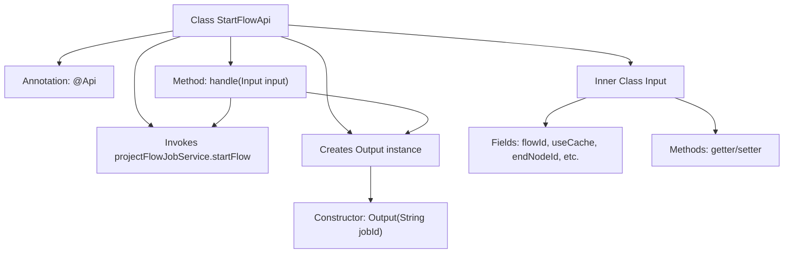

# Basic Information

|      |      |
|------|------|
| Name | StartFlowApi |
| Language | .java |
| Code Path | WeFe/board/board-service/src/main/java/com/welab/wefe/board/service/api/project/flow/StartFlowApi.java |
| Package Name | com.welab.wefe.board.service.api.project.flow |
| Dependencies | ['com.welab.wefe.board.service.service.ProjectFlowJobService', 'com.welab.wefe.common.exception.StatusCodeWithException', 'com.welab.wefe.common.fieldvalidate.annotation.Check', 'com.welab.wefe.common.web.api.base.AbstractApi', 'com.welab.wefe.common.web.api.base.Api', 'com.welab.wefe.common.web.dto.AbstractApiInput', 'com.welab.wefe.common.web.dto.ApiResult', 'org.springframework.beans.factory.annotation.Autowired'] |
| Brief Description | The StartFlowApi is used to initiate a process and create execution tasks. The input includes parameters such as the process ID and cache usage flag, while the output returns the task ID. |

# Description

The StartFlowApi is an API class designed for initiating workflows, creating and executing tasks, inheriting from AbstractApi. It accepts Input parameters, including the workflow ID, whether to use cache, termination node ID, task ID, arbitration member ID, OOT task ID, and remarks. The processing logic initiates the workflow via the projectFlowJobService.startFlow method and returns the task ID. The Output class contains only the task ID field. All input fields are constrained by validation annotations, with some being mandatory or hidden.

# Class Summary

| Name   | Type  | Description |
|-------|------|-------------|
| StartFlowApi | class | The StartFlowApi is used to initiate a process and create execution tasks. The input includes parameters such as the process ID and cache usage, while the output returns the task ID. |


## Class StartFlowApi

|      |      |
|------|------|
| Access Modifier | @Api(path = "flow/start", name = "start flow, create a job and execute it.");public |
| Type | class |
| Name | StartFlowApi |
| Description | The StartFlowApi is used to initiate a process and create execution tasks. The input includes parameters such as the process ID and cache usage, while the output returns the task ID. |


### UML Class Diagram

```mermaid
classDiagram
    class StartFlowApi {
        -ProjectFlowJobService projectFlowJobService
        +handle(Input input) ApiResult~Output~
    }
    
    class AbstractApi~T, R~ {
        <<Abstract>>
    }
    
    class AbstractApiInput {
        <<Abstract>>
    }
    
    class ProjectFlowJobService {
        <<Interface>>
        +startFlow(StartFlowApi$Input input) String
    }
    
    class ApiResult~T~ {
        <<Generic>>
    }
    
    class StatusCodeWithException {
        <<Exception>>
    }
    
    class StartFlowApi$Input {
        -String flowId
        -boolean useCache
        -String endNodeId
        -String jobId
        -String arbiterMemberId
        -String ootJobId
        -String remark
        +getFlowId() String
        +setFlowId(String flowId) void
        +isUseCache() boolean
        +setUseCache(boolean useCache) void
        +getJobId() String
        +setJobId(String jobId) void
        +getEndNodeId() String
        +setEndNodeId(String endNodeId) void
        +getArbiterMemberId() String
        +setArbiterMemberId(String arbiterMemberId) void
        +getOotJobId() String
        +setOotJobId(String ootJobId) void
        +getRemark() String
        +setRemark(String remark) void
    }
    
    class StartFlowApi$Output {
        -String jobId
        +Output(String jobId)
        +getJobId() String
        +setJobId(String jobId) void
    }
    
    StartFlowApi --> AbstractApi : Extends
    StartFlowApi --> ProjectFlowJobService : Depends on
    StartFlowApi ..> StartFlowApi$Input : Uses
    StartFlowApi ..> StartFlowApi$Output : Uses
    StartFlowApi$Input --> AbstractApiInput : Extends
    StartFlowApi --> ApiResult : Returns
    StartFlowApi ..> StatusCodeWithException : Throws
```

This code implements a flow initiation API interface that includes input parameter validation, flow execution, and result return functionalities. The StartFlowApi inherits from the generic abstract class AbstractApi, executes specific flows through the ProjectFlowJobService, with the Input class extending AbstractApiInput and containing multiple fields with validation annotations. The Output class encapsulates the returned jobId. The class diagram illustrates core inheritance, dependency, and usage relationships between classes, demonstrating a typical layered design pattern for API interfaces.


### Internal Method Call Graph



This code defines a StartFlowApi class for initiating workflows and creating execution tasks. The class inherits from AbstractApi and contains two inner classes (Input and Output) for processing input/output data. The core logic resides in the handle method, which triggers the workflow via projectFlowJobService.startFlow and returns an Output object containing jobId. The Input class includes multiple validation-annotated fields for receiving workflow parameters, while the Output class simply encapsulates jobId. The overall design adheres to the API layer principle of separating data encapsulation from business invocations.

### Field List

| Name  | Type  | Description |
|-------|-------|------|
| projectFlowJobService | ProjectFlowJobService | Automatically inject the ProjectFlowJobService service instance. |

### Method List

| Name  | Type  | Description |
|-------|-------|------|
| handle | ApiResult<Output> | Rewrite the method to handle input, invoke the service to start the process, and return a successful result containing the task ID. |


