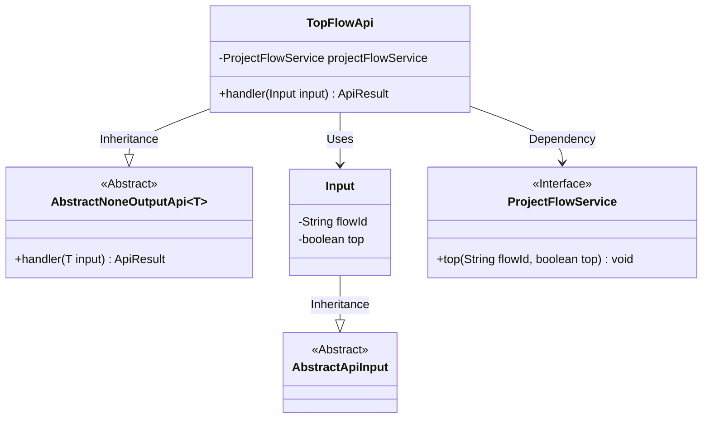
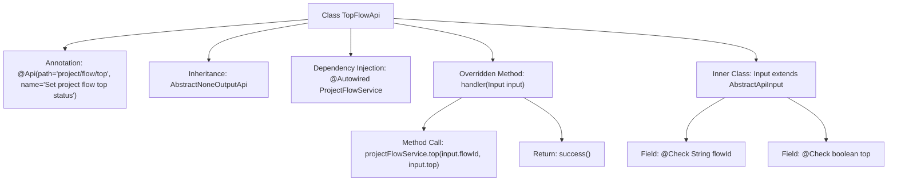

# Basic Information

|      |      |
|------|------|
| Name | TopFlowApi |
| Language | .java |
| Code Path | WeFe/board/board-service/src/main/java/com/welab/wefe/board/service/api/project/flow/TopFlowApi.java |
| Package Name | com.welab.wefe.board.service.api.project.flow |
| Dependencies | ['com.welab.wefe.board.service.service.ProjectFlowService', 'com.welab.wefe.common.exception.StatusCodeWithException', 'com.welab.wefe.common.fieldvalidate.annotation.Check', 'com.welab.wefe.common.web.api.base.AbstractNoneOutputApi', 'com.welab.wefe.common.web.api.base.Api', 'com.welab.wefe.common.web.dto.AbstractApiInput', 'com.welab.wefe.common.web.dto.ApiResult', 'org.springframework.beans.factory.annotation.Autowired'] |
| Brief Description | The TopFlowApi class is used to set the top status of a project flow. It accepts the flowId and top parameters, invokes the projectFlowService.top method for processing, and returns a successful result. |

# Description

The code defines an API class named TopFlowApi, which is used to set the top status of a project flow. The API path is "project/flow/top", and its name is "Set Project Flow Top Status". This class inherits from AbstractNoneOutputApi, using the generic type Input as the parameter type. It injects the ProjectFlowService to handle business logic, with the handler method calling the service's top method to implement the top functionality. The input parameter Input inherits from AbstractApiInput and includes two required fields: flowId (training ID) and top (whether to top). A successful execution returns an empty result.

# Class Summary

| Name   | Type  | Description |
|-------|------|-------------|
| TopFlowApi | class | The TopFlowApi class is used to set the top status of a project flow. It takes the flowId and top parameters, invokes the projectFlowService.top method for processing, and returns a successful result. |

## Class TopFlowApi

|      |      |
|------|------|
| Access Modifier | @Api(path = "project/flow/top", name = "设置项目流程置顶状态");public |
| Type | class |
| Name | TopFlowApi |
| Description | The TopFlowApi class is used to set the top status of a project flow. It takes the flowId and top parameters, invokes the projectFlowService.top method for processing, and returns a successful result. |

### UML Class Diagram

Class diagram description:
The TopFlowApi class inherits from the generic class AbstractNoneOutputApi<Input>, implementing the functionality to pin project workflows. It depends on the ProjectFlowService interface to execute the pinning operation and uses the inner static class Input as the input parameter. The Input class inherits from AbstractApiInput and contains two fields: flowId and top. ProjectFlowService is an interface defining the top method. The entire structure demonstrates the collaboration between the API layer and business services.

### Internal Method Call Graph

This code defines an API class named TopFlowApi for handling the setting of project flow top status. The class inherits from AbstractNoneOutputApi and contains an inner input class Input. The flowchart illustrates the class structure, annotations, dependency injection, method overriding, and field definitions of the inner class. The handler method invokes the top method of ProjectFlowService to perform the top operation, ultimately returning a success result. The entire process clearly demonstrates the complete call chain from API reception to business processing.

### Field List

| Name  | Type  | Description |
|-------|-------|------|
| projectFlowService | ProjectFlowService | Automatically inject the ProjectFlowService service instance. |

### Method List

| Name  | Type  | Description |
|-------|-------|------|
| handler | ApiResult | Override the method to handle input, invoke the service pinning process, and return a successful result. |

