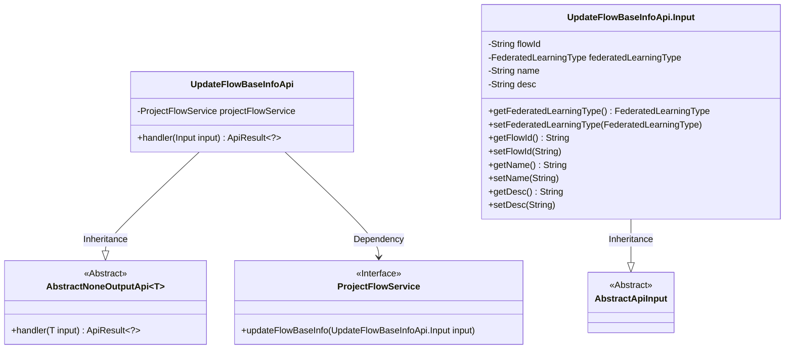

# Basic Information

|      |      |
|------|------|
| Name | UpdateFlowBaseInfoApi |
| Language | .java |
| Code Path | WeFe/board/board-service/src/main/java/com/welab/wefe/board/service/api/project/flow/UpdateFlowBaseInfoApi.java |
| Package Name | com.welab.wefe.board.service.api.project.flow |
| Dependencies | ['com.welab.wefe.board.service.service.ProjectFlowService', 'com.welab.wefe.common.exception.StatusCodeWithException', 'com.welab.wefe.common.fieldvalidate.annotation.Check', 'com.welab.wefe.common.web.api.base.AbstractNoneOutputApi', 'com.welab.wefe.common.web.api.base.Api', 'com.welab.wefe.common.web.dto.AbstractApiInput', 'com.welab.wefe.common.web.dto.ApiResult', 'com.welab.wefe.common.wefe.enums.FederatedLearningType', 'org.springframework.beans.factory.annotation.Autowired'] |
| Brief Description | API class for updating basic information of a workflow, including input parameters such as workflow ID, federated learning type, workflow name, and description. It invokes ProjectFlowService to update workflow information. |

# Description

The code defines an API class named UpdateFlowBaseInfoApi, which is used to update basic information of a workflow. The API path is project/flow/update/base_info, inheriting from AbstractNoneOutputApi, with the input parameter being the inner class Input. Input includes fields such as workflow ID (required), federated learning type (required), workflow name (required), and workflow description, along with corresponding getter and setter methods. The processing logic is implemented through the updateFlowBaseInfo method of ProjectFlowService, returning an empty result upon success.

# Class Summary

| Name   | Type  | Description |
|-------|------|-------------|
| UpdateFlowBaseInfoApi | class | API class for updating basic process information, including input parameters such as process ID, federated learning type, process name, and description, which invokes the ProjectFlowService to perform the update operation. |

## Class UpdateFlowBaseInfoApi

|      |      |
|------|------|
| Access Modifier | @Api(path = "project/flow/update/base_info", name = "update flow base info");public |
| Type | class |
| Name | UpdateFlowBaseInfoApi |
| Description | API class for updating basic process information, including input parameters such as process ID, federated learning type, process name, and description, which invokes the ProjectFlowService to perform the update operation. |

### UML Class Diagram

This code demonstrates an API implementation for updating flow basic information, including the core class UpdateFlowBaseInfoApi and its nested Input class. UpdateFlowBaseInfoApi inherits from the generic abstract class AbstractNoneOutputApi and implements business logic through the ProjectFlowService interface. The Input class inherits from AbstractApiInput and contains fields such as flow ID and federated learning type. The class diagram clearly presents the inheritance and dependency relationships, reflecting design patterns of Spring dependency injection and API processing.

### Internal Method Call Graph

```mermaid
graph TD
    A["Class UpdateFlowBaseInfoApi"]
    B["Annotation: @Api(path='project/flow/update/base_info', name='update flow base info')"]
    C["Inheritance: AbstractNoneOutputApi<Input>"]
    D["Dependency Injection: @Autowired ProjectFlowService"]
    E["Overridden Method: handler(Input input)"]
    F["Inner Class: Input"]
    G["Field: String flowId"]
    H["Field: FederatedLearningType federatedLearningType"]
    I["Field: String name"]
    J["Field: String desc"]
    K["getter/setter methods"]
    L["Method Call: projectFlowService.updateFlowBaseInfo(input)"]
    M["Return Result: success()"]

    A --> B
    A --> C
    A --> D
    A --> E
    E --> L
    E --> M
    A --> F
    F --> G
    F --> H
    F --> I
    F --> J
    F --> K
```

This code describes an API class UpdateFlowBaseInfoApi for updating flow basic information, which inherits from the abstract class AbstractNoneOutputApi and includes an inner Input class for parameters. The flowchart illustrates the class structure, annotations, inheritance relationships, dependency-injected service, core handler method implementation, and fields/access methods of the Input class. The core business logic updates flow basic information through projectFlowService, ultimately returning a success result. The entire design adopts a layered structure, conforming to standard API development patterns.

### Field List

| Name  | Type  | Description |
|-------|-------|------|
| projectFlowService | ProjectFlowService | Use @Autowired to automatically inject an instance of ProjectFlowService. |

### Method List

| Name  | Type  | Description |
|-------|-------|------|
| handler | ApiResult<?> | This method overrides the parent class handler, invokes projectFlowService to update the basic information of the workflow, takes input as the parameter, returns an empty result upon success, and throws StatusCodeWithException in case of exceptions. |

