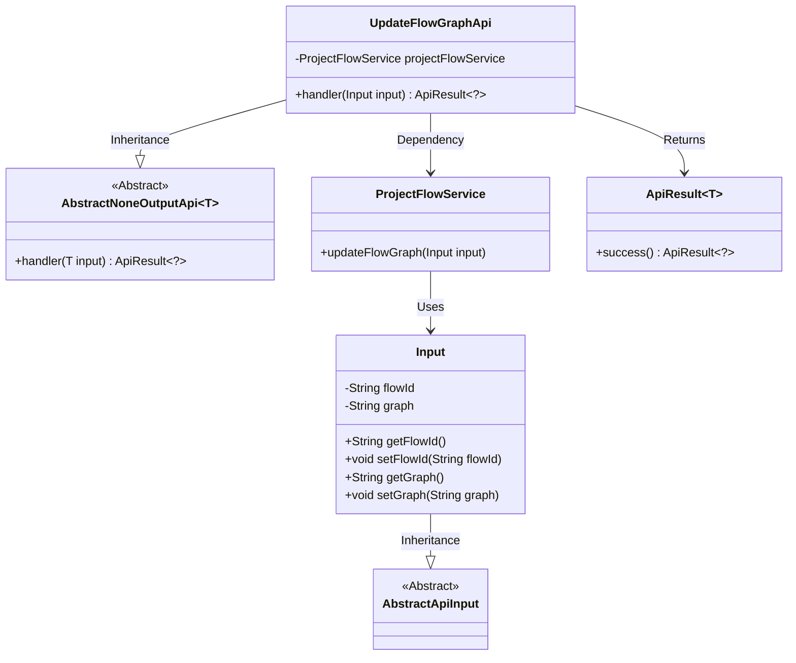
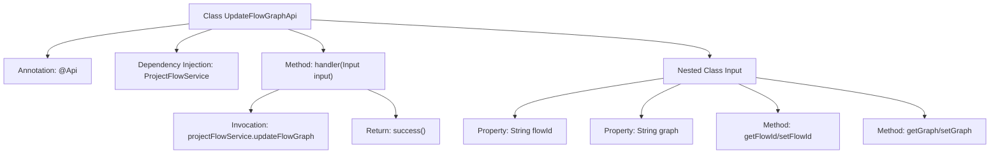

# Basic Information

|      |      |
|------|------|
| Name | UpdateFlowGraphApi |
| Language | .java |
| Code Path | WeFe/board/board-service/src/main/java/com/welab/wefe/board/service/api/project/flow/UpdateFlowGraphApi.java |
| Package Name | com.welab.wefe.board.service.api.project.flow |
| Dependencies | ['com.welab.wefe.board.service.service.ProjectFlowService', 'com.welab.wefe.common.exception.StatusCodeWithException', 'com.welab.wefe.common.fieldvalidate.annotation.Check', 'com.welab.wefe.common.web.api.base.AbstractNoneOutputApi', 'com.welab.wefe.common.web.api.base.Api', 'com.welab.wefe.common.web.dto.AbstractApiInput', 'com.welab.wefe.common.web.dto.ApiResult', 'org.springframework.beans.factory.annotation.Autowired'] |
| Brief Description | Update the flowchart API with the path `project/flow/update/graph`, which receives the flow ID and flowchart data, and calls `ProjectFlowService` to update the flowchart. |

# Description

This is an API class for updating flowcharts, with the path "project/flow/update/graph" and the name "update flow graph". It inherits from AbstractNoneOutputApi and accepts the Input class as a parameter. The Input class contains two required fields: flowId (flow ID) and graph (flowchart). The API processes the input by calling the updateFlowGraph method through the injected ProjectFlowService and returns an empty result upon success. All fields have corresponding getter and setter methods.

# Class Summary

| Name   | Type  | Description |
|-------|------|-------------|
| UpdateFlowGraphApi | class | The UpdateFlowGraphApi class is used to update flowcharts, receiving the flow ID and flowchart data, and invoking ProjectFlowService for processing. The input parameters flowId and graph are mandatory. |

## Class UpdateFlowGraphApi

|      |      |
|------|------|
| Access Modifier | @Api(path = "project/flow/update/graph", name = "update flow graph");public |
| Type | class |
| Name | UpdateFlowGraphApi |
| Description | The UpdateFlowGraphApi class is used to update flowcharts, receiving the flow ID and flowchart data, and invoking ProjectFlowService for processing. The input parameters flowId and graph are mandatory. |

### UML Class Diagram

Class Diagram Description: The diagram illustrates the structure of UpdateFlowGraphApi and its related classes. UpdateFlowGraphApi inherits from the generic class AbstractNoneOutputApi<Input> and contains a ProjectFlowService dependency. The Input class inherits from AbstractApiInput, featuring two private fields (flowId and graph) with corresponding getter/setter methods. ProjectFlowService provides the updateFlowGraph method, which accepts an Input parameter. ApiResult is a generic class used to encapsulate API response results.

### Internal Method Call Graph

This code describes a Spring framework-based API controller class UpdateFlowGraphApi, primarily used for updating flowchart data. The API inherits from AbstractNoneOutputApi and implements core business logic through the ProjectFlowService service layer. The nested class Input defines required request parameters flowId and graph, including parameter validation annotations and getter/setter methods. The handler method invokes the service layer update operation when processing requests and finally returns a success response. The overall structure demonstrates clear hierarchical division and separation of responsibilities.

### Field List

| Name  | Type  | Description |
|-------|-------|------|
| projectFlowService | ProjectFlowService | Automatically inject the ProjectFlowService service instance. |

### Method List

| Name  | Type  | Description |
|-------|-------|------|
| handler | ApiResult<?> | The override method processes the input, invokes the service to update the flowchart, and returns the result upon success. |

