# Basic Information

|      |      |
|------|------|
| Name | flow |
| Language | .java |
| Code Path | WeFe/board/board-service/src/main/java/com/welab/wefe/board/service/api/project/flow |
| Package Name | docs.board.board-service.src.main.java.com.welab.wefe.board.service.api.project.flow |
| Brief Description | ListFlowNodeApi queries the list of workflow nodes.  AddFlowApi adds a project workflow.  UpdateFlowBaseInfoApi updates workflow information.  QueryFlowTemplateApi queries workflow templates.  StartFlowApi initiates a workflow.  QueryDataIoTaskConfigApi queries data IO configurations.  GetProgressApi retrieves workflow progress.  DeleteApi deletes a workflow.  SaveFlowTemplateApi saves a template.  QueryDataIoTaskFeaturesApi queries feature columns.  UpdateFlowGraphApi updates the workflow diagram.  DetailFlowApi retrieves workflow details.  FlowQueryApi queries the workflow list.  AddOotFlowApi adds an OOT workflow.  CopyFlowApi copies a workflow.  TopFlowApi pins a workflow to the top.  FlowDataSetInfoApi retrieves dataset information.  ListFlowTableDataSetApi fetches the dataset list. |

# Description

## Overview  
The core responsibility of this module is to manage the lifecycle of processes in federated learning projects, including CRUD operations for processes, template management, task execution, and data querying. Similar to a workflow engine, it achieves process orchestration and state control through standardized API specifications.  

The interface specification follows RESTful conventions, with paths prefixed by `project/flow` and inheriting the `AbstractApi` base class for standardized input/output. Examples include `ListFlowNodeApi` for querying node lists and `AddFlowApi` for creating new processes. Key data structures include `ProjectFlowNodeOutputModel` (node information), `TemplateOutput` (template details), and `ProjectFlowDetailOutputModel` (process details).  

External dependencies include `ProjectFlowService` (core process service), `FlowTemplateService` (template management), and `TaskService` (task configuration). For instance, `StartFlowApi` relies on `projectFlowJobService` to initiate tasks. Implementation examples are abundant, such as `QueryDataIoTaskConfigApi` querying data I/O configurations and returning results in JObject format.  

## Key Business Scenarios  
The business process covers the entire lifecycle: creation (e.g., `AddFlowApi`), configuration (e.g., `UpdateFlowBaseInfoApi`), execution (e.g., `StartFlowApi`), and monitoring (e.g., `GetProgressApi`). The interaction mode primarily involves service calls, such as `ProjectFlowService` providing CRUD operations for processes.  

Typical applications include template-based creation (`SaveFlowTemplateApi`), process duplication (`CopyFlowApi`), and OOT process extension (`AddOotFlowApi`). API types encompass query (e.g., `FlowQueryApi` for paginated lists), operations (e.g., `DeleteApi`), and configuration (e.g., `UpdateFlowGraphApi` for updating flow diagrams).  

Data interaction scenarios are prominent, such as `ListFlowTableDataSetApi` collecting dataset features for processes and `QueryDataIoTaskFeaturesApi` querying feature columns by task ID. Completeness is reflected in closed-loop state management, from `TopFlowApi` pinning operations to `DetailFlowApi` detail queries, forming a comprehensive view.

### Package Internal Structure View

```mermaid
graph TD
    flow --> ListFlowNodeApi.java
    flow --> AddFlowApi.java
    flow --> UpdateFlowBaseInfoApi.java
    flow --> QueryFlowTemplateApi.java
    flow --> StartFlowApi.java
    flow --> QueryDataIoTaskConfigApi.java
    flow --> GetProgressApi.java
    flow --> DeleteApi.java
    flow --> SaveFlowTemplateApi.java
    flow --> QueryDataIoTaskFeaturesApi.java
    flow --> UpdateFlowGraphApi.java
    flow --> DetailFlowApi.java
    flow --> FlowQueryApi.java
    flow --> AddOotFlowApi.java
    flow --> CopyFlowApi.java
    flow --> TopFlowApi.java
    flow --> FlowDataSetInfoApi.java
    flow --> ListFlowTableDataSetApi.java
```

This flowchart illustrates the API file structure under the flow directory in the WeFe project. The root node is the flow folder, which directly contains 18 distinct Java API files covering functional modules such as process management, data querying, and template operations. Each file represents an independent API interface implementation, collectively forming a comprehensive set of project workflow service functionalities.

# File List

| Name   | Type  | Description |
|-------|------|-------------|
| [ListFlowNodeApi.java](ListFlowNodeApi.md) | file | This API retrieves a list of process nodes by process ID. The input must include the process ID, and the output returns the node list. |
| [AddFlowApi.java](AddFlowApi.md) | file | The AddFlowApi class is used to add project workflows, accepting inputs such as project ID, federation type, task type, etc., and invoking the ProjectFlowService to generate and return a workflow ID. The input includes mandatory fields and optional parameters, with the output being the workflow ID. |
| [UpdateFlowBaseInfoApi.java](UpdateFlowBaseInfoApi.md) | file | API class for updating basic process information, including input parameters such as process ID, federated learning type, process name, and description. It invokes ProjectFlowService to update the process information. |
| [QueryFlowTemplateApi.java](QueryFlowTemplateApi.md) | file | The QueryFlowTemplateApi class is used to query the list of workflow templates. It retrieves data through the flowTemplateService and converts it into the TemplateOutput format for return, including fields such as template ID, name, description, English name, and federated learning type. |
| [StartFlowApi.java](StartFlowApi.md) | file | The StartFlowApi is used to initiate a process and create an execution task. The input includes parameters such as the process ID and cache usage flag, while the output returns the task ID. |
| [QueryDataIoTaskConfigApi.java](QueryDataIoTaskConfigApi.md) | file | The QueryDataIoTaskConfigApi class is used to query the input parameters of the data IO component. It requires the jobId and role parameters and returns the configuration information by calling the taskService.findDataIoTaskConfig method. |
| [GetProgressApi.java](GetProgressApi.md) | file | API to retrieve the latest progress of specified workflows, with workflow ID list as input and progress data list as output. |
| [DeleteApi.java](DeleteApi.md) | file | The `DeleteApi` class is used to delete project workflows. It takes a workflow ID as a parameter, invokes the `flowService` to perform the deletion, and returns a success result. |
| [SaveFlowTemplateApi.java](SaveFlowTemplateApi.md) | file | Save Process Template API, which receives name, description, and flowchart inputs, invokes the service to generate a template ID and returns it. Includes input/output class definitions and core processing logic. |
| [QueryDataIoTaskFeaturesApi.java](QueryDataIoTaskFeaturesApi.md) | file | Query the API for data IO task feature columns to retrieve feature information based on jobId and memberId, supporting non-OOT mode flowId queries. The input includes flowId, jobId, and memberId, and the output is a feature list. |
| [UpdateFlowGraphApi.java](UpdateFlowGraphApi.md) | file | Update the flowchart API with the path `project/flow/update/graph`, which accepts the flow ID and flowchart data, and invokes the `ProjectFlowService` to update the flowchart. |
| [DetailFlowApi.java](DetailFlowApi.md) | file | The DetailFlowApi class handles requests for retrieving flow details, queries flow information via flowId, including project details, nodes with empty parameters, creator identification, and OOT model records, and returns a ProjectFlowDetailOutputModel result. |
| [FlowQueryApi.java](FlowQueryApi.md) | file | This is an API class for querying a list of project processes. It accepts inputs such as pagination parameters, project ID, and process ID list, and returns paginated process list data. |
| [AddOotFlowApi.java](AddOotFlowApi.md) | file | The AddOotFlowApi class is used to add an OOT flow, with inputs including the task ID, model node ID, and model name, and the output being the flow ID. |
| [CopyFlowApi.java](CopyFlowApi.md) | file | CopyFlowApi is used to copy a workflow, requiring the source workflow ID and target project ID, with optional new workflow ID and renaming. It invokes ProjectFlowService to perform the copy operation. |
| [TopFlowApi.java](TopFlowApi.md) | file | The TopFlowApi class is used to set the top status of a project flow. It takes the flowId and top parameters, invokes the projectFlowService.top method for processing, and returns a successful result. |
| [FlowDataSetInfoApi.java](FlowDataSetInfoApi.md) | file | The FlowDataSetInfoApi class retrieves dataset information via flowId, requiring flowId validation as input and outputting a list of JobDataSet. |
| [ListFlowTableDataSetApi.java](ListFlowTableDataSetApi.md) | file | API for Retrieving Process Dataset List: Queries related node datasets by process ID, assembles dataset information, and returns it. |

