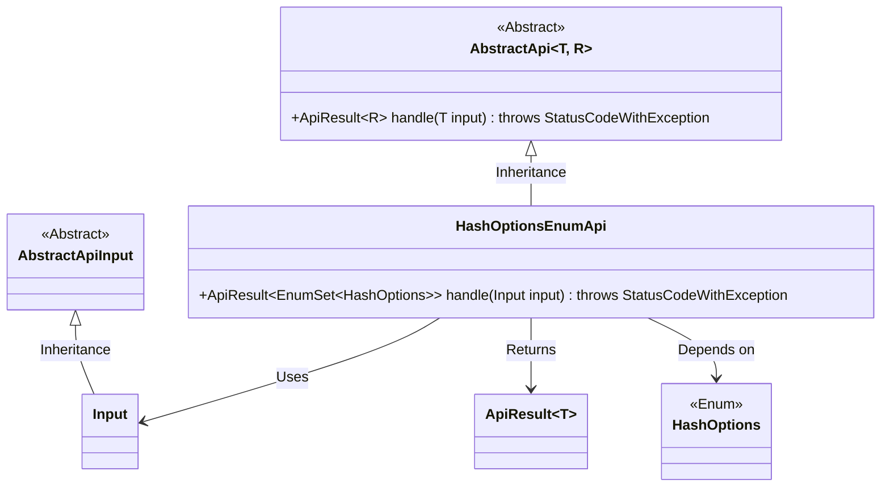

# Basic Information

|      |      |
|------|------|
| Name | HashOptionsEnumApi |
| Language | .java |
| Code Path | WeFe/board/board-service/src/main/java/com/welab/wefe/board/service/api/project/fusion/HashOptionsEnumApi.java |
| Package Name | com.welab.wefe.board.service.api.project.fusion |
| Dependencies | ['com.welab.wefe.common.exception.StatusCodeWithException', 'com.welab.wefe.common.web.api.base.AbstractApi', 'com.welab.wefe.common.web.api.base.Api', 'com.welab.wefe.common.web.dto.AbstractApiInput', 'com.welab.wefe.common.web.dto.ApiResult', 'com.welab.wefe.common.wefe.enums.HashOptions', 'java.util.EnumSet'] |
| Brief Description | The HashOptionsEnumApi interface provides the functionality to retrieve all values of the HashOptions enumeration. The input is empty, and it returns a collection of enumeration values. |

# Description

The code defines an API class named `HashOptionsEnumApi`, which inherits from the base class `AbstractApi`. The API path is `fusion/hash_options_enum`, with the name "Task Status" and the description "Task Status". It handles input parameters of type `Input` and returns a result of type `EnumSet<HashOptions>`. The `handle` method implements the retrieval of all `HashOptions` enumeration values and encapsulates them as a successful result for return. `Input` is an empty static inner class that inherits from `AbstractApiInput`. This API is primarily used to obtain the set of all possible values for the `HashOptions` enumeration.

# Class Summary

| Name   | Type  | Description |
|-------|------|-------------|
| HashOptionsEnumApi | class | The Java class `HashOptionsEnumApi` provides an API to retrieve all values of the `HashOptions` enumeration. The endpoint is `fusion/hash_options_enum`, which takes no input parameters and returns a collection of enumeration values. |

## Class HashOptionsEnumApi

|      |      |
|------|------|
| Access Modifier | @Api(path = "fusion/hash_options_enum", name = "任务状态", desc = "任务状态");public |
| Type | class |
| Name | HashOptionsEnumApi |
| Description | The Java class `HashOptionsEnumApi` provides an API to retrieve all values of the `HashOptions` enumeration. The endpoint is `fusion/hash_options_enum`, which takes no input parameters and returns a collection of enumeration values. |

### UML Class Diagram

Class Diagram Description: This diagram illustrates that the HashOptionsEnumApi class inherits from the generic abstract class AbstractApi and implements its handle method. Input, as a static inner class, inherits from AbstractApiInput. HashOptionsEnumApi returns an ApiResult object containing an EnumSet of HashOptions through the handle method, demonstrating dependencies on both the enum type and API result encapsulation. The overall structure clearly presents the hierarchical relationship between the API implementation layer and foundational abstract classes.

### Internal Method Call Graph

```mermaid
graph TD
    A["Class HashOptionsEnumApi"]
    B["Annotation: @Api"]
    C["Parent Class: AbstractApi<Input, EnumSet<HashOptions>>"]
    D["Method: handle(Input input)"]
    E["Inner Class: Input"]
    F["Invocation: EnumSet.allOf(HashOptions.class)"]
    G["Return: success(hashOptions)"]

    A --> B
    A --> C
    A --> D
    A --> E
    D --> F
    F --> G
```

This flowchart illustrates the structure and core logic of the HashOptionsEnumApi class. The class inherits from AbstractApi, defines API metadata via the @Api annotation, and its key method handle() invokes EnumSet.allOf() to retrieve all enum values and encapsulate them as a successful response. The inner class Input handles request parameters. The overall design is concise with clear responsibilities, conforming to a typical implementation pattern for enum query APIs.

### Field List

| Name  | Type  | Description |
|-------|-------|------|

### Method List

| Name  | Type  | Description |
|-------|-------|------|
| handle | ApiResult<EnumSet<HashOptions>> | Rewrite the method to return all HashOptions enum values, encapsulated as a successful ApiResult. |

