# Basic Information

|      |      |
|------|------|
| Name | fusion |
| Language | .java |
| Code Path | WeFe/board/board-service/src/main/java/com/welab/wefe/board/service/api/project/fusion |
| Package Name | docs.board.board-service.src.main.java.com.welab.wefe.board.service.api.project.fusion |
| Brief Description | Module 1: Data Fusion Result Management, providing preview, export, and progress query functionalities, utilizing RESTful interfaces, dependent on FusionResultService and storage services. Module 2: PSI Protocol API, managing Bloom filter downloads, status synchronization, and result reception, dependent on ActuatorManager. Module 3: Federated Learning Alignment Task Management, supporting task creation, query, and approval, with path prefix fusion/task/. Module 4: Query Project Provider List API, path being fusion/query/providers. Module 5: API for retrieving HashOptions enum values, path being fusion/hash_options_enum. |

# Description

## Overview  
The core responsibility of this module is to provide full lifecycle management for alignment tasks, data fusion results, and PSI protocols in federated learning, functioning similarly to a distributed workflow engine. The interface specifications uniformly adopt the RESTful style, with the path prefix `fusion/`, inheriting the AbstractApi base class and supporting signed access and parameter validation. Key data structures include Input classes with business identifiers (e.g., projectId/businessId), pagination/detail output structures (e.g., FusionTaskOutput), and status enums (e.g., PSIActuatorStatus). External dependencies include various business Services (e.g., FusionResultService), actuator management components (ActuatorManager), and infrastructure (JdbcClient). For example, ResultExportApi implements data export, PsiCryptoApi handles encryption conversion, and QueryProvidersApi retrieves project member lists.

## Core Business Scenarios  
The module supports three types of core processes: 1) Data fusion result processing (preview-export-progress query), 2) PSI protocol execution (status synchronization-encryption-result aggregation), and 3) Federated learning alignment tasks (creation-review-status tracking). The interaction mode resembles chained transactions, where multiple API calls are linked via businessId (e.g., ServerSynStatusApi polls the status before triggering ReceiveResultApi). Functional completeness is reflected in end-to-end coverage, such as TaskStatusApi monitoring progress, AuditCallbackApi handling review callbacks, and HashOptionsEnumApi providing enum options. Typical integration cases include signed asynchronous tasks (managed by ExportManager) and paginated queries (combining projectId/status conditions).

### Package Internal Structure View

```mermaid
graph TD
    fusion --> result
    fusion --> actuator
    fusion --> task
    fusion --> member
    fusion --> HashOptionsEnumApi.java
    result --> ResultExportApi.java
    result --> ResultPreviewApi.java
    result --> TestDBConnectApi.java
    result --> ResultExportProgressApi.java
    actuator --> psi
    psi --> DownloadBFApi.java
    psi --> ReceiveResultApi.java
    psi --> ServerSynStatusApi.java
    psi --> ServerCloseApi.java
    psi --> PsiCryptoApi.java
    task --> ReceiveApi.java
    task --> InfoApi.java
    task --> PagingApi.java
    task --> UpdateApi.java
    task --> RestartApi.java
    task --> DeleteApi.java
    task --> AddApi.java
    task --> DeleteCallbackApi.java
    task --> AuditCallbackApi.java
    task --> DetailApi.java
    task --> AuditApi.java
    task --> TaskStatusApi.java
    member --> QueryProvidersApi.java
```

This flowchart illustrates the API structure of the project's fusion module, comprising five main branches: result processing (result), actuator, task management (task), member management (member), and enumeration interfaces. The actuator branch includes a PSI encryption-related submodule, while task management encompasses 12 specific API interfaces. The overall structure clearly presents the hierarchical relationships between functional modules.

# File List

| Name   | Type  | Description |
|-------|------|-------------|
| [member](member/_module.md) | package | API interface for querying project member list, which retrieves formal project member information by project ID and returns a list of output models. |
| [HashOptionsEnumApi.java](HashOptionsEnumApi.md) | file | The HashOptionsEnumApi interface provides the functionality to retrieve all values of the HashOptions enumeration. The input is empty, and it returns a collection of enumeration values. |
| [task](task/_module.md) | package | ReceiveApi handles alignment requests, InfoApi queries task progress, PagingApi paginates task queries, UpdateApi modifies tasks, RestartApi reruns tasks, DeleteApi deletes tasks, AddApi adds tasks, DeleteCallbackApi processes deletion callbacks, AuditCallbackApi processes audit callbacks, DetailApi queries task details, AuditApi handles task audits, TaskStatusApi retrieves task status enumerations. |
| [actuator](actuator/_module.md) | package | The `DownloadBFApi` class handles Bloom filter downloads, located at `fusion/psi/download_bloom_filter`. The `ReceiveResultApi` class receives results, located at `fusion/receive/result`. The `ServerSynStatusApi` class queries server status, located at `fusion/psi/server_is_ready`. The `ServerCloseApi` class handles server shutdown, located at `fusion/server/close`. The `PsiCryptoApi` class handles PSI encryption, located at `fusion/psi/crypto`. All require signed access and use `businessId` to identify the business. |
| [result](result/_module.md) | package | ResultExportApi handles result export with the path `fusion/result/export`, requiring inputs including mandatory fields such as `businessId`. ResultPreviewApi manages preview functionality with the path `fusion/result/preview`, returning table headers and data. TestDBConnectApi tests database connectivity with the path `fusion/test_db_connect`. ResultExportProgressApi queries export progress with the path `fusion/result/export_progress`. |

