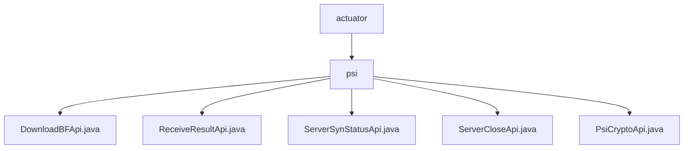

# Basic Information

|      |      |
|------|------|
| Name | actuator |
| Language | .java |
| Code Path | WeFe/board/board-service/src/main/java/com/welab/wefe/board/service/api/project/fusion/actuator |
| Package Name | docs.board.board-service.src.main.java.com.welab.wefe.board.service.api.project.fusion.actuator |
| Brief Description | The `DownloadBFApi` class handles Bloom filter downloads, located at `fusion/psi/download_bloom_filter`. The `ReceiveResultApi` class receives results, located at `fusion/receive/result`. The `ServerSynStatusApi` class queries server status, located at `fusion/psi/server_is_ready`. The `ServerCloseApi` class handles server shutdown, located at `fusion/server/close`. The `PsiCryptoApi` class handles PSI encryption, located at `fusion/psi/crypto`. All require signed access and use `businessId` to identify the business. |

# Description

## Overview  
This module provides core APIs for executing PSI (Private Set Intersection) protocols, functioning similarly to a distributed task coordinator that uniformly manages processes such as Bloom filter downloads, state synchronization, and result reception. All APIs inherit from the AbstractApi base class, support signed access, and track states by associating with ServerActuator instances via businessId. Key data structures include PsiActuatorMeta (execution metadata), JObject (status response), and PSIActuatorStatus (enum). The dependency is the unified ActuatorManager component for actuator management. For example, DownloadBFApi returns Bloom filter parameters, while PsiCryptoApi handles encrypted data conversion.  

## Primary Business Scenarios  
The module supports end-to-end PSI protocol execution, resembling multi-phase transaction processing: first polling service status via ServerSynStatusApi, then performing data encryption through PsiCryptoApi, and finally aggregating results via ReceiveResultApi. The typical interaction pattern involves clients initiating chained calls with a businessId, while the server maintains session states via ActuatorManager. APIs are categorized into three types: data operation (e.g., DownloadBFApi), state control (e.g., ServerCloseApi), and result processing (e.g., ReceiveResultApi). For instance, a close request updates PSIActuatorStatus, while the result reception API transparently passes data to the actuator instance.

### Package Internal Structure View

This flowchart illustrates the PSI-related API structure under the fusion actuator (actuator) in the WeFe project. The top level is the actuator directory, which contains the psi subdirectory. The psi directory includes five specific API implementation class files, covering functionalities such as downloading BF files, receiving results, and server synchronization status. All nodes display only the last-level names of the paths, with clear hierarchical relationships.

# File List

| Name   | Type  | Description |
|-------|------|-------------|
| [psi](psi/_module.md) | package | The `DownloadBFApi` class handles Bloom filter downloads, located at `fusion/psi/download_bloom_filter`. The `ReceiveResultApi` class receives results, located at `fusion/receive/result`. The `ServerSynStatusApi` class queries server status, located at `fusion/psi/server_is_ready`. The `ServerCloseApi` class handles server shutdown, located at `fusion/server/close`. The `PsiCryptoApi` class manages PSI encryption, located at `fusion/psi/crypto`. All require signed access and use `businessId` to identify the business. |

