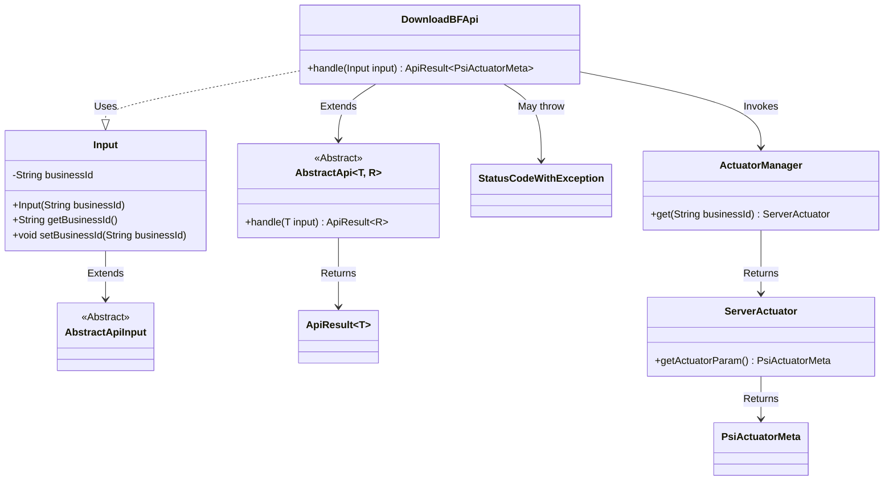

# Basic Information

|      |      |
|------|------|
| Name | DownloadBFApi |
| Language | .java |
| Code Path | WeFe/board/board-service/src/main/java/com/welab/wefe/board/service/api/project/fusion/actuator/psi/DownloadBFApi.java |
| Package Name | com.welab.wefe.board.service.api.project.fusion.actuator.psi |
| Dependencies | ['com.welab.wefe.board.service.fusion.actuator.psi.ServerActuator', 'com.welab.wefe.board.service.fusion.manager.ActuatorManager', 'com.welab.wefe.common.StatusCode', 'com.welab.wefe.common.exception.StatusCodeWithException', 'com.welab.wefe.common.fieldvalidate.annotation.Check', 'com.welab.wefe.common.web.api.base.AbstractApi', 'com.welab.wefe.common.web.api.base.Api', 'com.welab.wefe.common.web.dto.AbstractApiInput', 'com.welab.wefe.common.web.dto.ApiResult', 'com.welab.wefe.fusion.core.dto.PsiActuatorMeta', 'java.io.IOException'] |
| Brief Description | This API is used to download a Bloom filter and requires a valid businessId parameter. An error will be reported if the corresponding executor cannot be found, and the executor parameters will be returned upon success. |

# Description

The code defines an API class named `DownloadBFApi` for downloading Bloom filter data. The API path is `fusion/psi/download_bloom_filter` and allows signed access. The class inherits from `AbstractApi`, with the input type being the inner class `Input` and the output type being `PsiActuatorMeta`. The core logic resides in the `handle` method, which retrieves the corresponding `ServerActuator` instance using `businessId`—throwing an exception if it doesn't exist—otherwise returning the executor parameters. The `Input` class includes the required field `businessId` along with its getter and setter methods.

# Class Summary

| Name   | Type  | Description |
|-------|------|-------------|
| DownloadBFApi | class | Download the Bloom filter API by passing in the business ID, and upon successful verification, it will return the executor parameters. |

## Class DownloadBFApi

|      |      |
|------|------|
| Access Modifier | @Api(path = "fusion/psi/download_bloom_filter",;        name = "download bloomfilter",;        desc = "download bloomfilter",;        allowAccessWithSign = true;);public |
| Type | class |
| Name | DownloadBFApi |
| Description | Download the Bloom filter API by passing in the business ID, and upon successful verification, it will return the executor parameters. |

### UML Class Diagram

Class Diagram Description: This diagram illustrates that the DownloadBFApi class inherits from the generic abstract class AbstractApi and processes the Input parameter class. Input inherits from AbstractApiInput and contains the businessId field along with accessor methods. DownloadBFApi retrieves a ServerActuator instance via ActuatorManager, may throw StatusCodeWithException, and ultimately returns an ApiResult object containing PsiActuatorMeta. The components form a complete API processing flow through clear dependency relationships.

### Internal Method Call Graph

```mermaid
graph TD
    A["Class DownloadBFApi"]
    B["Annotation: @Api"]
    C["Parent class: AbstractApi<Input, PsiActuatorMeta>"]
    D["Method: handle(Input input)"]
    E["Get actuator: ActuatorManager.get(businessId)"]
    F["Check actuator existence: actuator == null"]
    G["Throw exception: throw StatusCodeWithException"]
    H["Return success result: success(actuatorParam)"]
    I["Nested class Input"]
    J["Property: String businessId"]
    K["Constructor: Input(String businessId)"]
    L["getter/setter methods"]

    A --> B
    A --> C
    A --> D
    D --> E
    D --> F
    F -->|Yes| G
    F -->|No| H
    A --> I
    I --> J
    I --> K
    I --> L
```

This code flowchart illustrates the structure and main execution flow of the DownloadBFApi class. The class is an API implementation annotated with @Api, inheriting from AbstractApi, with its core method being handle(), responsible for processing business requests. The flow starts with retrieving an actuator, checks for its existence, throws an exception if absent, and returns actuator parameters if present. The nested Input class contains the businessId property and related methods. The entire process clearly demonstrates the API request handling logic and exception handling path.

### Field List

| Name  | Type  | Description |
|-------|-------|------|

### Method List

| Name  | Type  | Description |
|-------|-------|------|
| handle | ApiResult<PsiActuatorMeta> | The method processes the input and returns executor parameters. If the executor does not exist, it logs an error and throws an exception. Upon success, it returns the executor parameters. |

