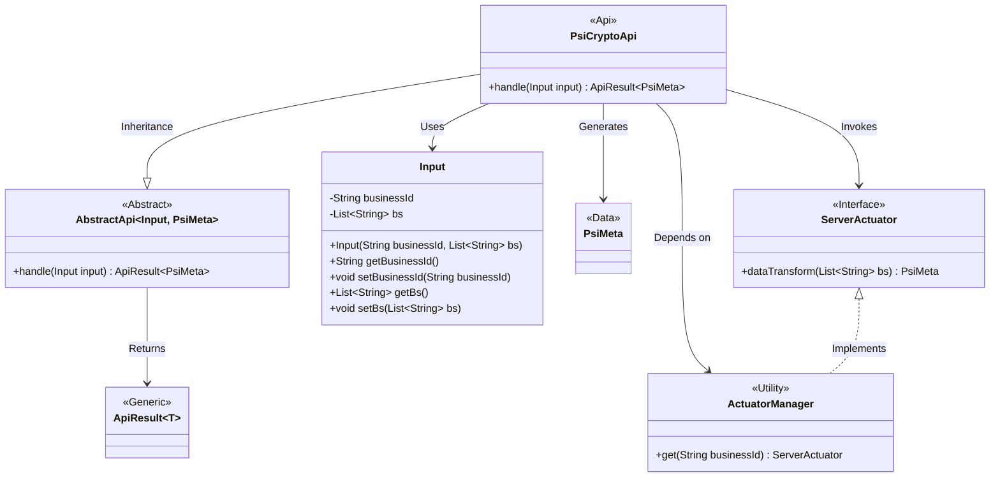

# Basic Information

|      |      |
|------|------|
| Name | PsiCryptoApi |
| Language | .java |
| Code Path | WeFe/board/board-service/src/main/java/com/welab/wefe/board/service/api/project/fusion/actuator/psi/PsiCryptoApi.java |
| Package Name | com.welab.wefe.board.service.api.project.fusion.actuator.psi |
| Dependencies | ['java.io.IOException', 'java.util.List', 'com.welab.wefe.board.service.dto.fusion.PsiMeta', 'com.welab.wefe.board.service.fusion.actuator.psi.ServerActuator', 'com.welab.wefe.board.service.fusion.manager.ActuatorManager', 'com.welab.wefe.common.StatusCode', 'com.welab.wefe.common.exception.StatusCodeWithException', 'com.welab.wefe.common.fieldvalidate.annotation.Check', 'com.welab.wefe.common.web.api.base.AbstractApi', 'com.welab.wefe.common.web.api.base.Api', 'com.welab.wefe.common.web.dto.AbstractApiInput', 'com.welab.wefe.common.web.dto.ApiResult'] |
| Brief Description | The PsiCryptoApi class handles encrypted data by retrieving an executor based on the businessId and transforming the data. The input includes a businessId and a bs list, and after validation, it returns a PsiMeta result. |

# Description

This is an API class named PsiCryptoApi, which inherits from AbstractApi and handles PSI encryption-related requests. The API path is `fusion/psi/crypto`, allowing signed access. The class includes an inner class Input as the input parameter, containing the required field `businessId` and the optional field `bs` (a list of strings). The main logic resides in the `handle` method, where a `ServerActuator` instance is retrieved using `businessId`—if it does not exist, an error is thrown; otherwise, the `dataTransform` method processes the `bs` data and returns a `PsiMeta` result. The input parameters are annotated with validation constraints to ensure `businessId` is mandatory.

# Class Summary

| Name   | Type  | Description |
|-------|------|-------------|
| PsiCryptoApi | class | The PsiCryptoApi class handles encrypted data conversion, requiring the input of businessId and a bs list. After validation, it converts the data through an executor and returns the result. |

## Class PsiCryptoApi

|      |      |
|------|------|
| Access Modifier | @Api(;        path = "fusion/psi/crypto",;        name = "psi crypto",;        desc = "psi crypto",;        allowAccessWithSign = true;);public |
| Type | class |
| Name | PsiCryptoApi |
| Description | The PsiCryptoApi class handles encrypted data conversion, requiring the input of businessId and a bs list. After validation, it converts the data through an executor and returns the result. |

### UML Class Diagram

This code demonstrates the implementation structure of a PSI encryption API. PsiCryptoApi inherits from the generic abstract class AbstractApi, processes Input, and returns an ApiResult containing PsiMeta. The core workflow involves obtaining a ServerActuator instance via ActuatorManager and invoking its dataTransform method to complete data transformation. The Input class encapsulates a business ID and a list of strings to be processed, including parameter validation annotations. The overall design reflects dependency injection and the template method pattern, isolating concrete implementations through abstraction layers to support extensible encryption processing logic.

### Internal Method Call Graph

```mermaid
graph TD
    A["Class PsiCryptoApi"]
    B["Parent Class: AbstractApi<Input, PsiMeta>"]
    C["Annotation: @Api"]
    D["Method: handle(Input input)"]
    E["Inner Class: Input"]
    F["Field: String businessId"]
    G["Field: List<String> bs"]
    H["Constructor: Input(String businessId, List<String> bs)"]
    I["getter/setter methods"]
    J["ServerActuator actuator = ActuatorManager.get()"]
    K["Check if actuator is null"]
    L["Throw exception: StatusCodeWithException"]
    M["Return result: success(PsiMeta.of())"]

    A --> B
    A --> C
    A --> D
    A --> E
    E --> F
    E --> G
    E --> H
    E --> I
    D --> J
    J --> K
    K --"Yes"--> L
    K --"No"--> M
```

This code demonstrates an API class named PsiCryptoApi, which inherits from AbstractApi and is primarily used for handling encryption-related PSI (Private Set Intersection) operations. The class contains a handle method for business logic processing and a static inner class Input for encapsulating input parameters. The flowchart clearly illustrates the class structure relationships and method invocation flow, including key steps such as parameter validation, actuator retrieval, exception handling, and result return, reflecting the complete lifecycle of API request processing.

### Field List

| Name  | Type  | Description |
|-------|-------|------|

### Method List

| Name  | Type  | Description |
|-------|-------|------|
| handle | ApiResult<PsiMeta> | Process the input and return PSI metadata. If the executor is not found, an error will be reported; otherwise, the data will be transformed and a successful result will be returned. |

