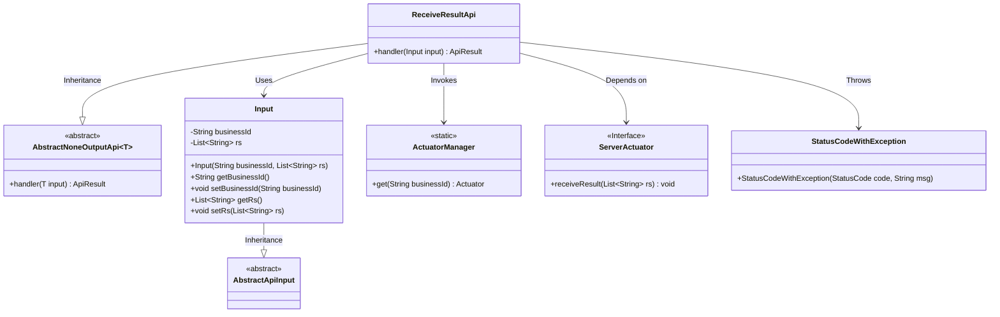
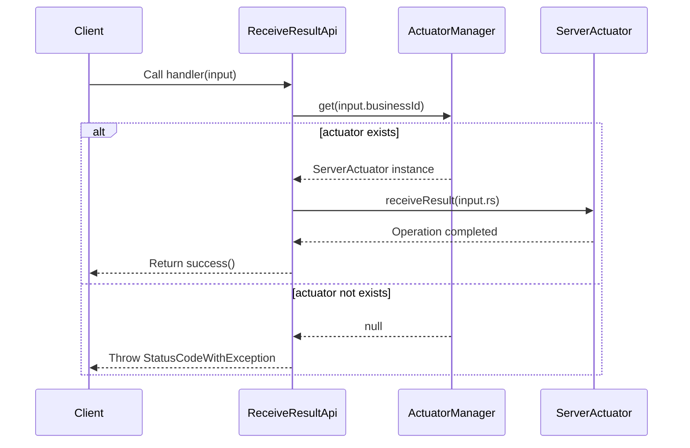

# Basic Information

|      |      |
|------|------|
| Name | ReceiveResultApi |
| Language | .java |
| Code Path | WeFe/board/board-service/src/main/java/com/welab/wefe/board/service/api/project/fusion/actuator/psi/ReceiveResultApi.java |
| Package Name | com.welab.wefe.board.service.api.project.fusion.actuator.psi |
| Dependencies | ['com.welab.wefe.board.service.fusion.actuator.psi.ServerActuator', 'com.welab.wefe.board.service.fusion.manager.ActuatorManager', 'com.welab.wefe.common.StatusCode', 'com.welab.wefe.common.exception.StatusCodeWithException', 'com.welab.wefe.common.fieldvalidate.annotation.Check', 'com.welab.wefe.common.web.api.base.AbstractNoneOutputApi', 'com.welab.wefe.common.web.api.base.Api', 'com.welab.wefe.common.web.dto.AbstractApiInput', 'com.welab.wefe.common.web.dto.ApiResult', 'java.util.List'] |
| Brief Description | The API class for receiving processing results, with the path `fusion/receive/result`, requires signed access. The input includes `businessId` and a list of `rs`. After verifying the existence of `businessId`, the results are processed. |

# Description

This is an API class named ReceiveResultApi, used for receiving processing results. The API path is fusion/receive/result, allowing access with signatures. This class inherits from AbstractNoneOutputApi and uses Input as the input parameter. Its main functionality is to retrieve the corresponding ServerActuator instance via businessId and pass the result list rs to this instance. If the corresponding instance cannot be found, a DATA_NOT_FOUND exception will be thrown. The Input class includes two mandatory fields: businessId and the result list rs, where businessId undergoes non-null validation. An empty result is returned upon successful processing.

# Class Summary

| Name   | Type  | Description |
|-------|------|-------------|
| ReceiveResultApi | class | The API for receiving processing results, with the path `fusion/receive/result`, requires signature-based access. It retrieves the executor via `businessId` and processes the result `rs`, throwing an exception upon failure. The input includes the mandatory `businessId` and the result list `rs`. |

## Class ReceiveResultApi

|      |      |
|------|------|
| Access Modifier | @Api(;        path = "fusion/receive/result",;        name = "receive result",;        desc = "receive result",;        allowAccessWithSign = true;);public |
| Type | class |
| Name | ReceiveResultApi |
| Description | The API for receiving processing results, with the path `fusion/receive/result`, requires signature-based access. It retrieves the executor via `businessId` and processes the result `rs`, throwing an exception upon failure. The input includes the mandatory `businessId` and the result list `rs`. |

### UML Class Diagram

Class Diagram Description: The diagram illustrates that ReceiveResultApi inherits from the generic class AbstractNoneOutputApi and contains the nested class Input. ReceiveResultApi obtains a ServerActuator instance via ActuatorManager and invokes its receiveResult method to process results. The Input class inherits from AbstractApiInput and includes fields for business ID and result list. Exception handling is implemented through StatusCodeWithException, with the overall structure reflecting the API request processing and actuator interaction flow.

### Internal Method Call Graph

```mermaid
graph TD
    A["Class ReceiveResultApi"]
    B["Annotation: @Api"]
    C["Parent Class: AbstractNoneOutputApi<Input>"]
    D["Method: handler(Input input)"]
    E["Inner Class: Input"]
    F["Field: String businessId"]
    G["Field: List<String> rs"]
    H["Constructor: Input(String, List<String>)"]
    I["Getter/Setter Methods"]
    J["Validation Annotation: @Check"]

    A --> B
    A --> C
    A --> D
    A --> E
    E --> F
    E --> G
    E --> H
    E --> I
    F --> J
    G --> J

    style D stroke:#f66,stroke-width:2px
    style H stroke:#090,stroke-width:2px
```

The flowchart depicts the structural composition of the ReceiveResultApi class, including API annotations, inheritance relationships, the core handler method, and field definitions of the nested Input class. The sequence diagram illustrates the complete call chain of the handler method: client requests trigger actuator lookup, processing success or exception paths based on actuator existence, highlighting key processes of data validation and exception handling.

### Field List

| Name  | Type  | Description |
|-------|-------|------|

### Method List

| Name  | Type  | Description |
|-------|-------|------|
| handler | ApiResult | Override the handler method to retrieve the ServerActuator using the businessId. If it does not exist, log an error and throw an exception. Otherwise, process the input result by calling receiveResult and return success. |

