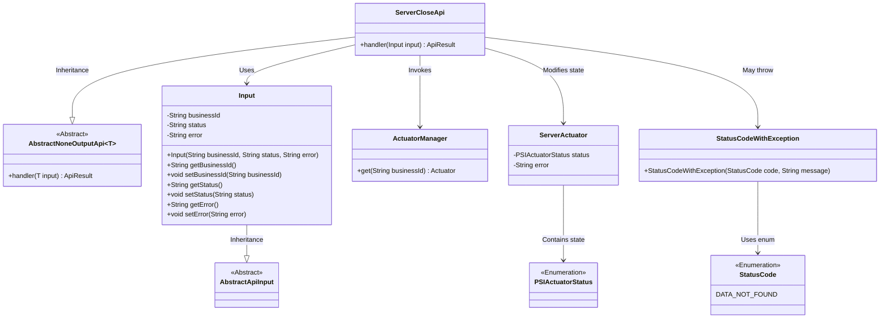
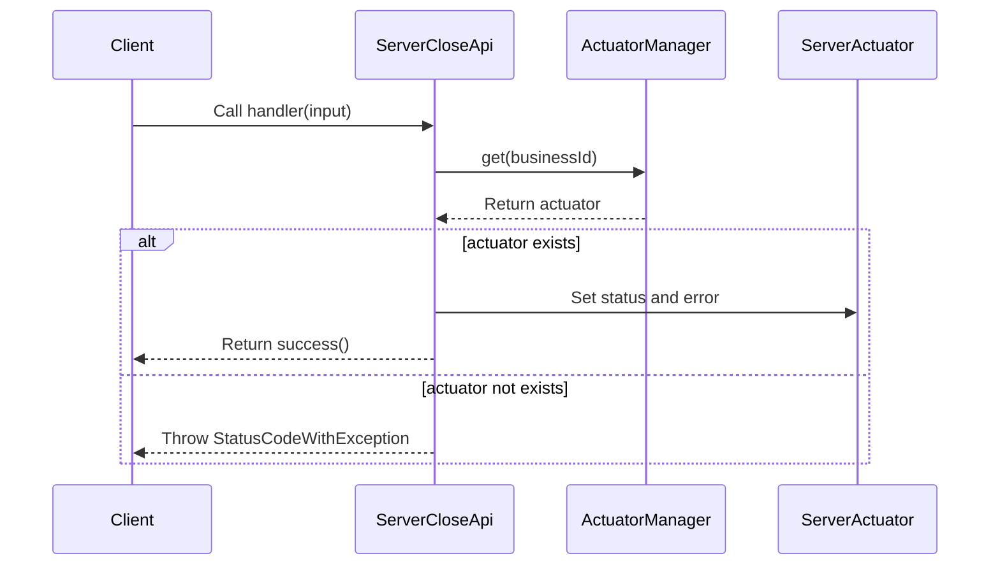

# Basic Information

|      |      |
|------|------|
| Name | ServerCloseApi |
| Language | .java |
| Code Path | WeFe/board/board-service/src/main/java/com/welab/wefe/board/service/api/project/fusion/actuator/psi/ServerCloseApi.java |
| Package Name | com.welab.wefe.board.service.api.project.fusion.actuator.psi |
| Dependencies | ['com.welab.wefe.board.service.fusion.actuator.psi.ServerActuator', 'com.welab.wefe.board.service.fusion.manager.ActuatorManager', 'com.welab.wefe.common.StatusCode', 'com.welab.wefe.common.exception.StatusCodeWithException', 'com.welab.wefe.common.fieldvalidate.annotation.Check', 'com.welab.wefe.common.web.api.base.AbstractNoneOutputApi', 'com.welab.wefe.common.web.api.base.Api', 'com.welab.wefe.common.web.dto.AbstractApiInput', 'com.welab.wefe.common.web.dto.ApiResult', 'com.welab.wefe.fusion.core.enums.PSIActuatorStatus'] |
| Brief Description | The `ServerCloseApi` class is used to shut down the server, receiving `businessId`, status, and error messages, then updating the executor status after validation. An error is reported if the executor does not exist. |

# Description

The code defines an API class named `ServerCloseApi` for handling server shutdown requests. The API path is `"fusion/server/close"` and allows signed access. This class inherits from `AbstractNoneOutputApi` and accepts input parameters of type `Input`. The `Input` class contains three required fields: `businessId`, `status`, and an optional `error`. The processing logic involves retrieving the corresponding `ServerActuator` instance using `businessId`—if it does not exist, an exception is thrown; if it exists, its status and error information are updated. Status updates use the `PSIActuatorStatus` enum values. A successful result is returned upon successful processing.

# Class Summary

| Name   | Type  | Description |
|-------|------|-------------|
| ServerCloseApi | class | The ServerCloseApi is used to shut down the server, receiving businessId, status, and error information, then updating the executor status after validation. An error will be reported if the executor does not exist. |

## Class ServerCloseApi

|      |      |
|------|------|
| Access Modifier | @Api(;        path = "fusion/server/close",;        name = "server close",;        desc = "server close",;        allowAccessWithSign = true;);public |
| Type | class |
| Name | ServerCloseApi |
| Description | The ServerCloseApi is used to shut down the server, receiving businessId, status, and error information, then updating the executor status after validation. An error will be reported if the executor does not exist. |

### UML Class Diagram

This code illustrates the architecture of a server shutdown API implementation. ServerCloseApi inherits from AbstractNoneOutputApi and processes input parameters containing business ID, status, and error information. The core logic involves retrieving the corresponding ServerActuator instance via ActuatorManager to update its state and error information. A StatusCodeWithException is thrown when the actuator doesn't exist. The class diagram clearly demonstrates inheritance, dependency, and association relationships among components, including input parameter processing, actuator state management, and exception handling mechanisms.

### Internal Method Call Graph

```mermaid
graph TD
    A["Class ServerCloseApi"]
    B["Annotation: @Api"]
    C["Parent Class: AbstractNoneOutputApi<Input>"]
    D["Method: handler(Input input)"]
    E["Get Actuator: ActuatorManager.get"]
    F["Check actuator existence"]
    G["Set actuator status and error message"]
    H["Return success result"]
    I["Throw exception: StatusCodeWithException"]
    J["Inner Class Input"]
    K["Field: String businessId"]
    L["Field: String status"]
    M["Field: String error"]
    N["Constructor: Input(String, String, String)"]
    O["Getter/Setter methods"]

    A --> B
    A --> C
    A --> D
    D --> E
    D --> F
    F -- Yes --> G
    F -- No --> I
    G --> H
    A --> J
    J --> K
    J --> L
    J --> M
    J --> N
    J --> O
```

This code implements a server shutdown API, primarily handling server shutdown requests. The flowchart illustrates the class structure and key method invocation relationships, while the sequence diagram depicts the complete API call flow. Upon receiving a request, it first retrieves the actuator instance via businessId. If the actuator exists, it updates the status and error information; otherwise, it throws an exception. The inner class Input defines the request parameter structure and validation rules.

### Field List

| Name  | Type  | Description |
|-------|-------|------|

### Method List

| Name  | Type  | Description |
|-------|-------|------|
| handler | ApiResult | Processing server shutdown request, checking if the executor exists, updating status and error information, and returning a successful result. |

