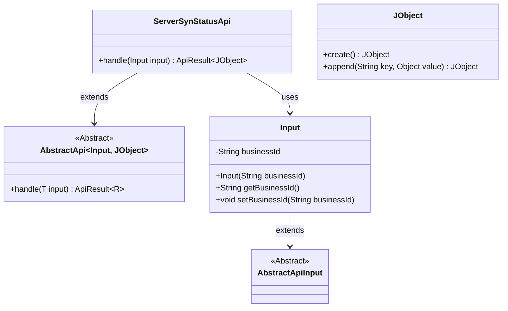

# Basic Information

|      |      |
|------|------|
| Name | ServerSynStatusApi |
| Language | .java |
| Code Path | WeFe/board/board-service/src/main/java/com/welab/wefe/board/service/api/project/fusion/actuator/psi/ServerSynStatusApi.java |
| Package Name | com.welab.wefe.board.service.api.project.fusion.actuator.psi |
| Dependencies | ['com.welab.wefe.board.service.fusion.manager.ActuatorManager', 'com.welab.wefe.common.fieldvalidate.annotation.Check', 'com.welab.wefe.common.util.JObject', 'com.welab.wefe.common.web.api.base.AbstractApi', 'com.welab.wefe.common.web.api.base.Api', 'com.welab.wefe.common.web.dto.AbstractApiInput', 'com.welab.wefe.common.web.dto.ApiResult'] |
| Brief Description | API for querying server status, with the path `fusion/psi/server_is_ready`. The `businessId` parameter must be passed, and it returns whether the server is ready. |

# Description

The content describes an API class named ServerSynStatusApi, which is used to query server status. The API path is fusion/psi/server_is_ready, allowing access with a signature. The input parameter Input includes a required field businessId. The processing logic checks whether the server for the specified businessId is ready via ActuatorManager and returns a JSON object containing the ready status. This API inherits from AbstractApi, with generics specifying the input type as Input and the output type as JObject.

# Class Summary

| Name   | Type  | Description |
|-------|------|-------------|
| ServerSynStatusApi | class | API for querying server status. Requires passing in businessId and returns a boolean value indicating readiness. Allows signed access. |

## Class ServerSynStatusApi

|      |      |
|------|------|
| Access Modifier | @Api(path = "fusion/psi/server_is_ready",;        name = "query server status",;        desc = "query server status",;        allowAccessWithSign = true;);public |
| Type | class |
| Name | ServerSynStatusApi |
| Description | API for querying server status. Requires passing in businessId and returns a boolean value indicating readiness. Allows signed access. |

### UML Class Diagram

This code describes a server status query API class `ServerSynStatusApi`, which inherits from the generic abstract class `AbstractApi` and processes requests with input type `Input` and return type `JObject`. The `Input` class inherits from `AbstractApiInput` and contains a required `businessId` field along with its accessor methods. `JObject` is a utility class for constructing JSON responses. The overall structure illustrates the core class relationships in the API request processing flow, implementing business logic through inheritance and composition.

### Internal Method Call Graph

```mermaid
graph TD
    A["Class ServerSynStatusApi"]
    B["Inherits: AbstractApi<Input, JObject>"]
    C["Annotation: @Api"]
    D["Method: handle(Input input)"]
    E["Calls: ActuatorManager.isReady"]
    F["Returns: success(JObject)"]
    G["Inner Class Input"]
    H["Inherits: AbstractApiInput"]
    I["Property: String businessId"]
    J["Constructor: Input(String businessId)"]
    K["Method: getBusinessId()"]
    L["Method: setBusinessId(String)"]
    M["Annotation: @Check"]

    A --> B
    A --> C
    A --> D
    D --> E
    D --> F
    A --> G
    G --> H
    G --> I
    G --> J
    G --> K
    G --> L
    I --> M
```

Flowchart description: This flowchart illustrates the structure of the ServerSynStatusApi class, which inherits from AbstractApi and is annotated with @Api. The core method is handle(), which invokes ActuatorManager.isReady() to check the business ID status and returns a JObject result containing the readiness state. The inner class Input inherits from AbstractApiInput, includes the businessId property with associated methods, and this property carries the @Check validation annotation. The overall diagram presents the state query logic for API request processing.

### Field List

| Name  | Type  | Description |
|-------|-------|------|

### Method List

| Name  | Type  | Description |
|-------|-------|------|
| handle | ApiResult<JObject> | This method checks whether the specified business ID is ready and returns a JSON result containing the readiness status. |

