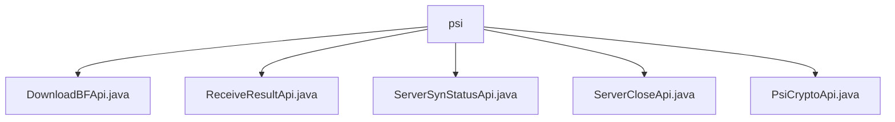

# Basic Information

|      |      |
|------|------|
| Name | psi |
| Language | .java |
| Code Path | WeFe/board/board-service/src/main/java/com/welab/wefe/board/service/api/project/fusion/actuator/psi |
| Package Name | docs.board.board-service.src.main.java.com.welab.wefe.board.service.api.project.fusion.actuator.psi |
| Brief Description | The `DownloadBFApi` class handles Bloom filter downloads, located at `fusion/psi/download_bloom_filter`. The `ReceiveResultApi` class receives results, located at `fusion/receive/result`. The `ServerSynStatusApi` class queries server status, located at `fusion/psi/server_is_ready`. The `ServerCloseApi` class handles server shutdown, located at `fusion/server/close`. The `PsiCryptoApi` class manages PSI encryption, located at `fusion/psi/crypto`. All require signed access and use `businessId` to identify the business. |

# Description

## Overview  
This module provides core APIs for executing PSI (Private Set Intersection) protocols, functioning similarly to a distributed task coordinator that uniformly manages processes such as Bloom filter downloads, state synchronization, and result reception. All APIs inherit from the AbstractApi base class, support signed access, and track states by associating businessId with ServerActuator instances. Key data structures include PsiActuatorMeta (execution metadata), JObject (status response), and PSIActuatorStatus (enum). The dependency is the unified ActuatorManager component for actuator management. For example, DownloadBFApi returns Bloom filter parameters, while PsiCryptoApi handles encrypted data conversion.  

## Core Business Scenarios  
The module supports end-to-end PSI protocol execution, resembling multi-phase transaction processing: first polling service status via ServerSynStatusApi, then performing data encryption through PsiCryptoApi, and finally aggregating results via ReceiveResultApi. The typical interaction pattern involves clients initiating chained calls with businessId, while the server maintains session states via ActuatorManager. APIs are categorized into three types: data operation (e.g., DownloadBFApi), state control (e.g., ServerCloseApi), and result processing (e.g., ReceiveResultApi). For instance, close requests update PSIActuatorStatus, while result reception APIs transparently pass data to actuator instances.

### Package Internal Structure View

This flowchart illustrates 5 Java interface files under the `psi` directory. All files are directly subordinate to the `psi` node with no deeper subdirectory structure. These interface files include API implementation classes related to functionalities such as download, receiving results, server status synchronization, server shutdown, and PSI encryption.

# File List

| Name   | Type  | Description |
|-------|------|-------------|
| [DownloadBFApi.java](DownloadBFApi.md) | file | This API is used to download a Bloom filter and requires a valid businessId parameter. An error will be reported if the corresponding executor cannot be found, and the executor parameters will be returned upon success. |
| [ReceiveResultApi.java](ReceiveResultApi.md) | file | The API class for receiving processing results, with the path `fusion/receive/result`, requires signed access. The input includes `businessId` and a list of `rs`. After verifying the existence of `businessId`, the results are processed. |
| [ServerSynStatusApi.java](ServerSynStatusApi.md) | file | API for querying server status, with the path `fusion/psi/server_is_ready`. The `businessId` parameter must be passed, and it returns whether the server is ready. |
| [ServerCloseApi.java](ServerCloseApi.md) | file | The `ServerCloseApi` class is used to shut down the server, receiving `businessId`, status, and error messages, then updating the executor status after validation. An error is reported if the executor does not exist. |
| [PsiCryptoApi.java](PsiCryptoApi.md) | file | The PsiCryptoApi class handles encrypted data by retrieving an executor via businessId and transforming the data. The input includes a businessId and a bs list, and after validation, it returns a PsiMeta result. |

