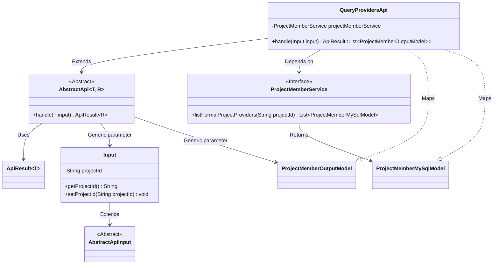

# Basic Information

|      |      |
|------|------|
| Name | QueryProvidersApi |
| Language | .java |
| Code Path | WeFe/board/board-service/src/main/java/com/welab/wefe/board/service/api/project/fusion/member/QueryProvidersApi.java |
| Package Name | com.welab.wefe.board.service.api.project.fusion.member |
| Dependencies | ['com.welab.wefe.board.service.database.entity.job.ProjectMemberMySqlModel', 'com.welab.wefe.board.service.dto.entity.project.ProjectMemberOutputModel', 'com.welab.wefe.board.service.service.ProjectMemberService', 'com.welab.wefe.common.exception.StatusCodeWithException', 'com.welab.wefe.common.fieldvalidate.annotation.Check', 'com.welab.wefe.common.web.api.base.AbstractApi', 'com.welab.wefe.common.web.api.base.Api', 'com.welab.wefe.common.web.dto.AbstractApiInput', 'com.welab.wefe.common.web.dto.ApiResult', 'com.welab.wefe.common.web.util.ModelMapper', 'org.springframework.beans.factory.annotation.Autowired', 'java.io.IOException', 'java.util.List'] |
| Brief Description | API interface for querying project member list, which retrieves formal project member information by project ID and returns a list of output models. |

# Description

The code defines an API class named QueryProvidersApi, which is used to query the list of project providers. The API path is fusion/query/providers, and its functional description is to query the provider list. This class inherits from AbstractApi, with the input type being the inner class Input and the output type being a list of ProjectMemberOutputModel. It retrieves formal project provider data through ProjectMemberService and maps the results to the output model. The Input class includes the required field project_id along with its getter and setter methods. The processing logic is encapsulated in the handle method, which returns the result in ApiResult format.

# Class Summary

| Name   | Type  | Description |
|-------|------|-------------|
| QueryProvidersApi | class | API interface for querying project member list, retrieves formal project member information by project ID and returns the member list. |

## Class QueryProvidersApi

|      |      |
|------|------|
| Access Modifier | @Api(path = "fusion/query/providers",;        name = "query provider list",;        desc = "query provider list";);public |
| Type | class |
| Name | QueryProvidersApi |
| Description | API interface for querying project member list, retrieves formal project member information by project ID and returns the member list. |

### UML Class Diagram

This code demonstrates an API implementation for querying a list of providers. QueryProvidersApi inherits from AbstractApi, processes Input parameters, and returns a list of ProjectMemberOutputModel. It relies on ProjectMemberService to fetch project member data, utilizing ModelMapper for model conversion. The Input class extends AbstractApiInput and contains a project ID field. The overall structure reflects clear hierarchical relationships and dependencies, achieving a flexible API processing framework through generics.

### Internal Method Call Graph

```mermaid
graph TD
    A["Class QueryProvidersApi"]
    B["Annotation: @Api"]
    C["Inheritance: AbstractApi<Input, List<ProjectMemberOutputModel>>"]
    D["Dependency Injection: @Autowired ProjectMemberService"]
    E["Overridden Method: handle(Input input)"]
    F["Inner Class: Input"]
    G["Field: @Check String projectId"]
    H["Method: getProjectId()"]
    I["Method: setProjectId(String)"]
    J["Invocation: projectMemberService.listFormalProjectProviders"]
    K["Return: success(ModelMapper.maps(...))"]

    A --> B
    A --> C
    A --> D
    A --> E
    A --> F
    F --> G
    F --> H
    F --> I
    E --> J
    E --> K
```

This code demonstrates a Spring framework-based API class QueryProvidersApi, primarily used for querying project member provider lists. The flowchart clearly illustrates the class structure: defining API metadata through the @Api annotation, inheriting from the AbstractApi base class with specified input/output types, and injecting ProjectMemberService via @Autowired. The core processing logic resides in the handle method, which invokes the service layer to retrieve data and returns transformed results via ModelMapper. The inner class Input defines the request parameter projectId with validation annotations and its getter/setter methods. The entire workflow presents a complete call chain from request handling to data response.

### Field List

| Name  | Type  | Description |
|-------|-------|------|
| projectMemberService | ProjectMemberService | Automatically inject the project member service instance. |

### Method List

| Name  | Type  | Description |
|-------|-------|------|
| handle | ApiResult<List<ProjectMemberOutputModel>> | This method processes project member query requests by retrieving the formal member list using the input project ID and converting it into an output model to return a successful result. |

