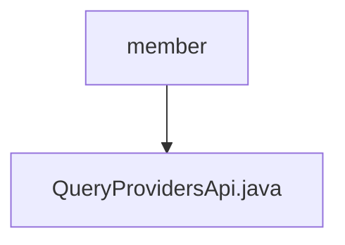

# Basic Information

|      |      |
|------|------|
| Name | member |
| Language | .java |
| Code Path | WeFe/board/board-service/src/main/java/com/welab/wefe/board/service/api/project/fusion/member |
| Package Name | docs.board.board-service.src.main.java.com.welab.wefe.board.service.api.project.fusion.member |
| Brief Description | API interface for querying project member list, which retrieves formal project member information by project ID and returns a list of output models. |

# Description

The code defines an API class named `QueryProvidersApi` for querying a list of project providers. The API path is `fusion/query/providers`, and its functionality is described as querying the provider list. This class inherits from `AbstractApi`, with the input type being the inner class `Input` and the output type being a list of `ProjectMemberOutputModel`. It retrieves formal project provider data via `ProjectMemberService` and maps the results to the output model. The `Input` class includes the required field `project_id` along with its getter and setter methods. The processing logic is encapsulated in the `handle` method, which returns results in the `ApiResult` format.

### Package Internal Structure View

This flowchart illustrates the hierarchical relationship within the project path, with the root node being the "member" folder, which contains a Java file "QueryProvidersApi.java". This is a simple single-level structure, indicating that the member directory contains only one specific API implementation file.

# File List

| Name   | Type  | Description |
|-------|------|-------------|
| [QueryProvidersApi.java](QueryProvidersApi.md) | file | API interface for querying project member list, which retrieves formal project member information by project ID and returns a list of output models. |

