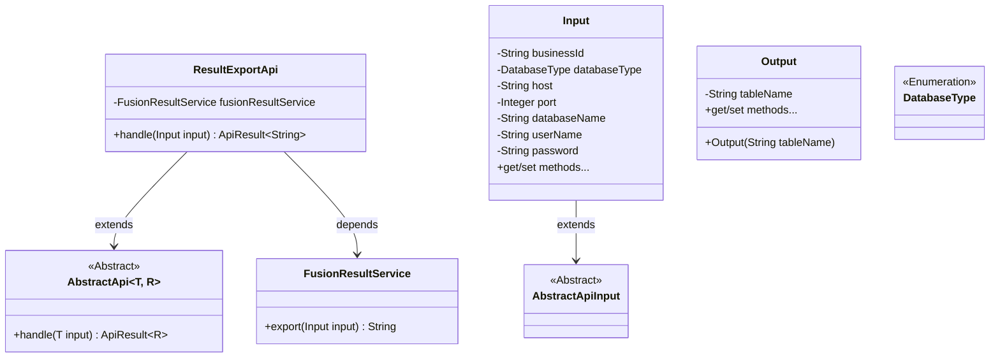

# Basic Information

|      |      |
|------|------|
| Name | ResultExportApi |
| Language | .java |
| Code Path | WeFe/board/board-service/src/main/java/com/welab/wefe/board/service/api/project/fusion/result/ResultExportApi.java |
| Package Name | com.welab.wefe.board.service.api.project.fusion.result |
| Dependencies | ['com.welab.wefe.board.service.service.fusion.FusionResultService', 'com.welab.wefe.common.fieldvalidate.annotation.Check', 'com.welab.wefe.common.jdbc.base.DatabaseType', 'com.welab.wefe.common.web.api.base.AbstractApi', 'com.welab.wefe.common.web.api.base.Api', 'com.welab.wefe.common.web.dto.AbstractApiInput', 'com.welab.wefe.common.web.dto.ApiResult', 'org.springframework.beans.factory.annotation.Autowired'] |
| Brief Description | Result Export API class, inherits from AbstractApi, processes input parameters such as businessId, database type, host, port, etc., and calls FusionResultService to export results. The output includes table names. |

# Description

The code defines an API class named ResultExportApi, which handles result export functionality. The API path is fusion/result/export, and it relies on FusionResultService to implement the export logic. The input parameter Input includes required fields businessId, databaseType, host, port, databaseName, as well as optional fields userName and password. All fields are validated by annotations to ensure they are non-null. The output is of string type, with the actual processing handled by the handle method calling fusionResultService.export. The Output class contains only a single tableName field. The overall structure follows an abstract API template, implementing a standardized input-output processing flow.

# Class Summary

| Name   | Type  | Description |
|-------|------|-------------|
| ResultExportApi | class | Result Export API class, handles database export requests, requires mandatory parameters such as businessId, database type, host, port, database name, etc., and returns table name results. |

## Class ResultExportApi

|      |      |
|------|------|
| Access Modifier | @Api(path = "fusion/result/export", name = "结果导出", desc = "结果导出");public |
| Type | class |
| Name | ResultExportApi |
| Description | Result Export API class, handles database export requests, requires mandatory parameters such as businessId, database type, host, port, database name, etc., and returns table name results. |

### UML Class Diagram

This code demonstrates the implementation structure of a result export API. ResultExportApi inherits from the generic abstract class AbstractApi, processes Input parameters, and returns string results. The Input class contains database connection fields and validation annotations, while the Output class simply encapsulates a table name. FusionResultService provides core export functionality, and DatabaseType is an enumeration type. The overall design reflects the principles of layering and dependency injection.

### Internal Method Call Graph

```mermaid
graph TD
    A["Class ResultExportApi"]
    B["Annotation: @Api"]
    C["Inheritance: AbstractApi<Input, String>"]
    D["Dependency Injection: @Autowired FusionResultService"]
    E["Overridden Method: handle(Input input)"]
    F["Inner Class Input"]
    G["Field: String businessId"]
    H["Field: DatabaseType databaseType"]
    I["Field: String host"]
    J["Field: Integer port"]
    K["Field: String databaseName"]
    L["Field: String userName"]
    M["Field: String password"]
    N["getter/setter methods"]
    O["Inner Class Output"]
    P["Field: String tableName"]
    Q["Constructor: Output(String tableName)"]
    R["getter/setter methods"]

    A --> B
    A --> C
    A --> D
    A --> E
    A --> F
    F --> G
    F --> H
    F --> I
    F --> J
    F --> K
    F --> L
    F --> M
    F --> N
    A --> O
    O --> P
    O --> Q
    O --> R
    E --> D
    E --> F
```

This code describes a result export API class ResultExportApi, which inherits from AbstractApi and implements the handle method. The class contains two inner classes: Input for encapsulating input parameters (including database connection information and business ID fields) and Output for encapsulating output results (table name). The flowchart illustrates the class structure, fields, method invocation relationships, and inner class composition, highlighting the input parameter validation and result export processing flow.

### Field List

| Name  | Type  | Description |
|-------|-------|------|
| fusionResultService | FusionResultService | Automatically inject the FusionResultService service instance. |

### Method List

| Name  | Type  | Description |
|-------|-------|------|
| handle | ApiResult<String> | Process the input and invoke the export service to return the result. |

