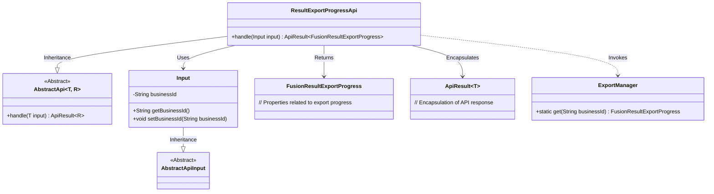

# Basic Information

|      |      |
|------|------|
| Name | ResultExportProgressApi |
| Language | .java |
| Code Path | WeFe/board/board-service/src/main/java/com/welab/wefe/board/service/api/project/fusion/result/ResultExportProgressApi.java |
| Package Name | com.welab.wefe.board.service.api.project.fusion.result |
| Dependencies | ['com.welab.wefe.board.service.dto.fusion.FusionResultExportProgress', 'com.welab.wefe.board.service.fusion.manager.ExportManager', 'com.welab.wefe.common.fieldvalidate.annotation.Check', 'com.welab.wefe.common.web.api.base.AbstractApi', 'com.welab.wefe.common.web.api.base.Api', 'com.welab.wefe.common.web.dto.AbstractApiInput', 'com.welab.wefe.common.web.dto.ApiResult'] |
| Brief Description | The Java class ResultExportProgressApi is used to handle result export progress queries, accepting the businessId parameter and returning export progress information. |

# Description

The code defines an API class named `ResultExportProgressApi`, which handles result export progress queries. The API path is `fusion/result/export_progress`, and its name is "Result Export". This class inherits from `AbstractApi`, accepts input parameters of type `Input`, and returns results of type `FusionResultExportProgress`. The `Input` class includes a required field `businessId` to specify the operation's business ID. The processing logic invokes the `ExportManager.get` method to retrieve export progress information based on the input `businessId` and returns a successful result.

# Class Summary

| Name   | Type  | Description |
|-------|------|-------------|
| ResultExportProgressApi | class | The Java class ResultExportProgressApi is used to handle result export progress queries, receiving the businessId parameter and returning export progress information. |

## Class ResultExportProgressApi

|      |      |
|------|------|
| Access Modifier | @Api(path = "fusion/result/export_progress", name = "结果导出", desc = "结果导出");public |
| Type | class |
| Name | ResultExportProgressApi |
| Description | The Java class ResultExportProgressApi is used to handle result export progress queries, receiving the businessId parameter and returning export progress information. |

### UML Class Diagram

Class diagram description: This diagram illustrates the class structure of a result export API. The core class ResultExportProgressApi inherits from the generic abstract class AbstractApi, processes Input parameters, and returns results of type FusionResultExportProgress. The Input class inherits from AbstractApiInput and contains a business ID field. ExportManager provides static methods to retrieve export progress. The design follows a layered architecture, encapsulating response data through ApiResult, adhering to interface segregation and dependency inversion principles.

### Internal Method Call Graph

```mermaid
graph TD
    A["Class ResultExportProgressApi"]
    B["Parent Class: AbstractApi<Input, FusionResultExportProgress>"]
    C["Annotation: @Api(path='fusion/result/export_progress', name='Result Export', desc='Result Export')"]
    D["Method: handle(Input input)"]
    E["Invocation: ExportManager.get(input.getBusinessId())"]
    F["Return: ApiResult<FusionResultExportProgress>"]
    G["Nested Class Input"]
    H["Parent Class: AbstractApiInput"]
    I["Field: String businessId"]
    J["Method: getBusinessId()"]
    K["Method: setBusinessId(String businessId)"]
    L["Annotation: @Check(name='Operation businessId', require=true)"]

    A --> B
    A --> C
    A --> D
    D --> E
    E --> F
    A --> G
    G --> H
    G --> I
    G --> J
    G --> K
    I --> L
```

This code describes an API class named ResultExportProgressApi, which inherits from AbstractApi and is used to handle result export progress queries. The core functionality involves invoking ExportManager through the handle method to retrieve the export progress for a specified businessId. The nested Input class defines the required businessId parameter with its getter/setter methods, annotated with parameter validation. The flowchart clearly illustrates the class inheritance relationships, method call chains, and parameter validation logic.

### Field List

| Name  | Type  | Description |
|-------|-------|------|

### Method List

| Name  | Type  | Description |
|-------|-------|------|
| handle | ApiResult<FusionResultExportProgress> | Java method override, invoke ExportManager to obtain the export progress corresponding to the business ID and return a successful result. |

