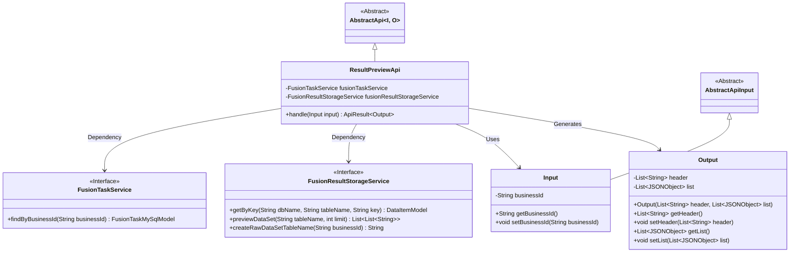
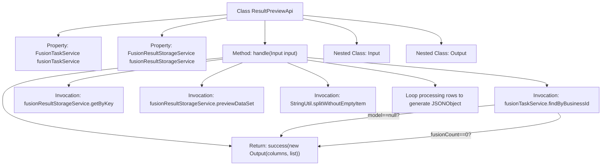
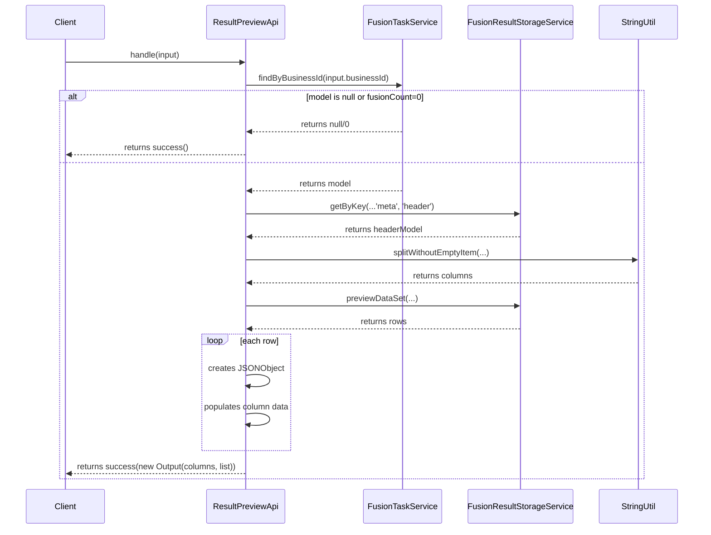

# Basic Information

|      |      |
|------|------|
| Name | ResultPreviewApi |
| Language | .java |
| Code Path | WeFe/board/board-service/src/main/java/com/welab/wefe/board/service/api/project/fusion/result/ResultPreviewApi.java |
| Package Name | com.welab.wefe.board.service.api.project.fusion.result |
| Dependencies | ['com.alibaba.fastjson.JSONObject', 'com.welab.wefe.board.service.database.entity.fusion.FusionTaskMySqlModel', 'com.welab.wefe.board.service.service.fusion.FusionResultStorageService', 'com.welab.wefe.board.service.service.fusion.FusionTaskService', 'com.welab.wefe.common.data.storage.common.Constant', 'com.welab.wefe.common.data.storage.model.DataItemModel', 'com.welab.wefe.common.fieldvalidate.annotation.Check', 'com.welab.wefe.common.util.StringUtil', 'com.welab.wefe.common.web.api.base.AbstractApi', 'com.welab.wefe.common.web.api.base.Api', 'com.welab.wefe.common.web.dto.AbstractApiInput', 'com.welab.wefe.common.web.dto.ApiResult', 'org.springframework.beans.factory.annotation.Autowired', 'java.util.ArrayList', 'java.util.List'] |
| Brief Description | Result Preview API class, which processes business ID input, queries the task model and data table headers, and returns a preview of the first 10 rows of data, including column names and row data lists. |

# Description

The code defines an API class named `ResultPreviewApi` for handling result preview requests. The API path is `fusion/result/preview`, and its name is "Result Preview." The class inherits from `AbstractApi` and uses `Input` and `Output` as its input and output types. The core logic is implemented in the `handle` method: first, it queries the `FusionTaskMySqlModel` using `businessId`. If the record does not exist or `fusionCount` is 0, it returns an empty result. Otherwise, it retrieves the data table header information and the first 10 rows of data from the storage service, then assembles the data into a list of JSON objects by column names and returns it. The `Input` class includes a required field `businessId`, while the `Output` class contains two properties: the table header and the data list.

# Class Summary

| Name   | Type  | Description |
|-------|------|-------------|
| ResultPreviewApi | class | Preview Results API class, which queries task data by businessId, retrieves the header and the first 10 rows of data, and returns column names and a data list in JSON format. |

## Class ResultPreviewApi

|      |      |
|------|------|
| Access Modifier | @Api(path = "fusion/result/preview", name = "结果预览", desc = "结果预览");public |
| Type | class |
| Name | ResultPreviewApi |
| Description | Preview Results API class, which queries task data by businessId, retrieves the header and the first 10 rows of data, and returns column names and a data list in JSON format. |

### UML Class Diagram

This code describes the implementation of a result preview API, which inherits from an abstract API base class and processes data by interacting with two service classes through dependency injection. It mainly includes an input parameter class, an output result class, and interactions with two service interfaces. The input class contains a business ID field, while the output class includes table headers and a data list. The workflow involves querying task information via the business ID, retrieving the dataset headers and preview data, and finally encapsulating the results in JSON format for return.

### Internal Method Call Graph

This flowchart illustrates the structure of the ResultPreviewApi class and its key method invocation relationships, with a focus on the processing flow of the handle method. The sequence diagram details the complete call chain from client request to final response, including conditional branching and data transformation processes. The core logic involves querying task information by business ID, retrieving data table header information, previewing the dataset, and encapsulating results in JSON format. The entire process consists of multiple service invocations and data transformation steps, ultimately generating structured output containing headers and row data.

### Field List

| Name  | Type  | Description |
|-------|-------|------|
| fusionResultStorageService | FusionResultStorageService | Automatically inject the FusionResultStorageService service instance. |
| fusionTaskService | FusionTaskService | Automatically inject the FusionTaskService instance. |

### Method List

| Name  | Type  | Description |
|-------|-------|------|
| handle | ApiResult<ResultPreviewApi.Output> | Handle business ID queries. If the model does not exist or the fusion count is 0, return success; otherwise, retrieve the dataset headers and data rows, assemble them into a list of JSON objects, and return the result. |

