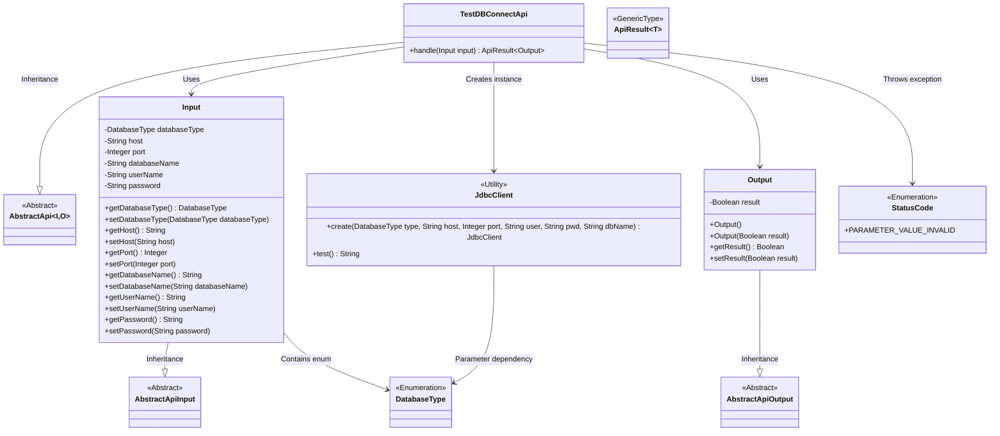

# Basic Information

|      |      |
|------|------|
| Name | TestDBConnectApi |
| Language | .java |
| Code Path | WeFe/board/board-service/src/main/java/com/welab/wefe/board/service/api/project/fusion/result/TestDBConnectApi.java |
| Package Name | com.welab.wefe.board.service.api.project.fusion.result |
| Dependencies | ['com.welab.wefe.common.StatusCode', 'com.welab.wefe.common.fieldvalidate.annotation.Check', 'com.welab.wefe.common.jdbc.JdbcClient', 'com.welab.wefe.common.jdbc.base.DatabaseType', 'com.welab.wefe.common.web.api.base.AbstractApi', 'com.welab.wefe.common.web.api.base.Api', 'com.welab.wefe.common.web.dto.AbstractApiInput', 'com.welab.wefe.common.web.dto.AbstractApiOutput', 'com.welab.wefe.common.web.dto.ApiResult'] |
| Brief Description | API class for testing database connections, which accepts parameters such as database type, host, port, etc., verifies the connection, and returns the result. |

# Description

This API class is designed for testing database connections, with the path "fusion/test_db_connect". It inherits from AbstractApi, and its input parameters include database type, host, port, database name, username, and password, with the first four being mandatory. The processing logic involves creating a connection and testing it via JdbcClient, throwing an exception upon failure. Upon success, it returns an output containing a boolean result of true. Both the input and output classes inherit from an abstract base class and include corresponding getter and setter methods.

# Class Summary

| Name   | Type  | Description |
|-------|------|-------------|
| TestDBConnectApi | class | API class for testing database connections, which accepts parameters such as database type, host, port, etc., verifies the connection, and returns the result. |

## Class TestDBConnectApi

|      |      |
|------|------|
| Access Modifier | @Api(path = "fusion/test_db_connect", name = "测试数据库连接", desc = "测试数据库连接");public |
| Type | class |
| Name | TestDBConnectApi |
| Description | API class for testing database connections, which accepts parameters such as database type, host, port, etc., verifies the connection, and returns the result. |

### UML Class Diagram

This code implements a database connection testing API, which processes input/output by inheriting the generic abstract class AbstractApi. The core class TestDBConnectApi contains nested Input/Output classes, where the Input class validates connection parameters via JdbcClient and Output returns test results. The class diagram illustrates inheritance relationships, enum dependencies for parameter validation, and invocation chains of the database client utility class, reflecting layered design and parameter validation mechanisms.

### Internal Method Call Graph

```mermaid
graph TD
    A["TestDBConnectApi class"]
    B["Inheritance: AbstractApi<Input, Output>"]
    C["Annotation: @Api"]
    D["Method: handle(Input input)"]
    E["Create: JdbcClient.create()"]
    F["Invoke: client.test()"]
    G["Condition: message != null"]
    H["Throw exception: StatusCode.PARAMETER_VALUE_INVALID"]
    I["Create: Output object"]
    J["Set: output.setResult(true)"]
    K["Return: success(output)"]
    L["Inner class: Input"]
    M["Inheritance: AbstractApiInput"]
    N["Fields: databaseType, host, port etc."]
    O["Methods: getter/setter"]
    P["Inner class: Output"]
    Q["Inheritance: AbstractApiOutput"]
    R["Field: result"]
    S["Methods: getter/setter"]

    A --> B
    A --> C
    A --> D
    D --> E
    E --> F
    F --> G
    G -->|Yes| H
    G -->|No| I
    I --> J
    J --> K
    A --> L
    L --> M
    L --> N
    L --> O
    A --> P
    P --> Q
    P --> R
    P --> S
```

The flowchart describes the structure and processing flow of the TestDBConnectApi class. This class inherits from AbstractApi and contains a handle method for testing database connections. It first creates a JdbcClient instance and tests the connection. If it fails, an exception is thrown; if successful, the output result is set and returned. It includes two inner classes, Input and Output, which inherit from AbstractApiInput and AbstractApiOutput respectively, used to encapsulate input parameters and output results. The process clearly shows the complete processing chain from parameter validation to result return.

### Field List

| Name  | Type  | Description |
|-------|-------|------|

### Method List

| Name  | Type  | Description |
|-------|-------|------|
| handle | ApiResult<TestDBConnectApi.Output> | This method handles database connection testing by creating a JDBC client and testing the connection, throwing an exception if it fails, and returning the connection result upon success. |

