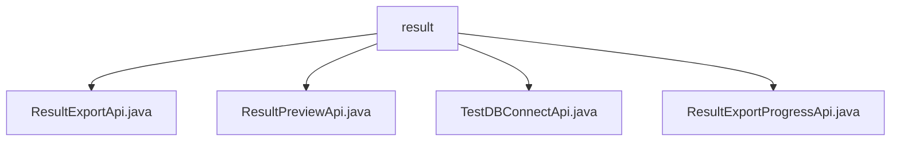

# Basic Information

|      |      |
|------|------|
| Name | result |
| Language | .java |
| Code Path | WeFe/board/board-service/src/main/java/com/welab/wefe/board/service/api/project/fusion/result |
| Package Name | docs.board.board-service.src.main.java.com.welab.wefe.board.service.api.project.fusion.result |
| Brief Description | ResultExportApi handles result export with the path `fusion/result/export`, requiring inputs including mandatory fields such as `businessId`. ResultPreviewApi manages preview functionality with the path `fusion/result/preview`, returning table headers and data. TestDBConnectApi tests database connectivity with the path `fusion/test_db_connect`. ResultExportProgressApi queries export progress with the path `fusion/result/export_progress`. |

# Description

## Overview  
The core responsibility of this module is to provide full lifecycle management of data fusion results, including result preview, export, and progress tracking, resembling a lightweight implementation of ETL tools. The interface specifications uniformly adopt the RESTful style, with a path prefix of `fusion/result/`. Both input and output inherit from abstract base classes, and mandatory fields are ensured through validation annotations. Key data structures include the Input class containing `businessId`, the Output class for table header data, and the export progress object. External dependencies involve FusionResultService, JdbcClient, and storage services. For example, ResultExportApi implements data export via `fusionResultService.export`, while TestDBConnectApi relies on JdbcClient to validate database connections.  

## Key Business Scenarios  
The module supports typical data fusion result processing workflows: first previewing data (e.g., ResultPreviewApi retrieves table headers and samples), then triggering exports (e.g., ResultExportApi) and querying progress (e.g., ResultExportProgressApi). The interaction model follows a request-response pattern, with integration cases including database connection testing (TestDBConnectApi) and phased result retrieval. For instance, the preview phase validates the `businessId`, while the export phase manages asynchronous tasks via ExportManager, forming an end-to-end solution. All APIs employ standardized exception handling to ensure process integrity.

### Package Internal Structure View

This flowchart illustrates the hierarchical relationships within the project path, with the root node being the "result" folder, which contains four Java files: ResultExportApi, ResultPreviewApi, TestDBConnectApi, and ResultExportProgressApi. All files are directly located under the result directory without deeper nested structures, clearly presenting the organization of API files in this module.

# File List

| Name   | Type  | Description |
|-------|------|-------------|
| [ResultExportApi.java](ResultExportApi.md) | file | The Result Export API class, inheriting from AbstractApi, processes input parameters such as businessId, database type, host, port, etc., and invokes FusionResultService to export the results. The output includes table names. |
| [ResultPreviewApi.java](ResultPreviewApi.md) | file | Result Preview API class, processes business ID input, queries task models and data table headers, and returns a preview of the first 10 rows of data, including column names and row data lists. |
| [TestDBConnectApi.java](TestDBConnectApi.md) | file | API class for testing database connection, which receives parameters such as database type, host, port, etc., verifies the connection and returns the result. |
| [ResultExportProgressApi.java](ResultExportProgressApi.md) | file | The Java class `ResultExportProgressApi` is used to handle result export progress queries, accepting the `businessId` parameter and returning export progress information. |

