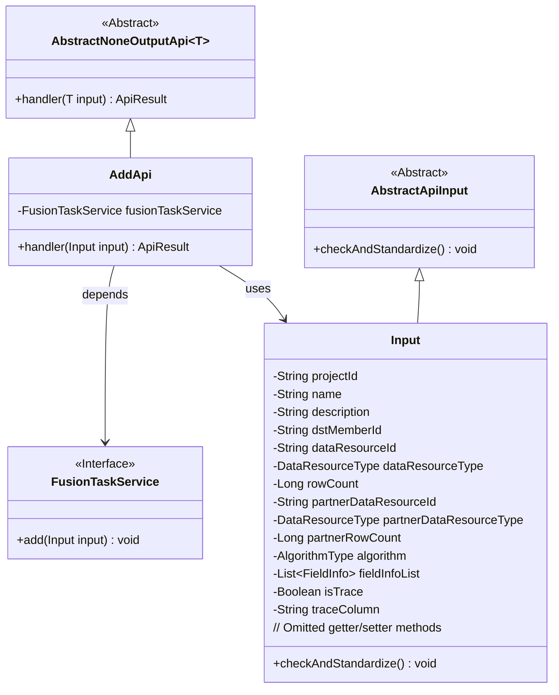
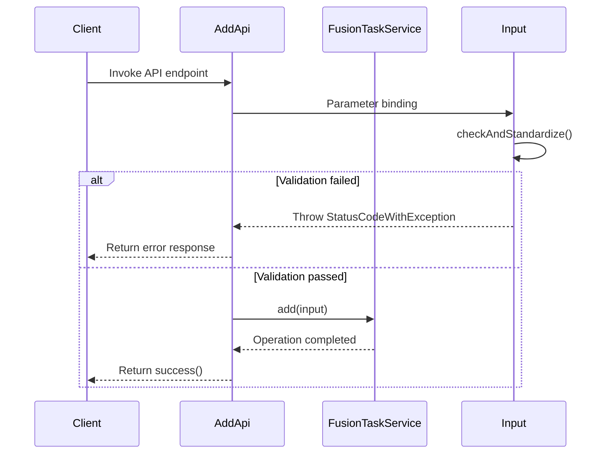

# Basic Information

|      |      |
|------|------|
| Name | AddApi |
| Language | .java |
| Code Path | WeFe/board/board-service/src/main/java/com/welab/wefe/board/service/api/project/fusion/task/AddApi.java |
| Package Name | com.welab.wefe.board.service.api.project.fusion.task |
| Dependencies | ['com.welab.wefe.board.service.service.fusion.FusionTaskService', 'com.welab.wefe.board.service.util.primarykey.FieldInfo', 'com.welab.wefe.common.StatusCode', 'com.welab.wefe.common.exception.StatusCodeWithException', 'com.welab.wefe.common.fieldvalidate.annotation.Check', 'com.welab.wefe.common.util.StringUtil', 'com.welab.wefe.common.web.api.base.AbstractNoneOutputApi', 'com.welab.wefe.common.web.api.base.Api', 'com.welab.wefe.common.web.dto.AbstractApiInput', 'com.welab.wefe.common.web.dto.ApiResult', 'com.welab.wefe.common.wefe.enums.DataResourceType', 'com.welab.wefe.fusion.core.enums.AlgorithmType', 'org.apache.commons.collections4.CollectionUtils', 'org.springframework.beans.factory.annotation.Autowired', 'java.util.List'] |
| Brief Description | Add an API interface for alignment tasks, including mandatory fields such as project ID, task name, partner ID, data resource information, and algorithm type. It supports primary key processing and traceability functions, with input parameter validation. |

# Description

The code defines an API class named `AddApi`, which is used to add alignment tasks. The API path is `fusion/task/add`, and its name is "Add Alignment Task". The class inherits from `AbstractNoneOutputApi`, with the input parameter being the inner class `Input`. The `Input` class includes multiple required and optional fields, such as project ID, task name, description, partner ID, data resource information, algorithm type, etc., and performs validation and standardization on these fields. The validation logic includes non-null checks, length constraints, and checks for compatibility between algorithm types and resource types. The processing logic completes the task addition by invoking the `add` method of `FusionTaskService`.

# Class Summary

| Name   | Type  | Description |
|-------|------|-------------|
| AddApi | class | Add an API interface for alignment tasks, including required fields such as project ID, task name, description, partner ID, data resource information, algorithm type, etc., and perform parameter validation and standardization processing. |

## Class AddApi

|      |      |
|------|------|
| Access Modifier | @Api(path = "fusion/task/add", name = "添加对齐任务", desc = "添加对齐任务");public |
| Type | class |
| Name | AddApi |
| Description | Add an API interface for alignment tasks, including required fields such as project ID, task name, description, partner ID, data resource information, algorithm type, etc., and perform parameter validation and standardization processing. |

### UML Class Diagram

This code describes an API implementation for adding alignment tasks. AddApi inherits from AbstractNoneOutputApi, processes input parameters of type Input, and executes the actual task addition operation through the FusionTaskService. The Input class contains comprehensive field validation logic, covering business parameters such as project ID, task name, data resource type, algorithm selection, etc., and implements parameter standardization and business rule validation through the checkAndStandardize method. The overall design reflects a clear hierarchical structure, where abstract base classes provide generic capabilities, and concrete implementation classes handle specific business logic.

### Internal Method Call Graph

```mermaid
graph TD
    A["Class AddApi"]
    B["Inheritance: AbstractNoneOutputApi<Input>"]
    C["Annotation: @Api"]
    D["Dependency Injection: @Autowired FusionTaskService"]
    E["Overridden Method: handler(Input input)"]
    F["Inner Class: Input"]
    G["Input Validation: checkAndStandardize()"]
    H["Field Validation: @Check annotated fields"]
    I["Business Logic Validation: Algorithm/trace field rules"]
    J["Getter/Setter Methods"]

    A --> B
    A --> C
    A --> D
    A --> E
    A --> F
    F --> G
    F --> H
    G --> I
    F --> J
```

This code implements an API endpoint for adding alignment tasks, primarily consisting of two core processes: parameter validation and business processing. The Input inner class implements multi-layer parameter validation through @Check annotations and custom validation methods, including field mandatory checks, format regex, and business rules (such as algorithm compatibility verification). The class diagram illustrates the hierarchical relationship of class structure and validation logic, while the sequence diagram depicts the complete interaction flow from client invocation to service processing, particularly highlighting the branching logic of parameter validation.

### Field List

| Name  | Type  | Description |
|-------|-------|------|
| fusionTaskService | FusionTaskService | Automatically inject the FusionTaskService service instance. |

### Method List

| Name  | Type  | Description |
|-------|-------|------|
| handler | ApiResult | Override method to process input, invoke service to add task, and return result upon success. |

