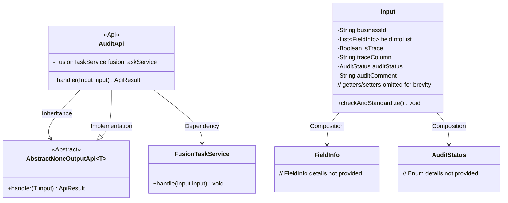

# Basic Information

|      |      |
|------|------|
| Name | AuditApi |
| Language | .java |
| Code Path | WeFe/board/board-service/src/main/java/com/welab/wefe/board/service/api/project/fusion/task/AuditApi.java |
| Package Name | com.welab.wefe.board.service.api.project.fusion.task |
| Dependencies | ['com.welab.wefe.board.service.service.fusion.FusionTaskService', 'com.welab.wefe.board.service.util.primarykey.FieldInfo', 'com.welab.wefe.common.StatusCode', 'com.welab.wefe.common.exception.StatusCodeWithException', 'com.welab.wefe.common.fieldvalidate.annotation.Check', 'com.welab.wefe.common.util.StringUtil', 'com.welab.wefe.common.web.api.base.AbstractNoneOutputApi', 'com.welab.wefe.common.web.api.base.Api', 'com.welab.wefe.common.web.dto.AbstractApiInput', 'com.welab.wefe.common.web.dto.ApiResult', 'com.welab.wefe.common.wefe.enums.AuditStatus', 'org.springframework.beans.factory.annotation.Autowired', 'java.util.List'] |
| Brief Description | The AuditApi class handles task auditing, including mandatory fields such as businessId and auditStatus, as well as optional fields like traceColumn and auditComment. The input parameter validation logic ensures that required fields are not empty. |

# Description

The code defines a task processing API class named `AuditApi`, which inherits from `AbstractNoneOutputApi` with the path `fusion/task/audit`. The class injects `FusionTaskService` to handle tasks. The input parameter class `Input` includes fields such as `businessId`, `fieldInfoList`, `isTrace`, `traceColumn`, `auditStatus`, and `auditComment`, with non-null validation applied. When `isTrace` is `true`, `traceColumn` cannot be empty. Getter and setter methods are provided for each field. The `handler` method invokes `fusionTaskService` to process the input and returns a successful result.

# Class Summary

| Name   | Type  | Description |
|-------|------|-------------|
| AuditApi | class | Task Processing API, which receives inputs containing parameters such as business ID, primary key, traceability field, and approval status, invokes the service to process the task and returns the result. Input parameters must be validated for non-nullity and legality. |

## Class AuditApi

|      |      |
|------|------|
| Access Modifier | @Api(path = "fusion/task/audit", name = "任务处理", desc = "任务处理");public |
| Type | class |
| Name | AuditApi |
| Description | Task Processing API, which receives inputs containing parameters such as business ID, primary key, traceability field, and approval status, invokes the service to process the task and returns the result. Input parameters must be validated for non-nullity and legality. |

### UML Class Diagram

Class Diagram Description: This diagram illustrates the core structure of the Audit API. The AuditApi inherits from the generic abstract class AbstractNoneOutputApi<Input> and relies on FusionTaskService for task processing. The Input class contains multiple validation fields and business parameters as internal components, maintaining associations with FieldInfo and AuditStatus. The overall design demonstrates the separation of parameter validation from business processing, implementing the template method pattern through inheritance.

### Internal Method Call Graph

```mermaid
graph TD
    A["Class AuditApi"]
    B["Annotation: @Api"]
    C["Inheritance: AbstractNoneOutputApi<Input>"]
    D["Dependency Injection: @Autowired FusionTaskService"]
    E["Overridden Method: handler(Input input)"]
    F["Inner Class: Input"]
    G["Property: String businessId"]
    H["Property: List<FieldInfo> fieldInfoList"]
    I["Property: Boolean isTrace"]
    J["Property: String traceColumn"]
    K["Property: AuditStatus auditStatus"]
    L["Property: String auditComment"]
    M["Method: checkAndStandardize()"]
    N["getter/setter methods"]

    A --> B
    A --> C
    A --> D
    A --> E
    A --> F
    F --> G
    F --> H
    F --> I
    F --> J
    F --> K
    F --> L
    F --> M
    F --> N
    E --> D["Calls fusionTaskService.handle(input)"]
    E --> A["Returns success()"]
    M -->|Condition Check| F
    M -->|Throws Exception| F["StatusCodeWithException"]
```

This code describes the implementation of a task audit API, including the main class AuditApi and its inner input parameter class Input. The flowchart illustrates the class structure relationships, where AuditApi defines the API path through annotations, inherits from an abstract parent class, and injects service dependencies. The core processing logic resides in the handler method that invokes the service layer. The Input class contains multiple properties with validation annotations and a parameter standardization method, throwing specific exceptions when parameters fail validation. The overall design reflects an architectural philosophy of separating parameter validation from business logic.

### Field List

| Name  | Type  | Description |
|-------|-------|------|
| fusionTaskService | FusionTaskService | Automatically inject the FusionTaskService service instance. |

### Method List

| Name  | Type  | Description |
|-------|-------|------|
| handler | ApiResult | Java method override, calling fusionTaskService to process the input and return a successful result. |

