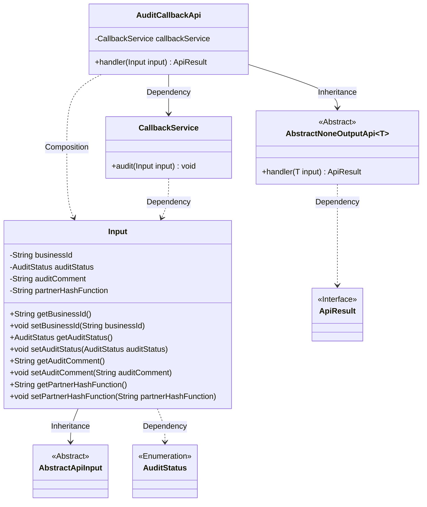
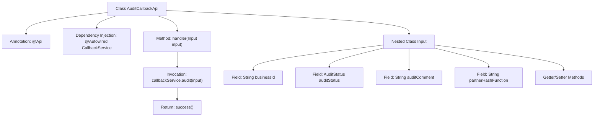

# Basic Information

|      |      |
|------|------|
| Name | AuditCallbackApi |
| Language | .java |
| Code Path | WeFe/board/board-service/src/main/java/com/welab/wefe/board/service/api/project/fusion/task/AuditCallbackApi.java |
| Package Name | com.welab.wefe.board.service.api.project.fusion.task |
| Dependencies | ['com.welab.wefe.board.service.service.fusion.CallbackService', 'com.welab.wefe.common.exception.StatusCodeWithException', 'com.welab.wefe.common.fieldvalidate.annotation.Check', 'com.welab.wefe.common.web.api.base.AbstractNoneOutputApi', 'com.welab.wefe.common.web.api.base.Api', 'com.welab.wefe.common.web.dto.AbstractApiInput', 'com.welab.wefe.common.web.dto.ApiResult', 'com.welab.wefe.common.wefe.enums.AuditStatus', 'org.springframework.beans.factory.annotation.Autowired'] |
| Brief Description | Audit callback interface, which receives inputs including business ID, audit status, comments, and hash function, processes the service call, and returns a successful result. |

# Description

The code defines an API class named `AuditCallbackApi` for receiving audit callback messages. The API path is `fusion/audit/callback` and allows access with a signature. The class inherits from `AbstractNoneOutputApi`, with the generic parameter being the inner class `Input`. The `Input` class contains four fields: the required `businessId` and `auditStatus`, and the optional `auditComment` and `partnerHashFunction`, all validated via annotations. The `handler` method invokes the `audit` method of `callbackService` to process the input and returns a successful result. The entire API is designed to handle callback requests for audit status changes and related information.

# Class Summary

| Name   | Type  | Description |
|-------|------|-------------|
| AuditCallbackApi | class | The API interface for receiving audit callbacks requires passing parameters such as businessId and auditStatus, and invokes the callbackService to process the audit result. |

## Class AuditCallbackApi

|      |      |
|------|------|
| Access Modifier | @Api(path = "fusion/audit/callback", name = "接收消息接口", allowAccessWithSign = true);public |
| Type | class |
| Name | AuditCallbackApi |
| Description | The API interface for receiving audit callbacks requires passing parameters such as businessId and auditStatus, and invokes the callbackService to process the audit result. |

### UML Class Diagram

This code illustrates the implementation structure of an audit callback API. The AuditCallbackApi inherits from the generic class AbstractNoneOutputApi, processes Input-type data, and executes audit operations via CallbackService. The Input class contains fields such as business ID, audit status, comments, etc., and inherits from AbstractApiInput. The class diagram clearly presents inheritance, dependency, and composition relationships, reflecting the core workflow and data structure of API request processing.

### Internal Method Call Graph

This code demonstrates an audit callback API implementation, consisting of the main class AuditCallbackApi and a nested input class Input. The main class defines the interface path via @Api annotation, injects CallbackService to handle core business logic, and processes input parameters through the handler method before invoking the service layer and returning a success result. The Input class declares four fields with validation annotations and corresponding access methods, encapsulating audit-related information including business ID, status, comments, and hash function. The flowchart clearly presents the class structure, dependencies, and method invocation chain.

### Field List

| Name  | Type  | Description |
|-------|-------|------|
| callbackService | CallbackService | Automatically inject callback service instances. |

### Method List

| Name  | Type  | Description |
|-------|-------|------|
| handler | ApiResult | This method overrides the parent class handler, accepts an Input parameter, invokes the audit method of callbackService for review, and returns an ApiResult upon success. It throws a StatusCodeWithException in case of exceptions. |

