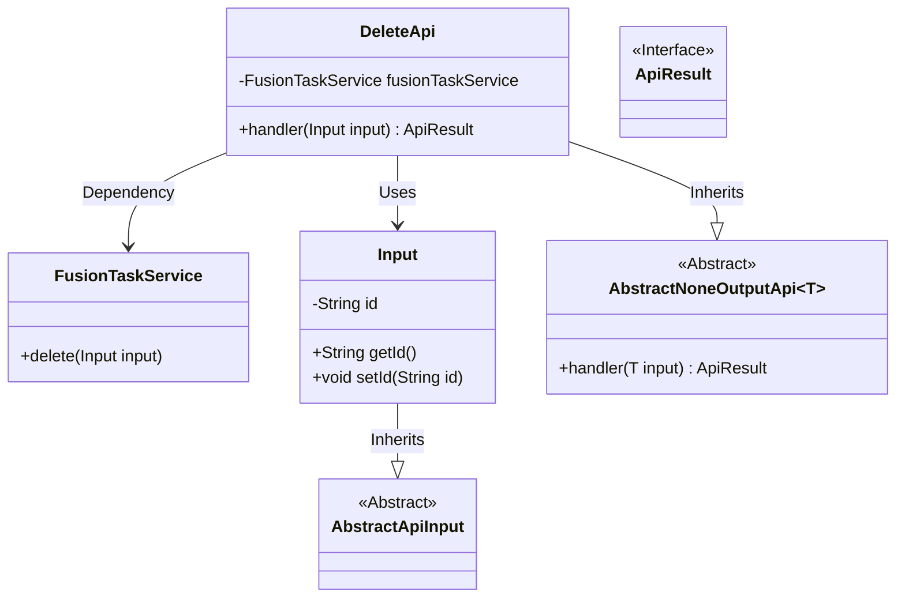
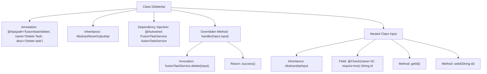

# Basic Information

|      |      |
|------|------|
| Name | DeleteApi |
| Language | .java |
| Code Path | WeFe/board/board-service/src/main/java/com/welab/wefe/board/service/api/project/fusion/task/DeleteApi.java |
| Package Name | com.welab.wefe.board.service.api.project.fusion.task |
| Dependencies | ['com.welab.wefe.board.service.service.fusion.FusionTaskService', 'com.welab.wefe.common.exception.StatusCodeWithException', 'com.welab.wefe.common.fieldvalidate.annotation.Check', 'com.welab.wefe.common.web.api.base.AbstractNoneOutputApi', 'com.welab.wefe.common.web.api.base.Api', 'com.welab.wefe.common.web.dto.AbstractApiInput', 'com.welab.wefe.common.web.dto.ApiResult', 'org.springframework.beans.factory.annotation.Autowired'] |
| Brief Description | Delete Task API, which receives the task ID parameter, invokes the FusionTaskService to perform the deletion operation, and returns a successful result. |

# Description

This is a Java class named DeleteApi, designed to implement an API interface for deleting tasks. The class extends AbstractNoneOutputApi, with its generic parameter being the inner class Input. The API path is fusion/task/delete, and its name is "Delete Task." The class injects the FusionTaskService and completes the deletion operation by calling the service's delete function through the handler method. The Input inner class extends AbstractApiInput and includes a mandatory field id along with its getter/setter methods. Upon successful execution, this API returns an empty result.

# Class Summary

| Name   | Type  | Description |
|-------|------|-------------|
| DeleteApi | class | Delete Task API, which accepts a task ID parameter, invokes the service to delete the task, and returns a success result. |

## Class DeleteApi

|      |      |
|------|------|
| Access Modifier | @Api(path = "fusion/task/delete", name = "删除任务", desc = "删除任务");public |
| Type | class |
| Name | DeleteApi |
| Description | Delete Task API, which accepts a task ID parameter, invokes the service to delete the task, and returns a success result. |

### UML Class Diagram

This code demonstrates the implementation class DeleteApi for a task deletion API, which inherits from the generic abstract class AbstractNoneOutputApi and processes input parameters of type Input. DeleteApi executes the actual deletion operation through the injected FusionTaskService. The Input class inherits from AbstractApiInput and contains a mandatory id field. The overall structure reflects clear hierarchical relationships, with DeleteApi serving as the core class coordinating service invocation and input validation, ultimately returning results of the ApiResult interface type.

### Internal Method Call Graph

This code defines a task deletion API class DeleteApi, which inherits from the abstract class AbstractNoneOutputApi and performs deletion operations through the injected FusionTaskService. It includes a nested input class Input for validating the mandatory parameter id. The flowchart illustrates the class structure, annotations, inheritance relationships, method invocations, and input parameter validation logic, comprehensively presenting the API workflow from request processing to business invocation.

### Field List

| Name  | Type  | Description |
|-------|-------|------|
| fusionTaskService | FusionTaskService | Automatically inject the FusionTaskService service instance. |

### Method List

| Name  | Type  | Description |
|-------|-------|------|
| handler | ApiResult | The method processes the input and invokes the service to delete the task, returning the result upon successful completion. |

