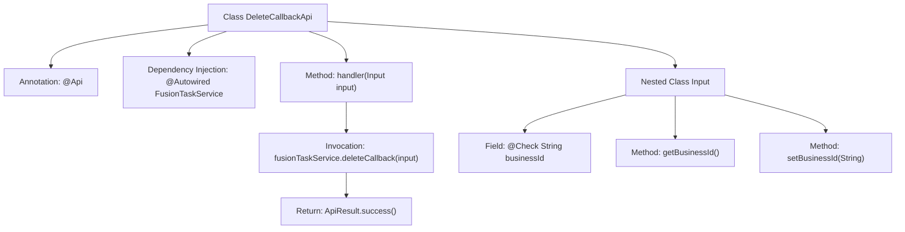

# Basic Information

|      |      |
|------|------|
| Name | DeleteCallbackApi |
| Language | .java |
| Code Path | WeFe/board/board-service/src/main/java/com/welab/wefe/board/service/api/project/fusion/task/DeleteCallbackApi.java |
| Package Name | com.welab.wefe.board.service.api.project.fusion.task |
| Dependencies | ['com.welab.wefe.board.service.service.fusion.FusionTaskService', 'com.welab.wefe.common.exception.StatusCodeWithException', 'com.welab.wefe.common.fieldvalidate.annotation.Check', 'com.welab.wefe.common.web.api.base.AbstractNoneOutputApi', 'com.welab.wefe.common.web.api.base.Api', 'com.welab.wefe.common.web.dto.AbstractApiInput', 'com.welab.wefe.common.web.dto.ApiResult', 'org.springframework.beans.factory.annotation.Autowired'] |
| Brief Description | This is an API class designed to handle delete requests, with the path "task/delete_callback". It requires the mandatory parameter businessId, invokes the fusionTaskService to process the delete callback, and returns a successful result. |

# Description

This is an API class named DeleteCallbackApi, designed to handle delete requests. It inherits from AbstractNoneOutputApi with a generic parameter of the inner class Input. The API path is `task/delete_callback` and allows signed access. Its primary function is to process delete callbacks through the injected FusionTaskService. The input parameter Input includes a required field `businessId`. Upon successful processing, it returns an empty result. The entire class encapsulates the business logic for delete callbacks.

# Class Summary

| Name   | Type  | Description |
|-------|------|-------------|
| DeleteCallbackApi | class | This is an API class for handling delete requests, with the path "task/delete_callback", requiring signature-based access. It accepts input containing the necessary parameter businessId, invokes fusionTaskService to process the delete callback, and returns a successful result. |


## Class DeleteCallbackApi

|      |      |
|------|------|
| Access Modifier | @Api(path = "task/delete_callback", name = "接收删除请求", desc = "接收删除请求", allowAccessWithSign = true);public |
| Type | class |
| Name | DeleteCallbackApi |
| Description | This is an API class for handling delete requests, with the path "task/delete_callback", requiring signature-based access. It accepts input containing the necessary parameter businessId, invokes fusionTaskService to process the delete callback, and returns a successful result. |


### UML Class Diagram

```mermaid
classDiagram
    class DeleteCallbackApi {
        -FusionTaskService fusionTaskService
        +handler(DeleteCallbackApi~Input~ input) ApiResult
    }
    DeleteCallbackApi --> FusionTaskService : Dependency
    DeleteCallbackApi ..|> AbstractNoneOutputApi~DeleteCallbackApi~Input~~ : Implements

    class AbstractNoneOutputApi~T~ {
        <<Abstract>>
        +handler(T input) ApiResult
    }

    class FusionTaskService {
        <<Service>>
        +deleteCallback(DeleteCallbackApi~Input~ input)
    }

    class DeleteCallbackApi~Input~ {
        -String businessId
        +String getBusinessId()
        +void setBusinessId(String businessId)
    }
    DeleteCallbackApi~Input~ --|> AbstractApiInput : Extends

    class AbstractApiInput {
        <<Abstract>>
    }
```

This code describes a class structure for an API that handles delete callback requests. The DeleteCallbackApi inherits from AbstractNoneOutputApi, using generics to specify the input type as its inner class Input. The Input class extends AbstractApiInput and contains the businessId field with getter/setter methods. The API processes business logic through the injected FusionTaskService to implement the delete callback functionality. The class diagram clearly illustrates inheritance relationships, dependencies, and the use of generic parameters, reflecting a Spring-style API controller design pattern.


### Internal Method Call Graph



This flowchart illustrates the structure of the DeleteCallbackApi class and its internal invocation relationships. The top-level class annotated with @Api contains an auto-wired FusionTaskService and a core handler method. The handler method invokes the service-layer deleteCallback and returns a success result. The nested Input class includes a @Check-annotated businessId field with its getter/setter methods. The entire flow clearly reflects the API request processing path and parameter validation mechanism.

### Field List

| Name  | Type  | Description |
|-------|-------|------|
| fusionTaskService | FusionTaskService | Using @Autowired to automatically inject an instance of FusionTaskService. |

### Method List

| Name  | Type  | Description |
|-------|-------|------|
| handler | ApiResult | Process the delete callback API request, invoke the service to delete the callback, and return a successful result. |


