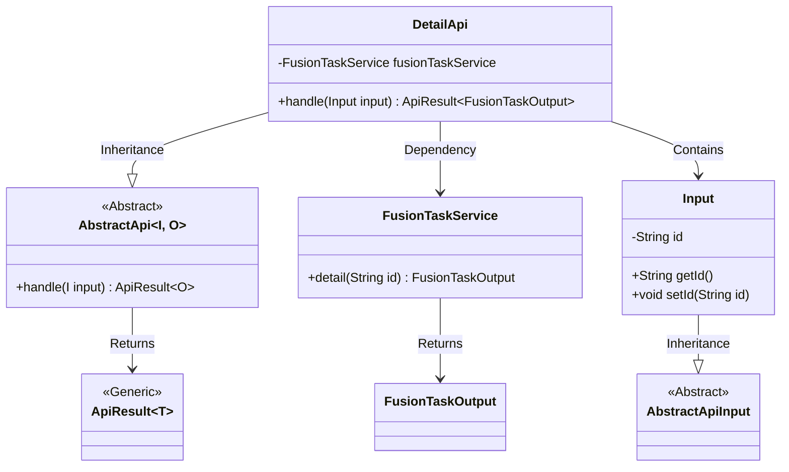

# Basic Information

|      |      |
|------|------|
| Name | DetailApi |
| Language | .java |
| Code Path | WeFe/board/board-service/src/main/java/com/welab/wefe/board/service/api/project/fusion/task/DetailApi.java |
| Package Name | com.welab.wefe.board.service.api.project.fusion.task |
| Dependencies | ['com.welab.wefe.board.service.dto.fusion.FusionTaskOutput', 'com.welab.wefe.board.service.service.fusion.FusionTaskService', 'com.welab.wefe.common.exception.StatusCodeWithException', 'com.welab.wefe.common.fieldvalidate.annotation.Check', 'com.welab.wefe.common.web.api.base.AbstractApi', 'com.welab.wefe.common.web.api.base.Api', 'com.welab.wefe.common.web.dto.AbstractApiInput', 'com.welab.wefe.common.web.dto.ApiResult', 'com.welab.wefe.fusion.core.utils.CryptoUtils', 'org.bouncycastle.crypto.AsymmetricCipherKeyPair', 'org.bouncycastle.crypto.params.RSAKeyParameters', 'org.bouncycastle.crypto.params.RSAPrivateCrtKeyParameters', 'org.springframework.beans.factory.annotation.Autowired', 'java.math.BigInteger'] |
| Brief Description | The DetailApi class handles task detail queries by calling the FusionTaskService to retrieve data. The main method generates an RSA key pair and tests the performance of two modular exponentiation operations. The Input class includes a mandatory taskId field. |

# Description

The code defines an API class named `DetailApi`, which handles task detail query requests. The class inherits from `AbstractApi`, accepts an `Input` parameter, and returns a `FusionTaskOutput` result. Its primary functionality is to query task details by a specified ID through the `fusionTaskService`. The `Input` class includes a mandatory `taskId` field. The code also contains a `main` method demonstrating RSA key generation and a performance comparison between two modular exponentiation approaches: one optimized with the Chinese Remainder Theorem and the other using direct computation, with execution times printed. The class primarily involves two functionalities: API interface implementation and cryptographic operation performance testing.

# Class Summary

| Name   | Type  | Description |
|-------|------|-------------|
| DetailApi | class | The DetailApi class handles task detail queries, using RSA key pairs for performance testing to compare the time consumption of two modular exponentiation methods. The input parameter is taskId, and it outputs the task details. |

## Class DetailApi

|      |      |
|------|------|
| Access Modifier | @Api(path = "fusion/task/detail", name = "任务列表", desc = "任务列表");public |
| Type | class |
| Name | DetailApi |
| Description | The DetailApi class handles task detail queries, using RSA key pairs for performance testing to compare the time consumption of two modular exponentiation methods. The input parameter is taskId, and it outputs the task details. |

### UML Class Diagram

Class Diagram Description:
The diagram illustrates a task detail query system based on an abstract API framework. DetailApi inherits from the generic abstract class AbstractApi, processing Input and returning ApiResult<FusionTaskOutput> results. Input is a subclass of AbstractApiInput and contains a task ID field. DetailApi retrieves task details through the dependency-injected FusionTaskService, with the core handle method implementing business logic. The class diagram clearly demonstrates inheritance, dependency, and generic relationships, reflecting a typical Spring-based API service structure.

### Internal Method Call Graph

```mermaid
graph TD
    A["Class DetailApi"]
    B["Annotation: @Api"]
    C["Inheritance: AbstractApi<Input, FusionTaskOutput>"]
    D["Dependency Injection: @Autowired FusionTaskService"]
    E["Overridden Method: handle(Input input)"]
    F["Invocation: fusionTaskService.detail(input.id)"]
    G["Return: ApiResult.success()"]
    H["main Method: Generate RSA Key Pair"]
    I["Calculation: Modular Inverses (tp/tq) and Coefficients (cp/cq)"]
    J["Loop: Chinese Remainder Theorem-Optimized Decryption"]
    K["Loop: Direct Modular Exponentiation Decryption"]
    L["Output: Execution Time Comparison of Two Decryption Methods"]

    A --> B
    A --> C
    A --> D
    A --> E
    E --> F
    F --> G
    A -.-> H
    H --> I
    I --> J
    H --> K
    J --> L
    K --> L
```

This code primarily implements a task detail API and RSA decryption performance testing. The API part inherits the AbstractApi class to implement specific business logic, utilizing FusionTaskService to retrieve task details. The main method demonstrates two RSA decryption approaches: one optimized with the Chinese Remainder Theorem (precomputing modular inverses and coefficients) and the other using direct modular exponentiation, comparing their execution efficiency through 200,000 iterations. The flowchart clearly illustrates the class structure, method invocation relationships, and the execution flow of the performance test.

### Field List

| Name  | Type  | Description |
|-------|-------|------|
| fusionTaskService | FusionTaskService | The code snippet uses @Autowired to automatically inject an instance of the FusionTaskService. |

### Method List

| Name  | Type  | Description |
|-------|-------|------|
| handle | ApiResult<FusionTaskOutput> | Rewrite the handle method to call fusionTaskService.detail to retrieve the details of the input ID and return a successful result. |
| main | void | Generate RSA key pairs, optimize decryption operations using the Chinese Remainder Theorem, and compare the time consumption before and after optimization. The optimization method improves performance by splitting modular exponentiation operations and merging the results. |

