# Basic Information

|      |      |
|------|------|
| Name | InfoApi |
| Language | .java |
| Code Path | WeFe/board/board-service/src/main/java/com/welab/wefe/board/service/api/project/fusion/task/InfoApi.java |
| Package Name | com.welab.wefe.board.service.api.project.fusion.task |
| Dependencies | ['com.welab.wefe.board.service.fusion.manager.ActuatorManager', 'com.welab.wefe.common.exception.StatusCodeWithException', 'com.welab.wefe.common.fieldvalidate.annotation.Check', 'com.welab.wefe.common.util.JObject', 'com.welab.wefe.common.web.api.base.AbstractApi', 'com.welab.wefe.common.web.api.base.Api', 'com.welab.wefe.common.web.dto.AbstractApiInput', 'com.welab.wefe.common.web.dto.ApiResult'] |
| Brief Description | The InfoApi class is used to query task progress, accepting the businessId parameter and returning task information. It inherits from AbstractApi, with Input class as input and JObject as output. |

# Description

This is a Java class named InfoApi, designed for querying task progress. It extends AbstractApi with generic parameters Input and JObject. The class annotation defines the API path as "fusion/task/info" and the name as "Query Task Progress". The class overrides the handle method, retrieving task information through ActuatorManager and returning a successful result. The inner class Input extends AbstractApiInput, containing a mandatory field businessId to specify the taskId for the operation, along with its getter and setter methods. The overall functionality of this API is to accept input containing businessId and return a JSON object representing the corresponding task progress.

# Class Summary

| Name   | Type  | Description |
|-------|------|-------------|
| InfoApi | class | The InfoApi class is used to query task progress, accepts the businessId parameter, and returns task information. It inherits from AbstractApi, and its input class Input includes the mandatory field businessId along with its getter/setter methods. |


## Class InfoApi

|      |      |
|------|------|
| Access Modifier | @Api(path = "fusion/task/info", name = "查询任务进度", desc = "查询任务进度");public |
| Type | class |
| Name | InfoApi |
| Description | The InfoApi class is used to query task progress, accepts the businessId parameter, and returns task information. It inherits from AbstractApi, and its input class Input includes the mandatory field businessId along with its getter/setter methods. |


### UML Class Diagram

```mermaid
classDiagram
    class AbstractApi~T, R~ {
        <<Abstract>>
        +handle(T input) ApiResult~R~
    }

    class InfoApi {
        +handle(Input input) ApiResult~JObject~
    }
    InfoApi --|> AbstractApi~Input, JObject~

    class AbstractApiInput {
        <<Abstract>>
    }

    class InfoApi$Input {
        -String businessId
        +String getBusinessId()
        +void setBusinessId(String businessId)
    }
    InfoApi$Input --|> AbstractApiInput

    class ActuatorManager {
        +getTaskInfo(String businessId) JObject
    }
    InfoApi ..> ActuatorManager : invokes

    class ApiResult~T~ {
        <<Generic>>
    }
    InfoApi --> ApiResult~JObject~

    class JObject {
    }
    InfoApi --> JObject
```

Class Diagram Description: The diagram illustrates that InfoApi inherits from the generic class AbstractApi<Input, JObject>, with its inner class Input inheriting from AbstractApiInput. InfoApi processes input parameters via the handle method and invokes the getTaskInfo method of ActuatorManager to retrieve task information, ultimately returning an ApiResult containing a JObject. The diagram clearly depicts inheritance relationships, dependencies between classes, and the passing of generic parameters.


### Internal Method Call Graph

```mermaid
graph TD
    A["Class InfoApi"]
    B["Parent Class: AbstractApi<Input, JObject>"]
    C["Annotation: @Api(path='fusion/task/info', name='Query Task Progress', desc='Query task progress')"]
    D["Method: handle(Input input)"]
    E["Invocation: ActuatorManager.getTaskInfo"]
    F["Return: ApiResult<JObject>"]
    G["Inner Class Input"]
    H["Field: String businessId"]
    I["Method: getBusinessId()"]
    J["Method: setBusinessId(String)"]
    K["Annotation: @Check(name='Task ID for specified operation', require=true)"]

    A --> B
    A --> C
    A --> D
    D --> E
    E --> F
    A --> G
    G --> H
    G --> I
    G --> J
    H --> K
```



This code defines an API class named InfoApi for querying task progress. The class inherits from AbstractApi and contains a handle method to process requests, which retrieves task information via ActuatorManager and returns the result. The inner class Input defines the request parameter businessId along with its getter/setter methods, marked as mandatory by the @Check annotation. The overall structure is clear, with annotations specifying the API path and functional description, and comprehensive input parameter validation.

### Field List

| Name  | Type  | Description |
|-------|-------|------|

### Method List

| Name  | Type  | Description |
|-------|-------|------|
| handle | ApiResult<JObject> | Java method override, processes the input and returns task information, and upon success, invokes ActuatorManager to retrieve task details corresponding to the business ID. |


