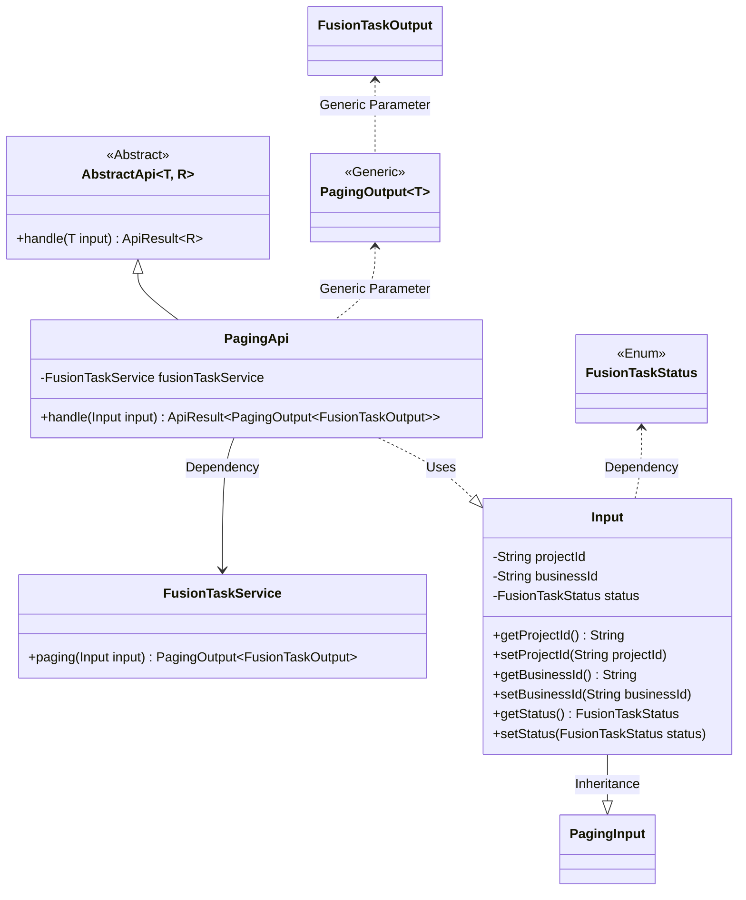

# Basic Information

|      |      |
|------|------|
| Name | PagingApi |
| Language | .java |
| Code Path | WeFe/board/board-service/src/main/java/com/welab/wefe/board/service/api/project/fusion/task/PagingApi.java |
| Package Name | com.welab.wefe.board.service.api.project.fusion.task |
| Dependencies | ['com.welab.wefe.board.service.dto.base.PagingInput', 'com.welab.wefe.board.service.dto.base.PagingOutput', 'com.welab.wefe.board.service.dto.fusion.FusionTaskOutput', 'com.welab.wefe.board.service.service.fusion.FusionTaskService', 'com.welab.wefe.common.exception.StatusCodeWithException', 'com.welab.wefe.common.fieldvalidate.annotation.Check', 'com.welab.wefe.common.web.api.base.AbstractApi', 'com.welab.wefe.common.web.api.base.Api', 'com.welab.wefe.common.web.dto.ApiResult', 'com.welab.wefe.fusion.core.enums.FusionTaskStatus', 'org.springframework.beans.factory.annotation.Autowired'] |
| Brief Description | API for paginated query of task list. The input includes project ID, business ID, and task status. It calls the FusionTaskService to perform a paginated query and returns the results. |

# Description

The code defines an API class named `PagingApi` for handling paginated queries of task lists. The API path is `"fusion/task/paging"`, which inherits from `AbstractApi`. The input type is the inner class `Input`, and the output is `FusionTaskOutput` in paginated format. The `Input` class contains three validated fields: `projectId`, `businessId`, and task status `status`, along with corresponding getter and setter methods. The processing logic invokes the `paging` method of `fusionTaskService` to return the paginated result.

# Class Summary

| Name   | Type  | Description |
|-------|------|-------------|
| PagingApi | class | This is an API class for paginated querying of task lists, which takes projectId, businessId, and task status as input parameters, and calls the fusionTaskService.paging method to return paginated results. |

## Class PagingApi

|      |      |
|------|------|
| Access Modifier | @Api(path = "fusion/task/paging", name = "任务列表", desc = "任务列表");public |
| Type | class |
| Name | PagingApi |
| Description | This is an API class for paginated querying of task lists, which takes projectId, businessId, and task status as input parameters, and calls the fusionTaskService.paging method to return paginated results. |

### UML Class Diagram

This code describes the implementation of a pagination query API, with the core being the `PagingApi` class inheriting from the generic abstract class `AbstractApi`, processing `Input` parameters and returning paginated results. The class diagram illustrates the following relationships: 1) PagingApi uses FusionTaskService via composition to execute pagination queries; 2) Input, as an inner class, inherits from PagingInput and contains three validation fields; 3) The generic structure ensures type-safe data returns through PagingOutput wrapping FusionTaskOutput. The entire design demonstrates clear hierarchical relationships and separation of responsibilities: the Input class encapsulates request parameters, the Service handles business logic, and the abstract parent class standardizes the API processing flow.

### Internal Method Call Graph

```mermaid
graph TD
    A["Class PagingApi"]
    B["Annotation: @Api"]
    C["Inheritance: AbstractApi<Input, PagingOutput<FusionTaskOutput>>"]
    D["Dependency Injection: @Autowired FusionTaskService"]
    E["Overridden Method: handle(Input input)"]
    F["Inner Class: Input"]
    G["Inheritance: PagingInput"]
    H["Property: String projectId"]
    I["Property: String businessId"]
    J["Property: FusionTaskStatus status"]
    K["Methods: getProjectId/setProjectId"]
    L["Methods: getBusinessId/setBusinessId"]
    M["Methods: getStatus/setStatus"]
    N["Invocation: fusionTaskService.paging(input)"]
    O["Return: ApiResult.success"]

    A --> B
    A --> C
    A --> D
    A --> E
    A --> F
    F --> G
    F --> H
    F --> I
    F --> J
    F --> K
    F --> L
    F --> M
    E --> N
    N --> O
```

This flowchart illustrates the complete structure of the PagingApi class, from class annotations, inheritance relationships, and dependency injection to the composition of the inner class Input. The core process involves the handle method processing pagination requests through fusionTaskService.paging, ultimately returning a successfully encapsulated ApiResult. The inner class Input inherits from PagingInput and includes three properties with validation annotations along with corresponding getter/setter methods, used to receive pagination query parameters from the frontend. The entire design reflects a clear hierarchical structure and division of responsibilities.

### Field List

| Name  | Type  | Description |
|-------|-------|------|
| fusionTaskService | FusionTaskService | Use @Autowired to automatically inject an instance of the FusionTaskService. |

### Method List

| Name  | Type  | Description |
|-------|-------|------|
| handle | ApiResult<PagingOutput<FusionTaskOutput>> | Process the input and return paginated query results, invoking the service method upon success. |

