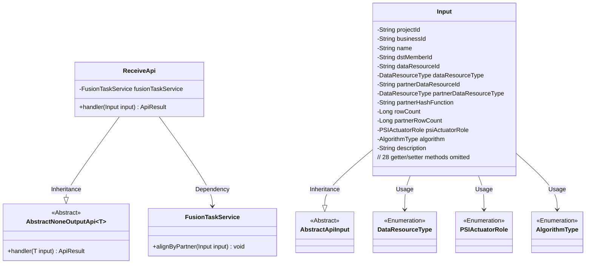
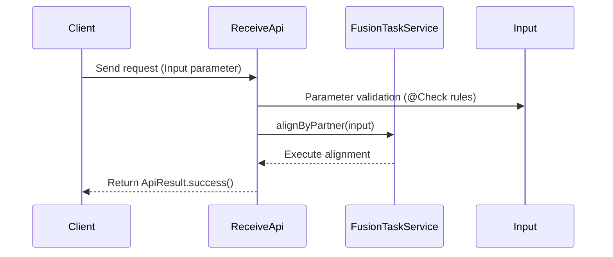

# Basic Information

|      |      |
|------|------|
| Name | ReceiveApi |
| Language | .java |
| Code Path | WeFe/board/board-service/src/main/java/com/welab/wefe/board/service/api/project/fusion/task/ReceiveApi.java |
| Package Name | com.welab.wefe.board.service.api.project.fusion.task |
| Dependencies | ['com.welab.wefe.board.service.service.fusion.FusionTaskService', 'com.welab.wefe.common.exception.StatusCodeWithException', 'com.welab.wefe.common.fieldvalidate.annotation.Check', 'com.welab.wefe.common.web.api.base.AbstractNoneOutputApi', 'com.welab.wefe.common.web.api.base.Api', 'com.welab.wefe.common.web.dto.AbstractApiInput', 'com.welab.wefe.common.web.dto.ApiResult', 'com.welab.wefe.common.wefe.enums.DataResourceType', 'com.welab.wefe.fusion.core.enums.AlgorithmType', 'com.welab.wefe.fusion.core.enums.PSIActuatorRole', 'org.springframework.beans.factory.annotation.Autowired'] |
| Brief Description | API for Receiving Alignment Requests requires mandatory parameters such as project ID, business ID, task name, partner ID, data resource information, and algorithm type. It invokes the FusionTaskService to perform alignment processing. |

# Description

The `ReceiveApi` is an API class designed to handle alignment requests, accessible via the path `task/receive` with signature-based authentication. It inherits from `AbstractNoneOutputApi` and accepts an `Input` class as its parameter. Its primary function is to process alignment requests through the `alignByPartner` method of `FusionTaskService`.  

The `Input` class includes several mandatory fields: `projectId`, `businessId`, `name`, `dstMemberId`, `dataResourceId` and its type, `partnerDataResourceId` and its type, `partnerHashFunction`, `psiActuatorRole`, and `algorithm`. Optional fields include `rowCount`, `partnerRowCount`, and `description` (limited to 1,024 characters). All fields are equipped with getter and setter methods. Upon successful processing, it returns an `ApiResult`.

# Class Summary

| Name   | Type  | Description |
|-------|------|-------------|
| ReceiveApi | class | API for Receiving Alignment Requests requires mandatory parameters such as project ID, business ID, task name, partner ID, data resource information, and algorithms. It invokes the FusionTaskService to process the alignment request. |

## Class ReceiveApi

|      |      |
|------|------|
| Access Modifier | @Api(path = "task/receive", name = "接收对齐请求", desc = "接收对齐请求", allowAccessWithSign = true);public |
| Type | class |
| Name | ReceiveApi |
| Description | API for Receiving Alignment Requests requires mandatory parameters such as project ID, business ID, task name, partner ID, data resource information, and algorithms. It invokes the FusionTaskService to process the alignment request. |

### UML Class Diagram

This class diagram illustrates the API implementation structure for receiving alignment requests. ReceiveApi inherits from the generic abstract class AbstractNoneOutputApi, processes the Input parameter class containing complex validation rules, and executes core business logic through FusionTaskService. The Input class inherits from AbstractApiInput, comprising 15 validation fields with corresponding access methods and involving 4 enumeration types. The overall design demonstrates clear hierarchical structure and separation of responsibilities, decoupling input parameter validation from business processing.

### Internal Method Call Graph

```mermaid
graph TD
    A["Class ReceiveApi"]
    B["Annotation: @Api"]
    C["Inheritance: AbstractNoneOutputApi<Input>"]
    D["Dependency Injection: FusionTaskService"]
    E["Overridden Method: handler(Input input)"]
    F["Inner Class Input"]
    G["Properties: 15 validation fields"]
    H["Methods: Field getters/setters"]

    A --> B
    A --> C
    A --> D
    A --> E
    A --> F
    F --> G
    F --> H
    E --> D["Calls fusionTaskService.alignByPartner"]
```

The flowchart illustrates the structure of the ReceiveApi class, including API annotations, service injection, and input parameter processing logic. The sequence diagram depicts the request handling flow: after the client submits Input parameters, field validation is performed first, followed by calling the fusion task service to execute alignment operations, and finally returning a success result. The inner class Input contains 15 fields with validation rules and their accessor methods, strictly constraining input parameters.

### Field List

| Name  | Type  | Description |
|-------|-------|------|
| fusionTaskService | FusionTaskService | The code snippet uses the @Autowired annotation to automatically inject an instance of the FusionTaskService. |

### Method List

| Name  | Type  | Description |
|-------|-------|------|
| handler | ApiResult | This method overrides the parent class handler, invokes the alignByPartner method of fusionTaskService to process the input parameter input, and returns ApiResult upon success. It throws StatusCodeWithException in case of exceptions. |

