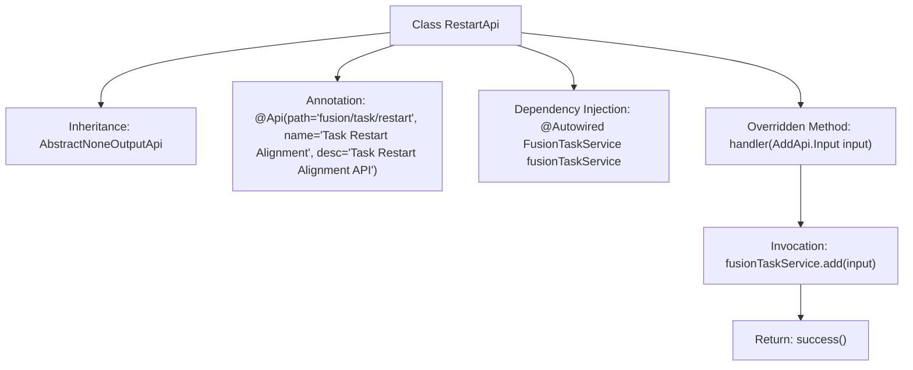

# Basic Information

|      |      |
|------|------|
| Name | RestartApi |
| Language | .java |
| Code Path | WeFe/board/board-service/src/main/java/com/welab/wefe/board/service/api/project/fusion/task/RestartApi.java |
| Package Name | com.welab.wefe.board.service.api.project.fusion.task |
| Dependencies | ['com.welab.wefe.board.service.service.fusion.FusionTaskService', 'com.welab.wefe.common.exception.StatusCodeWithException', 'com.welab.wefe.common.web.api.base.AbstractNoneOutputApi', 'com.welab.wefe.common.web.api.base.Api', 'com.welab.wefe.common.web.dto.ApiResult', 'org.springframework.beans.factory.annotation.Autowired'] |
| Brief Description | This is an API class named "Task Restart Alignment Task", with the path "fusion/task/restart", which inherits from AbstractNoneOutputApi and uses FusionTaskService to process input and return successful results. |

# Description

The content describes a Java class named RestartApi, which extends AbstractNoneOutputApi and is used for handling task rerun alignment tasks. The class annotation @Api defines the path as fusion/task/restart and the name as task rerun alignment task. The class injects the FusionTaskService and overrides the handler method, calling the fusionTaskService.add method to process the input parameters and returning a successful result.

# Class Summary

| Name   | Type  | Description |
|-------|------|-------------|
| RestartApi | class | This is an API class for task rerun alignment, inherited from a no-output abstract class, which processes the input through FusionTaskService and returns a successful result. |


## Class RestartApi

|      |      |
|------|------|
| Access Modifier | @Api(path = "fusion/task/restart", name = "任务重跑对齐任务", desc = "任务重跑对齐任务");public |
| Type | class |
| Name | RestartApi |
| Description | This is an API class for task rerun alignment, inherited from a no-output abstract class, which processes the input through FusionTaskService and returns a successful result. |


### UML Class Diagram

```mermaid
classDiagram
    class RestartApi {
        -FusionTaskService fusionTaskService
        +handler(AddApi~Input~ input) ApiResult
    }
    <<Interface>> AbstractNoneOutputApi~T~
    AbstractNoneOutputApi~T~ <|-- RestartApi : Inheritance
    RestartApi --> FusionTaskService : Dependency

    class FusionTaskService {
        +add(AddApi~Input~ input) void
    }
```

Class Diagram Description: This diagram illustrates that the RestartApi class inherits from the generic interface AbstractNoneOutputApi<AddApi.Input> and depends on the FusionTaskService class. The RestartApi implements the handler method, which processes input parameters by invoking the add method of fusionTaskService. AbstractNoneOutputApi serves as a generic interface, with its concrete implementation provided by RestartApi, forming a clear hierarchical relationship.


### Internal Method Call Graph



This flowchart illustrates the structure and execution flow of the RestartApi class. The class inherits from AbstractNoneOutputApi, defines API path and description via @Api annotation, and injects FusionTaskService. The core logic resides in the handler method, which first invokes fusionTaskService.add to process input parameters, then returns a success result. The entire process concisely reflects the API request handling procedure.

### Field List

| Name  | Type  | Description |
|-------|-------|------|
| fusionTaskService | FusionTaskService | Automatically inject the FusionTaskService instance using @Autowired. |

### Method List

| Name  | Type  | Description |
|-------|-------|------|
| handler | ApiResult | Java method override, calling the service to add a task and returning a successful result. |


