# Basic Information

|      |      |
|------|------|
| Name | TaskStatusApi |
| Language | .java |
| Code Path | WeFe/board/board-service/src/main/java/com/welab/wefe/board/service/api/project/fusion/task/TaskStatusApi.java |
| Package Name | com.welab.wefe.board.service.api.project.fusion.task |
| Dependencies | ['com.welab.wefe.common.exception.StatusCodeWithException', 'com.welab.wefe.common.web.api.base.AbstractApi', 'com.welab.wefe.common.web.api.base.Api', 'com.welab.wefe.common.web.dto.AbstractApiInput', 'com.welab.wefe.common.web.dto.ApiResult', 'com.welab.wefe.fusion.core.enums.FusionTaskStatus', 'java.util.EnumSet'] |
| Brief Description | This is a task status API class that inherits from AbstractApi, processes the input, and returns all FusionTaskStatus enumeration values. The input class is empty. |

# Description

The code defines an API class named `TaskStatusApi`, which inherits from `AbstractApi` and is used to handle task status-related requests. The API path is `fusion/task/status`, with the name "Task Status" and the description "Task Status." The input parameter is the `Input` class, which inherits from `AbstractApiInput` and has no additional fields. The processing logic returns an `EnumSet` collection containing all `FusionTaskStatus` enumeration values, wrapped into an `ApiResult` via the `success` method. The overall functionality of the API is to retrieve all possible task status enumeration values.

# Class Summary

| Name   | Type  | Description |
|-------|------|-------------|
| TaskStatusApi | class | This is a task status API class, inherited from AbstractApi, which processes input and returns all FusionTaskStatus enum values. The input class is empty. |


## Class TaskStatusApi

|      |      |
|------|------|
| Access Modifier | @Api(path = "fusion/task/status", name = "任务状态", desc = "任务状态");public |
| Type | class |
| Name | TaskStatusApi |
| Description | This is a task status API class, inherited from AbstractApi, which processes input and returns all FusionTaskStatus enum values. The input class is empty. |


### UML Class Diagram

```mermaid
classDiagram
    class AbstractApi~T, R~ {
        <<Abstract>>
        +ApiResult~R~ handle(T input) throws StatusCodeWithException
        +ApiResult~R~ success(R result)
    }

    class TaskStatusApi {
        +TaskStatusApi()
        +ApiResult~EnumSet~FusionTaskStatus~~ handle(Input input) throws StatusCodeWithException
    }

    class AbstractApiInput {
        <<Abstract>>
    }

    class Input {
    }

    class ApiResult~T~ {
    }

    class EnumSet~E~ {
    }

    class FusionTaskStatus {
    }

    TaskStatusApi --|> AbstractApi~Input, EnumSet~FusionTaskStatus~~ : Inheritance
    Input --|> AbstractApiInput : Inheritance
    TaskStatusApi --> Input : Uses
    TaskStatusApi --> EnumSet~FusionTaskStatus~ : Returns
    TaskStatusApi --> ApiResult~EnumSet~FusionTaskStatus~~ : Returns
    EnumSet~FusionTaskStatus~ --> FusionTaskStatus : Contains
```

This code defines a task status API class `TaskStatusApi`, which inherits from the generic abstract class `AbstractApi`. It processes input of type `Input` and returns a type of `EnumSet<FusionTaskStatus>`. The primary function is to retrieve all `FusionTaskStatus` enumeration values and return them wrapped in `ApiResult`. The class diagram illustrates inheritance relationships, generic parameter passing, and dependencies between classes, reflecting the design pattern of an API handling requests and returning a collection of enumeration states.


### Internal Method Call Graph

```mermaid
graph TD
    A["Class TaskStatusApi"]
    B["Parent Class: AbstractApi<Input, EnumSet<FusionTaskStatus>>"]
    C["Annotation: @Api(path='fusion/task/status', name='Task Status', desc='Task Status')"]
    D["Method: handle(Input input)"]
    E["Inner Class: Input"]
    F["Parent Class: AbstractApiInput"]
    G["Operation: EnumSet.allOf(FusionTaskStatus.class)"]
    H["Return: success(statuses)"]

    A --> B
    A --> C
    A --> D
    A --> E
    E --> F
    D --> G
    G --> H
```



This code demonstrates the implementation of a task status API, which inherits from an abstract API class and processes specific inputs. The flowchart clearly presents the class inheritance structure, annotation configuration, and core method logic. TaskStatusApi retrieves all enum states through the handle method and returns a successful result, with the inner class Input serving as the parameter type inherited from the abstract input class. The entire structure reflects a standard API implementation pattern, comprising three core components: annotation configuration, input/output type definitions, and business logic processing.

### Field List

| Name  | Type  | Description |
|-------|-------|------|

### Method List

| Name  | Type  | Description |
|-------|-------|------|
| handle | ApiResult<EnumSet<FusionTaskStatus>> | Rewrite the method to handle the input and return a successful result containing all FusionTaskStatus enum values. |


