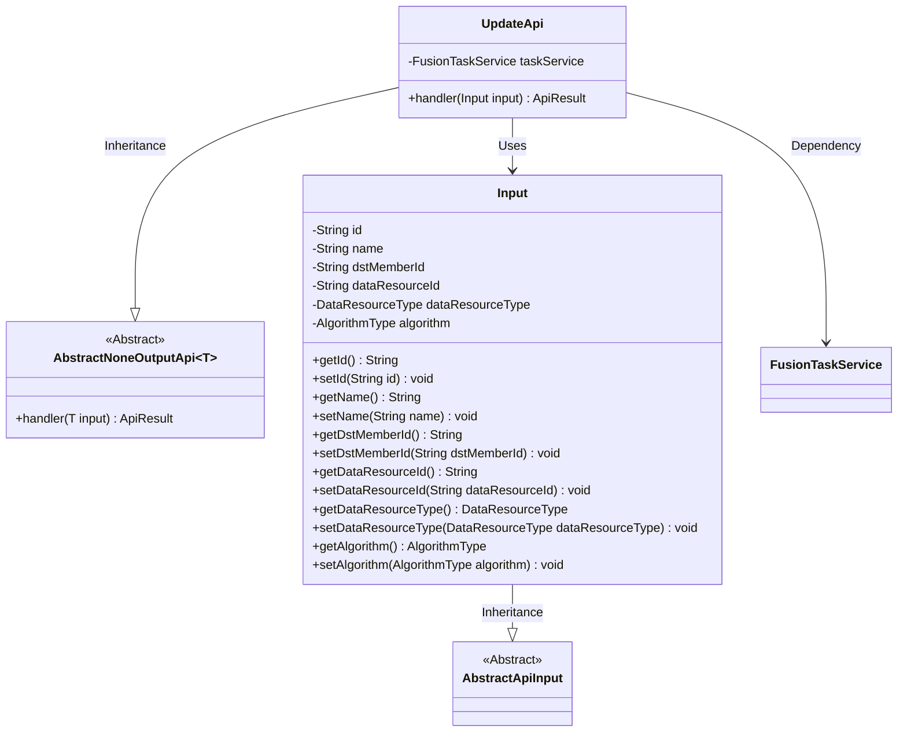

# Basic Information

|      |      |
|------|------|
| Name | UpdateApi |
| Language | .java |
| Code Path | WeFe/board/board-service/src/main/java/com/welab/wefe/board/service/api/project/fusion/task/UpdateApi.java |
| Package Name | com.welab.wefe.board.service.api.project.fusion.task |
| Dependencies | ['com.welab.wefe.board.service.service.fusion.FusionTaskService', 'com.welab.wefe.common.exception.StatusCodeWithException', 'com.welab.wefe.common.fieldvalidate.annotation.Check', 'com.welab.wefe.common.web.api.base.AbstractNoneOutputApi', 'com.welab.wefe.common.web.api.base.Api', 'com.welab.wefe.common.web.dto.AbstractApiInput', 'com.welab.wefe.common.web.dto.ApiResult', 'com.welab.wefe.common.wefe.enums.DataResourceType', 'com.welab.wefe.fusion.core.enums.AlgorithmType', 'org.springframework.beans.factory.annotation.Autowired'] |
| Brief Description | Modify the API for alignment tasks, including mandatory fields such as task ID, name, partner ID, data resource ID, and type, with the default algorithm set to RSA_PSI. |

# Description

The code defines a class named UpdateApi, which is used to modify alignment tasks. The class inherits from AbstractNoneOutputApi, with the input parameter being the inner class Input. Input includes mandatory fields such as task ID, name, partner ID, data resource ID, data resource type, and algorithm type, where the algorithm type defaults to RSA_PSI. By invoking the update method of taskService, it processes the input parameters and returns a successful result.

# Class Summary

| Name   | Type  | Description |
|-------|------|-------------|
| UpdateApi | class | Modify the API for alignment tasks, including mandatory fields such as task ID, name, partner ID, data resource ID, and type, with RSA_PSI algorithm set as the default. |

## Class UpdateApi

|      |      |
|------|------|
| Access Modifier | @Api(path = "task/update", name = "修改对齐任务", desc = "修改对齐任务");public |
| Type | class |
| Name | UpdateApi |
| Description | Modify the API for alignment tasks, including mandatory fields such as task ID, name, partner ID, data resource ID, and type, with RSA_PSI algorithm set as the default. |

### UML Class Diagram

This class diagram illustrates the structure of UpdateApi and its related classes. UpdateApi inherits from the generic class AbstractNoneOutputApi<Input>, containing dependencies on FusionTaskService and input parameter handling logic. The Input class inherits from AbstractApiInput, encapsulating multiple fields required for task updates along with their getter/setter methods. The overall design demonstrates the API layer's encapsulation of business services and parameter validation capabilities.

### Internal Method Call Graph

```mermaid
graph TD
    A["Class UpdateApi"]
    B["Annotation: @Api"]
    C["Inheritance: AbstractNoneOutputApi<Input>"]
    D["Dependency Injection: @Autowired FusionTaskService"]
    E["Overridden Method: handler(Input input)"]
    F["Inner Class: Input"]
    G["Field: String id"]
    H["Field: String name"]
    I["Field: String dstMemberId"]
    J["Field: String dataResourceId"]
    K["Field: DataResourceType dataResourceType"]
    L["Field: AlgorithmType algorithm"]
    M["Validation Annotation: @Check"]
    N["Getter/Setter Methods"]

    A --> B
    A --> C
    A --> D
    A --> E
    A --> F
    F --> G
    F --> H
    F --> I
    F --> J
    F --> K
    F --> L
    G --> M
    H --> M
    I --> M
    J --> M
    K --> M
    L --> M
    F --> N
```

The flowchart depicts the structure of the UpdateApi class, which is an API class designed for modifying alignment tasks. It inherits from AbstractNoneOutputApi, injects the FusionTaskService via @Autowired, and overrides the handler method to process input parameters. The inner class Input contains multiple fields annotated with @Check validation annotations along with corresponding Getter/Setter methods, used to receive and validate parameters for task update requests. The entire flow illustrates the complete class structure relationships from API entry to parameter validation.

### Field List

| Name  | Type  | Description |
|-------|-------|------|
| taskService | FusionTaskService | Automatically inject the FusionTaskService instance taskService. |

### Method List

| Name  | Type  | Description |
|-------|-------|------|
| handler | ApiResult | Java method override, call taskService to update input data, return ApiResult upon success. Throw StatusCodeWithException in case of exceptions. |

