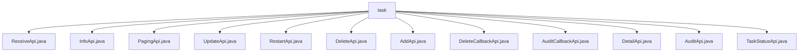

# Basic Information

|      |      |
|------|------|
| Name | task |
| Language | .java |
| Code Path | WeFe/board/board-service/src/main/java/com/welab/wefe/board/service/api/project/fusion/task |
| Package Name | docs.board.board-service.src.main.java.com.welab.wefe.board.service.api.project.fusion.task |
| Brief Description | ReceiveApi handles alignment requests, InfoApi queries task progress, PagingApi paginates task queries, UpdateApi modifies tasks, RestartApi reruns tasks, DeleteApi deletes tasks, AddApi adds tasks, DeleteCallbackApi processes deletion callbacks, AuditCallbackApi processes audit callbacks, DetailApi queries task details, AuditApi handles task audits, TaskStatusApi retrieves task status enumerations. |

# Description

## Overview  
The core responsibility of this module is to provide comprehensive lifecycle management for alignment tasks in federated learning, including functions such as task creation, query, modification, review, and status tracking. The interface specifications adhere to the RESTful style, uniformly inherit the AbstractApi base class, and use the path prefix "fusion/task/". They support signed access and parameter validation.  

Key data structures include the Input class (containing identifier fields such as projectId and businessId), FusionTaskOutput (for paginated/detailed output), and EnumSet<FusionTaskStatus> (status enumeration). External dependencies primarily consist of FusionTaskService (core business logic) and ActuatorManager (executor management). For example, ReceiveApi processes alignment requests via alignByPartner, while DetailApi returns task details and cryptographic performance data.  

## Main Business Scenarios  
The module supports typical federated learning alignment task workflows: tasks are created via AddApi (e.g., specifying the RSA_PSI algorithm), reviewed by AuditApi, and then ReceiveApi triggers multi-party data alignment. InfoApi/PagingApi monitors progress, and tasks can eventually be cleaned up via DeleteApi. The interaction model resembles a workflow engine, with all APIs linked by businessId.  

Functional completeness is reflected in end-to-end coverage: it includes status queries (TaskStatusApi), callback handling (AuditCallbackApi), retry mechanisms (RestartApi), and more. Integration examples include signed review callbacks (e.g., auditStatus changes) and paginated queries (combining projectId/status conditions). All APIs uniformly execute business logic through the Service layer to ensure processing consistency.

### Package Internal Structure View

This flowchart illustrates the API file structure under the project's task integration module, comprising 12 specific API implementation classes such as interfaces for receiving, information querying, pagination, updating, restarting, and other operations. All API files reside at the same directory level without deeper nesting, forming a flat structural layout.

# File List

| Name   | Type  | Description |
|-------|------|-------------|
| [ReceiveApi.java](ReceiveApi.md) | file | API for receiving alignment requests requires mandatory parameters such as project ID, business ID, task name, partner ID, data resource information, and algorithm type. It invokes the FusionTaskService to perform alignment processing. |
| [InfoApi.java](InfoApi.md) | file | The InfoApi class is used to query task progress, accepting the businessId parameter and returning task information. It inherits from AbstractApi, with Input class as the input and JObject as the output. |
| [PagingApi.java](PagingApi.md) | file | API for paginated query of task list. The input includes project ID, business ID, and task status. It calls the FusionTaskService to perform paginated query and returns the results. |
| [UpdateApi.java](UpdateApi.md) | file | Modify the alignment task API to include mandatory fields such as task ID, name, partner ID, data resource ID, and type, with the default algorithm set to RSA_PSI. |
| [RestartApi.java](RestartApi.md) | file | This is an API class named "Task Restart Alignment Task", with the path "fusion/task/restart", inheriting from AbstractNoneOutputApi, using FusionTaskService to process input and return successful results. |
| [DeleteApi.java](DeleteApi.md) | file | Delete Task API, which accepts a task ID parameter, invokes the FusionTaskService to perform the deletion operation, and returns a success result. |
| [AddApi.java](AddApi.md) | file | Add an API interface for alignment tasks, including mandatory fields such as project ID, task name, partner ID, data resource information, and algorithm type, supporting primary key processing and traceability functions, with input parameter validation. |
| [DeleteCallbackApi.java](DeleteCallbackApi.md) | file | This is an API class for handling delete requests, with the path "task/delete_callback". It requires the mandatory parameter businessId, invokes fusionTaskService to process the delete callback, and returns a successful result. |
| [AuditCallbackApi.java](AuditCallbackApi.md) | file | Audit callback interface, which receives inputs including business ID, audit status, comments, and hash function, processes the service call, and returns a successful result. |
| [DetailApi.java](DetailApi.md) | file | The DetailApi class handles task detail queries by invoking the FusionTaskService to retrieve data. The main method generates an RSA key pair and tests the performance of two modular exponentiation operations. The Input class includes a mandatory taskId field. |
| [AuditApi.java](AuditApi.md) | file | The AuditApi class handles task auditing, including mandatory fields such as businessId and auditStatus, as well as optional fields like traceColumn and auditComment. The input parameter validation logic ensures that required fields are not empty. |
| [TaskStatusApi.java](TaskStatusApi.md) | file | This is a task status API class that inherits from AbstractApi, processes input, and returns all FusionTaskStatus enumeration values. The input class is empty. |

