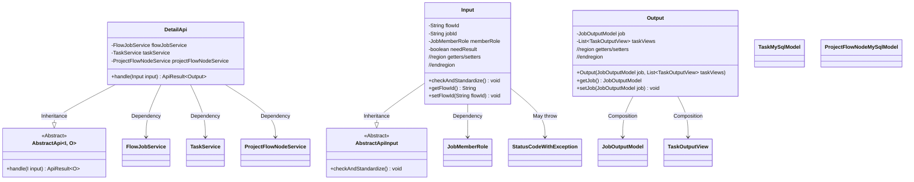
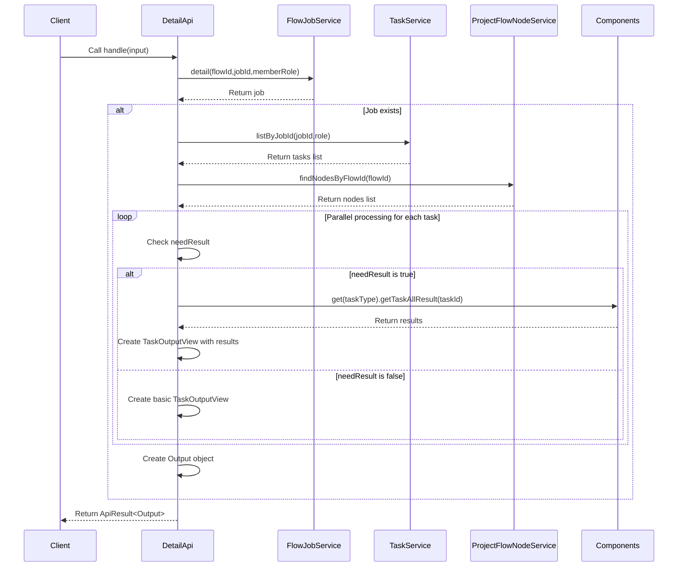

# Basic Information

|      |      |
|------|------|
| Name | DetailApi |
| Language | .java |
| Code Path | WeFe/board/board-service/src/main/java/com/welab/wefe/board/service/api/project/job/DetailApi.java |
| Package Name | com.welab.wefe.board.service.api.project.job |
| Dependencies | ['com.welab.wefe.board.service.component.Components', 'com.welab.wefe.board.service.database.entity.job.ProjectFlowNodeMySqlModel', 'com.welab.wefe.board.service.database.entity.job.TaskMySqlModel', 'com.welab.wefe.board.service.dto.entity.job.JobOutputModel', 'com.welab.wefe.board.service.dto.entity.job.TaskOutputView', 'com.welab.wefe.board.service.dto.entity.job.TaskResultOutputModel', 'com.welab.wefe.board.service.service.FlowJobService', 'com.welab.wefe.board.service.service.ProjectFlowNodeService', 'com.welab.wefe.board.service.service.TaskService', 'com.welab.wefe.common.StatusCode', 'com.welab.wefe.common.exception.StatusCodeWithException', 'com.welab.wefe.common.fieldvalidate.annotation.Check', 'com.welab.wefe.common.util.StringUtil', 'com.welab.wefe.common.web.api.base.AbstractApi', 'com.welab.wefe.common.web.api.base.Api', 'com.welab.wefe.common.web.dto.AbstractApiInput', 'com.welab.wefe.common.web.dto.ApiResult', 'com.welab.wefe.common.wefe.enums.JobMemberRole', 'org.springframework.beans.factory.annotation.Autowired', 'java.util.List', 'java.util.stream.Collectors'] |
| Brief Description | API for Retrieving Task Details: Query task information (including task lists and node details) by flowId and jobId, with support for on-demand return of task execution results. Input parameters must be validated to ensure flowId and jobId are not both empty. |

# Description

The code defines an API class named `DetailApi`, which is used to retrieve job details. The API path is `flow/job/detail`, and the input parameters include the flow ID, job ID, role, and whether task execution results need to be returned. In the processing logic, the job details are obtained through `flowJobService`, while `taskService` and `projectFlowNodeService` are used to fetch related task and flow node information, respectively. Based on the `needResult` parameter, it determines whether to include task execution results. Finally, it returns an `Output` object containing the job details and a list of task views. The input parameters are validated to ensure that `flowId` and `jobId` are not both empty, and `memberRole` must be specified when `jobId` is provided.

# Class Summary

| Name   | Type  | Description |
|-------|------|-------------|
| DetailApi | class | The DetailApi class is used to retrieve task details. The input parameters include process ID, task ID, role, and whether results are needed. The output contains task details and a task view list. |

## Class DetailApi

|      |      |
|------|------|
| Access Modifier | @Api(path = "flow/job/detail", name = "get job detail");public |
| Type | class |
| Name | DetailApi |
| Description | The DetailApi class is used to retrieve task details. The input parameters include process ID, task ID, role, and whether results are needed. The output contains task details and a task view list. |

### UML Class Diagram

This code implements an API interface for retrieving task details, primarily including input parameter validation, task detail queries, and fetching associated task and node data. The class diagram shows that DetailApi inherits from the generic abstract class AbstractApi, containing three service dependencies and nested Input/Output classes. The Input class handles parameter validation, while the Output class encapsulates response data. The overall design adheres to layered architecture principles, implementing business logic through dependency injection and service calls.

### Internal Method Call Graph

```mermaid
graph TD
    A["DetailApi Class"]
    B["Inheritance: AbstractApi<Input, Output>"]
    C["Dependency Injection: FlowJobService"]
    D["Dependency Injection: TaskService"]
    E["Dependency Injection: ProjectFlowNodeService"]
    F["Main Method: handle(Input input)"]
    G["Get job details: flowJobService.detail()"]
    H["Check if job exists"]
    I["Get tasks: taskService.listByJobId()"]
    J["Get nodes: projectFlowNodeService.findNodesByFlowId()"]
    K["Parallel processing of tasks"]
    L["Check input.needResult"]
    M["Get task results: Components.get().getTaskAllResult()"]
    N["Construct TaskOutputView"]
    O["Return success result: success(new Output())"]
    P["Inner Class Output"]
    Q["Inner Class Input"]

    A --> B
    A --> C
    A --> D
    A --> E
    A --> F
    F --> G
    G --> H
    H -->|Job exists| I
    H -->|Job doesn't exist| O
    I --> K
    K --> L
    L -->|true| M
    M --> N
    L -->|false| N
    N --> O
    A --> P
    A --> Q
```

This code implements an API for retrieving task details. The main workflow includes: obtaining basic task information through flowJobService, fetching related task lists via taskService, and acquiring process node information through projectFlowNodeService. When task results are required, it retrieves execution results for specific task types through Components. The entire process considers scenarios such as parameter validation, null value handling, and parallel processing, ultimately encapsulating the data into an Output object for return. The inner class Input handles parameter validation, while Output is responsible for result encapsulation, demonstrating clear separation of responsibilities.

### Field List

| Name  | Type  | Description |
|-------|-------|------|
| taskService | TaskService | Automatically inject the TaskService instance. |
| flowJobService | FlowJobService | Using @Autowired to automatically inject an instance of FlowJobService. |
| projectFlowNodeService | ProjectFlowNodeService | Automatically inject project process node service instances. |

### Method List

| Name  | Type  | Description |
|-------|-------|------|
| handle | ApiResult<Output> | Process the input and return the task output result: Check the task details, return success if none exists; otherwise, retrieve the task list and process nodes, handle tasks in parallel and collect results, and finally return the task output view. |

