# Basic Information

|      |      |
|------|------|
| Name | DownloadLogApi |
| Language | .java |
| Code Path | WeFe/board/board-service/src/main/java/com/welab/wefe/board/service/api/project/job/DownloadLogApi.java |
| Package Name | com.welab.wefe.board.service.api.project.job |
| Dependencies | ['com.welab.wefe.board.service.service.globalconfig.GlobalConfigService', 'com.welab.wefe.common.exception.StatusCodeWithException', 'com.welab.wefe.common.fieldvalidate.annotation.Check', 'com.welab.wefe.common.util.UrlUtil', 'com.welab.wefe.common.web.api.base.AbstractApi', 'com.welab.wefe.common.web.api.base.Api', 'com.welab.wefe.common.web.dto.AbstractApiInput', 'com.welab.wefe.common.web.dto.ApiResult', 'com.welab.wefe.common.wefe.dto.global_config.FlowConfigModel', 'org.springframework.beans.factory.annotation.Autowired', 'org.springframework.http.HttpMethod', 'org.springframework.http.RequestEntity', 'org.springframework.http.ResponseEntity', 'org.springframework.web.client.RestTemplate'] |
| Brief Description | The DownloadLogApi class downloads task logs via a GET request, requiring the jobId parameter. It calls an internal API to retrieve log data and returns a byte array response. |

# Description

This is a Java class named DownloadLogApi, designed to handle API requests for download task logs. It extends AbstractApi, accepts DownloadLogApi.Input as input parameters, and returns ResponseEntity. The class injects GlobalConfigService to retrieve configuration information. The handle method constructs a URL and uses RestTemplate to initiate a GET request, obtaining log data corresponding to the specified jobId. The Input inner class defines the required jobId field with its getter/setter methods and includes parameter validation annotations. The full API path is job/log/download, named download job log.

# Class Summary

| Name   | Type  | Description |
|-------|------|-------------|
| DownloadLogApi | class | The DownloadLogApi class is used to download task logs, retrieving an intranet URL via jobId and returning a byte stream response. The input parameter jobId is mandatory. |


## Class DownloadLogApi

|      |      |
|------|------|
| Access Modifier | @Api(path = "job/log/download", name = "download job log");public |
| Type | class |
| Name | DownloadLogApi |
| Description | The DownloadLogApi class is used to download task logs, retrieving an intranet URL via jobId and returning a byte stream response. The input parameter jobId is mandatory. |


### UML Class Diagram

```mermaid
classDiagram
    class DownloadLogApi {
        -GlobalConfigService globalConfigService
        +handle(DownloadLogApi~Input~ input) ApiResult~ResponseEntity~
    }
    DownloadLogApi --> GlobalConfigService : Dependency
    DownloadLogApi --> AbstractApi~DownloadLogApi~Input~, ResponseEntity~ : Inheritance

    class AbstractApi~T, R~ {
        <<Abstract>>
        #handle(T input) ApiResult~R~
    }

    class GlobalConfigService {
        +getModel(Class~T~ clazz) T
    }

    class DownloadLogApi~Input~ {
        -String jobId
        +String getJobId()
        +void setJobId(String jobId)
    }
    DownloadLogApi~Input~ --> AbstractApiInput : Inheritance

    class AbstractApiInput {
        <<Abstract>>
    }

    class ResponseEntity~T~ {
    }

    class ApiResult~T~ {
    }
```

This code illustrates the implementation of a download log API class, DownloadLogApi, which inherits from the generic abstract class AbstractApi. It processes the input parameter Input and returns a ResponseEntity. The Input class inherits from AbstractApiInput and includes the jobId property along with corresponding getter/setter methods. DownloadLogApi retrieves configuration information via GlobalConfigService and uses RestTemplate to initiate HTTP requests for log data. The class diagram clearly depicts the inheritance and dependency relationships, including the use of generic classes and interface implementations.


### Internal Method Call Graph

```mermaid
graph TD
    A["Class DownloadLogApi"]
    B["Inheritance: AbstractApi<Input, ResponseEntity>"]
    C["Dependency Injection: GlobalConfigService globalConfigService"]
    D["Overridden Method: handle(Input input)"]
    E["Invocation: globalConfigService.getModel(FlowConfigModel.class)"]
    F["URL Concatenation: intranetBaseUri + '/job/download_logs?job_id=' + input.jobId"]
    G["Creation: RequestEntity"]
    H["Instantiation: RestTemplate"]
    I["Invocation: restTemplate.exchange"]
    J["Return: success(response)"]
    K["Static Inner Class Input"]
    L["Property: String jobId"]
    M["Validation Annotation: @Check"]
    N["getter/setter Methods"]

    A --> B
    A --> C
    A --> D
    D --> E
    E --> F
    F --> G
    G --> H
    H --> I
    I --> J
    A -.-> K
    K --> L
    L --> M
    K --> N
```



This flowchart illustrates the complete processing flow of the DownloadLogApi class. Starting from inheritance relationships, it obtains configuration services through dependency injection, concatenates download URLs when handling input parameters, initiates HTTP requests using RestTemplate, and finally returns response results. The static inner class Input contains job ID properties and validation logic, providing access interfaces through getter/setter methods. The entire process demonstrates a complete chain from parameter validation to remote invocation.

### Field List

| Name  | Type  | Description |
|-------|-------|------|
| globalConfigService | GlobalConfigService | Use @Autowired to automatically inject an instance of GlobalConfigService. |

### Method List

| Name  | Type  | Description |
|-------|-------|------|
| handle | ApiResult<ResponseEntity> | Processing download log request, constructing intranet URL and initiating a GET request, returning byte array response. |


