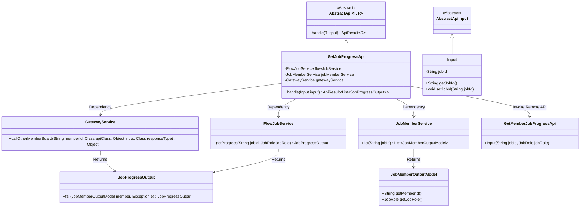
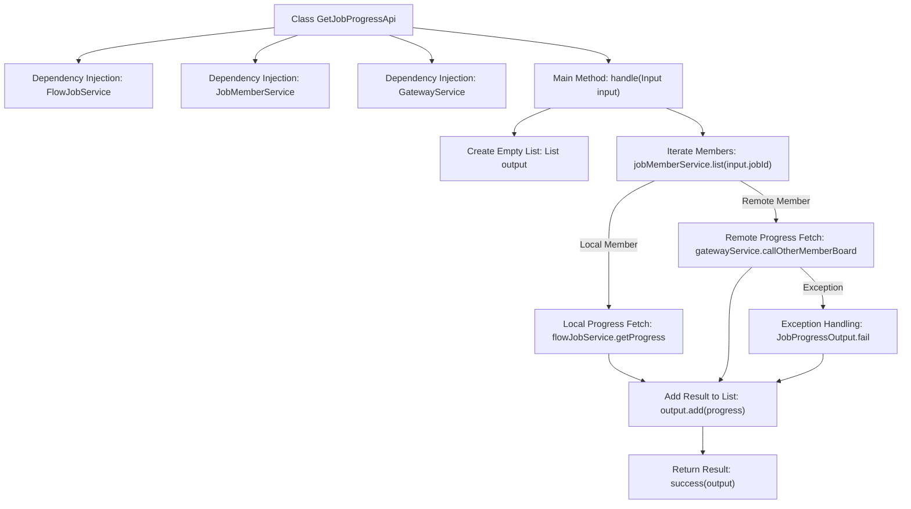
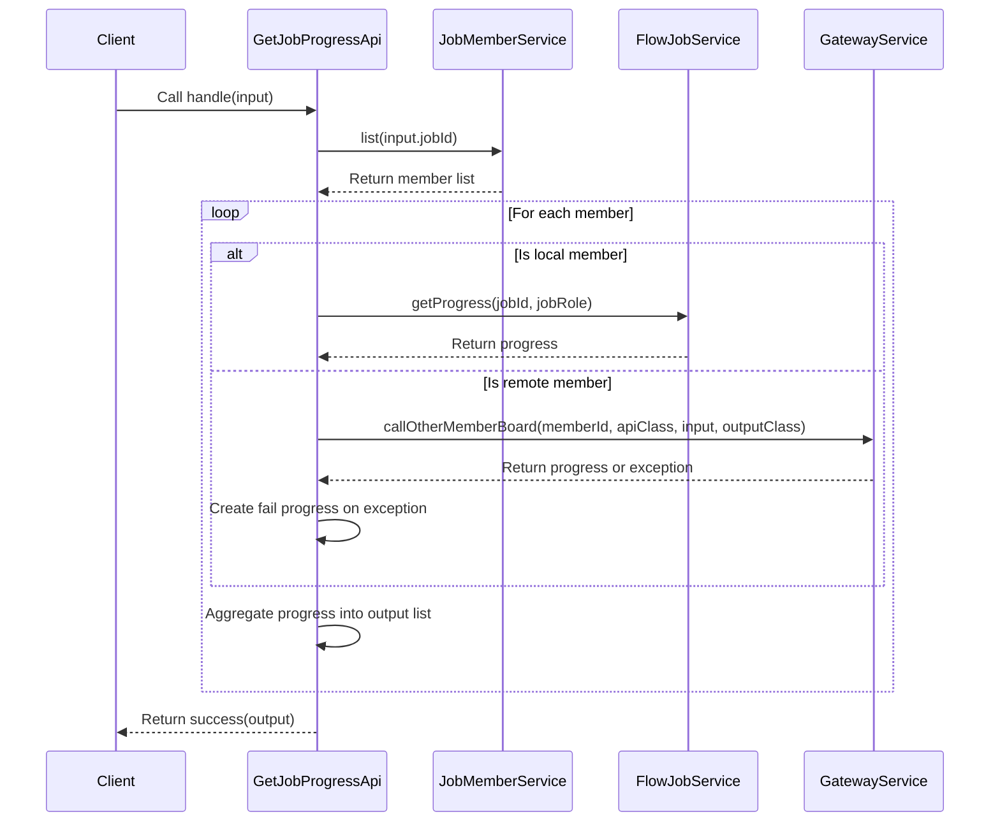

# Basic Information

|      |      |
|------|------|
| Name | GetJobProgressApi |
| Language | .java |
| Code Path | WeFe/board/board-service/src/main/java/com/welab/wefe/board/service/api/project/job/GetJobProgressApi.java |
| Package Name | com.welab.wefe.board.service.api.project.job |
| Dependencies | ['com.welab.wefe.board.service.api.gateway.GetMemberJobProgressApi', 'com.welab.wefe.board.service.dto.entity.job.JobMemberOutputModel', 'com.welab.wefe.board.service.dto.vo.JobProgressOutput', 'com.welab.wefe.board.service.service.CacheObjects', 'com.welab.wefe.board.service.service.FlowJobService', 'com.welab.wefe.board.service.service.GatewayService', 'com.welab.wefe.board.service.service.JobMemberService', 'com.welab.wefe.common.exception.StatusCodeWithException', 'com.welab.wefe.common.fieldvalidate.annotation.Check', 'com.welab.wefe.common.web.api.base.AbstractApi', 'com.welab.wefe.common.web.api.base.Api', 'com.welab.wefe.common.web.dto.AbstractApiInput', 'com.welab.wefe.common.web.dto.ApiResult', 'org.springframework.beans.factory.annotation.Autowired', 'java.util.ArrayList', 'java.util.List'] |
| Brief Description | API for Retrieving Task Execution Progress, supporting local and remote queries of member progress, returns a list of all member progress corresponding to the task ID. |

# Description

This API class is used to retrieve the task execution progress of all members, with the path "flow/job/get_progress" and allowing signed access. It inherits from an abstract API class, takes an Input class containing the task ID as input, and outputs a list of task progress. The processing logic includes: obtaining the progress of local members through an injected service class or fetching the progress of remote members by calling their interfaces via a gateway service, returning failure information in case of exceptions. The Input class contains a mandatory task ID field and corresponding getter/setter methods.

# Class Summary

| Name   | Type  | Description |
|-------|------|-------------|
| GetJobProgressApi | class | API for Obtaining Task Execution Progress, supporting local and remote queries of member progress, returning a list of all member progress corresponding to the task ID. |

## Class GetJobProgressApi

|      |      |
|------|------|
| Access Modifier | @Api(path = "flow/job/get_progress", name = "Get job execution progress of all members", allowAccessWithSign = true);public |
| Type | class |
| Name | GetJobProgressApi |
| Description | API for Obtaining Task Execution Progress, supporting local and remote queries of member progress, returning a list of all member progress corresponding to the task ID. |

### UML Class Diagram

Class Diagram Description:
This diagram illustrates the GetJobProgressApi class and its related dependencies. It is an API implementation class inheriting from AbstractApi, designed to retrieve task execution progress. Key dependencies include three services: FlowJobService (local progress query), JobMemberService (member list retrieval), and GatewayService (remote member progress query). The Input class inherits from AbstractApiInput and contains a job ID field. JobProgressOutput serves as the return type, while JobMemberOutputModel represents member information. Progress is obtained through both local and remote methods, ultimately aggregated into a progress list for return.

### Internal Method Call Graph

This flowchart illustrates the core processing logic of the GetJobProgressApi class, primarily divided into local and remote methods for retrieving task progress. The sequence diagram details the complete call chain from client request to final result, including key steps such as member list retrieval, progress query (distinguishing local/remote), exception handling, and result aggregation. The entire process implements unified task progress collection in a distributed environment.

### Field List

| Name  | Type  | Description |
|-------|-------|------|
| jobMemberService | JobMemberService | Using @Autowired to automatically inject an instance of JobMemberService. |
| flowJobService | FlowJobService | Using @Autowired to automatically inject an instance of FlowJobService. |
| gatewayService | GatewayService | Using @Autowired to automatically inject an instance of GatewayService. |

### Method List

| Name  | Type  | Description |
|-------|-------|------|
| handle | ApiResult<List<JobProgressOutput>> | Processing task progress queries: local members directly retrieve progress, while remote members obtain progress by invoking interfaces of other members via the gateway. Failure messages are returned in case of exceptions, and the results are ultimately aggregated and returned. |

