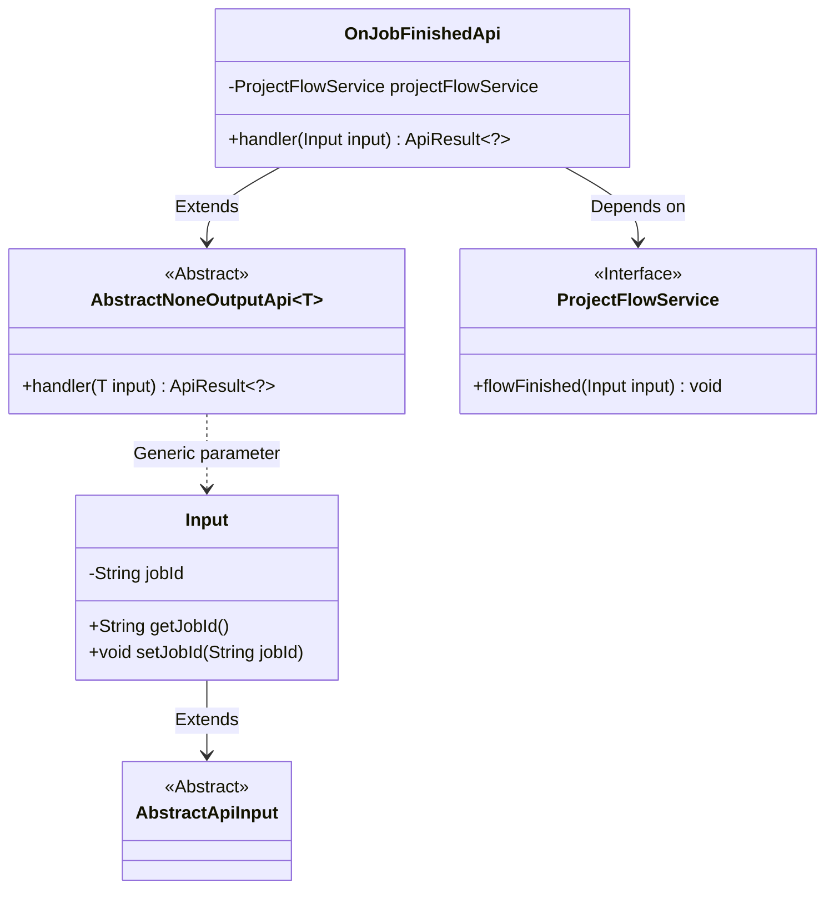
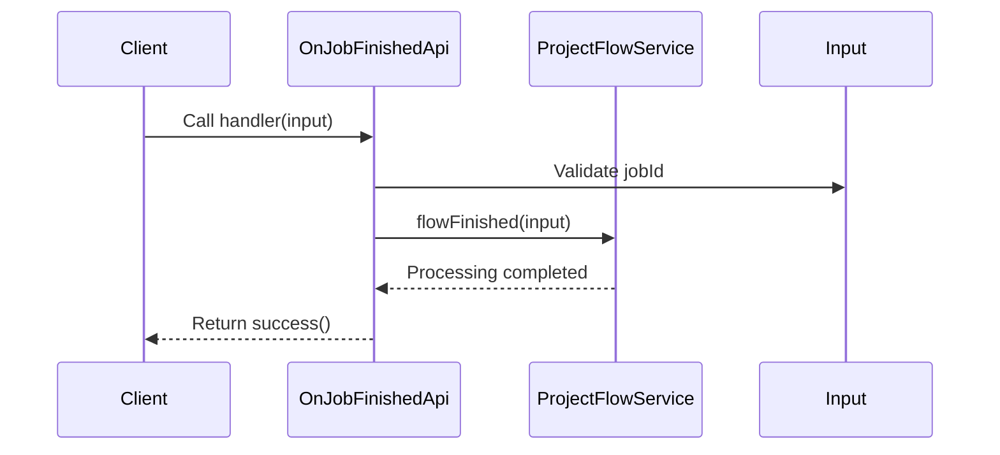

# Basic Information

|      |      |
|------|------|
| Name | OnJobFinishedApi |
| Language | .java |
| Code Path | WeFe/board/board-service/src/main/java/com/welab/wefe/board/service/api/project/job/OnJobFinishedApi.java |
| Package Name | com.welab.wefe.board.service.api.project.job |
| Dependencies | ['com.welab.wefe.board.service.service.ProjectFlowService', 'com.welab.wefe.common.exception.StatusCodeWithException', 'com.welab.wefe.common.fieldvalidate.annotation.Check', 'com.welab.wefe.common.web.api.base.AbstractNoneOutputApi', 'com.welab.wefe.common.web.api.base.Api', 'com.welab.wefe.common.web.dto.AbstractApiInput', 'com.welab.wefe.common.web.dto.ApiResult', 'org.springframework.beans.factory.annotation.Autowired'] |
| Brief Description | Defined an API class named OnJobFinishedApi with the path project/job/finished, used for job completion callback. Requires signature authentication, accepts the jobId parameter, and invokes ProjectFlowService to handle job completion logic. |

# Description

The code defines an API class named `OnJobFinishedApi`, designed to handle callback requests after job completion. The API path is `"project/job/finished"` and allows signed access. The class inherits from `AbstractNoneOutputApi`, with the input parameter being the inner class `Input`, which contains the mandatory field `jobId`. The core logic involves processing the input parameters by executing the `flowFinished` method through the injected `ProjectFlowService`, returning an empty result upon success. The entire API implements the functionality for handling callbacks after job completion.

# Class Summary

| Name   | Type  | Description |
|-------|------|-------------|
| OnJobFinishedApi | class | Defined an API interface for handling task completion callbacks, with the path `project/job/finished`. The `jobId` parameter must be passed, and it invokes the `ProjectFlowService` to process the workflow completion logic. |

## Class OnJobFinishedApi

|      |      |
|------|------|
| Access Modifier | @Api(path = "project/job/finished", name = "callback on job finished", allowAccessWithSign = true);public |
| Type | class |
| Name | OnJobFinishedApi |
| Description | Defined an API interface for handling task completion callbacks, with the path `project/job/finished`. The `jobId` parameter must be passed, and it invokes the `ProjectFlowService` to process the workflow completion logic. |

### UML Class Diagram

This diagram illustrates the class structure relationships of the job completion callback API. OnJobFinishedApi inherits from the generic class AbstractNoneOutputApi and depends on the ProjectFlowService interface to handle business logic. The Input class, serving as a parameter, extends AbstractApiInput and contains job ID attributes with accessor methods. The overall structure reflects Spring-style dependency injection and layered design, standardizing API processing flow through abstract base classes.

### Internal Method Call Graph

```mermaid
graph TD
    A["Class OnJobFinishedApi"]
    B["Annotation: @Api"]
    C["Dependency Injection: ProjectFlowService projectFlowService"]
    D["Method: handler(Input input)"]
    E["Invocation: projectFlowService.flowFinished(input)"]
    F["Return: success()"]
    G["Nested Class Input"]
    H["Property: String jobId"]
    I["Method: getJobId()"]
    J["Method: setJobId(String jobId)"]
    K["Parent Class: AbstractNoneOutputApi<Input>"]
    L["Parent Class: AbstractApiInput"]

    A --> B
    A --> K
    A --> C
    A --> D
    D --> E
    D --> F
    A --> G
    G --> L
    G --> H
    G --> I
    G --> J
```

This code defines an API class OnJobFinishedApi for handling project job completion callbacks, inheriting from the AbstractNoneOutputApi base class. Its primary functionality involves processing job completion events through ProjectFlowService, including input parameter validation logic. The flowchart illustrates class structural relationships, while the sequence diagram depicts the complete API invocation flow, covering parameter validation, service invocation, and response return. The nested Input class encapsulates the required jobId parameter and performs validation via annotations.

### Field List

| Name  | Type  | Description |
|-------|-------|------|
| projectFlowService | ProjectFlowService | Automatically inject the ProjectFlowService service instance. |

### Method List

| Name  | Type  | Description |
|-------|-------|------|
| handler | ApiResult<?> | Method override, call projectFlowService to complete the process, and return a successful result. |

