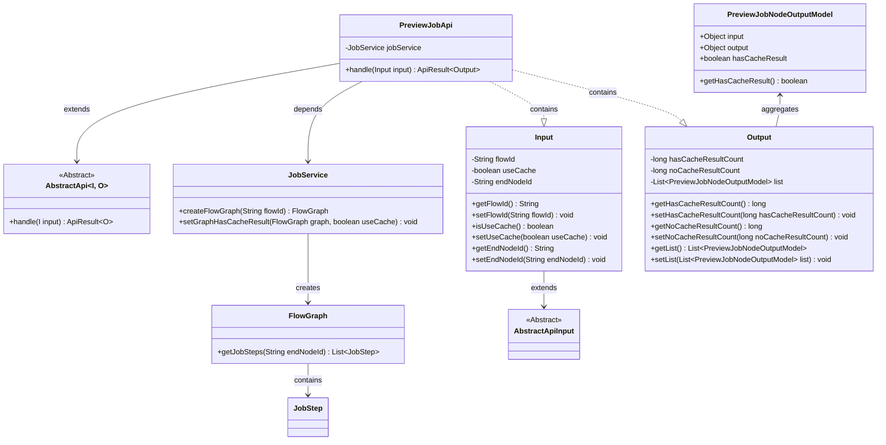
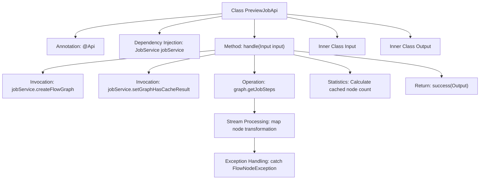
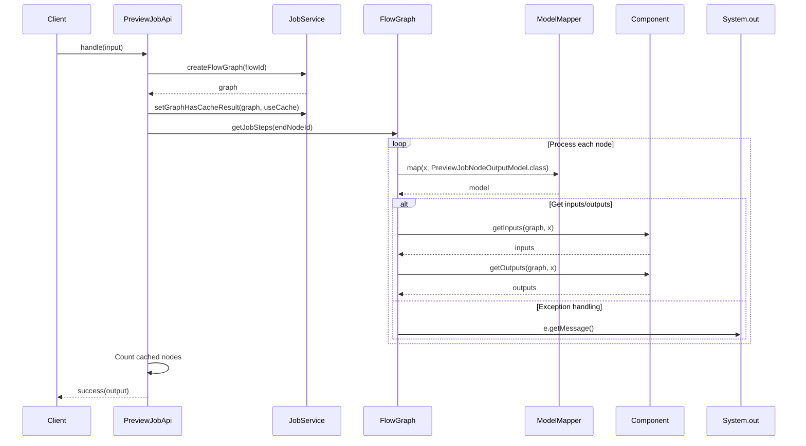

# Basic Information

|      |      |
|------|------|
| Name | PreviewJobApi |
| Language | .java |
| Code Path | WeFe/board/board-service/src/main/java/com/welab/wefe/board/service/api/project/job/PreviewJobApi.java |
| Package Name | com.welab.wefe.board.service.api.project.job |
| Dependencies | ['com.welab.wefe.board.service.dto.entity.job.PreviewJobNodeOutputModel', 'com.welab.wefe.board.service.exception.FlowNodeException', 'com.welab.wefe.board.service.model.FlowGraph', 'com.welab.wefe.board.service.service.JobService', 'com.welab.wefe.common.exception.StatusCodeWithException', 'com.welab.wefe.common.fieldvalidate.annotation.Check', 'com.welab.wefe.common.web.api.base.AbstractApi', 'com.welab.wefe.common.web.api.base.Api', 'com.welab.wefe.common.web.dto.AbstractApiInput', 'com.welab.wefe.common.web.dto.ApiResult', 'com.welab.wefe.common.web.util.ModelMapper', 'org.springframework.beans.factory.annotation.Autowired', 'java.util.List', 'java.util.stream.Collectors'] |
| Brief Description | API for previewing the execution process of a workflow. The input includes the workflow ID, whether to use cache, and termination nodes. The output includes cache result statistics and a detailed list of nodes. |

# Description

The PreviewJobApi is an API class designed for previewing workflow execution processes, inheriting from AbstractApi. It accepts input parameters including the workflow ID, whether to use cache, and the termination node ID. It utilizes JobService to create a workflow diagram and set cached results. During processing, workflow nodes are mapped to output models, with statistics collected for nodes with and without cache. Ultimately, it returns an output object containing statistical results and a node list. The input class Input includes validation and access methods for the workflow ID, cache usage flag, and termination node ID. The output class Output provides access methods for cache statistics and the node list.

# Class Summary

| Name   | Type  | Description |
|-------|------|-------------|
| PreviewJobApi | class | The PreviewJobApi is used to preview the execution process of a workflow. The input includes the workflow ID, whether to use caching, and the termination node. The output contains cache result statistics and a detailed list of nodes. |

## Class PreviewJobApi

|      |      |
|------|------|
| Access Modifier | @Api(path = "project/flow/job/preview", name = "Preview flow execution process");public |
| Type | class |
| Name | PreviewJobApi |
| Description | The PreviewJobApi is used to preview the execution process of a workflow. The input includes the workflow ID, whether to use caching, and the termination node. The output contains cache result statistics and a detailed list of nodes. |

### UML Class Diagram

Class Diagram Description: The diagram illustrates the structure of PreviewJobApi and its associated classes. PreviewJobApi inherits from the generic class AbstractApi and depends on JobService to create and process flow graphs. It contains nested classes Input and Output, where Input inherits from AbstractApiInput, and Output aggregates a list of PreviewJobNodeOutputModel. JobService interacts with FlowGraph, which contains JobStep information. The overall implementation provides flow execution preview functionality, including cache handling and data statistics capabilities.

### Internal Method Call Graph

This code implements a workflow job preview API, whose primary function is to retrieve a flow diagram via flowId, process node data, and track cache hit statistics. The class diagram illustrates the class structure and key method invocation relationships, while the sequence diagram details the complete processing flow from client request to result return, including critical steps such as flow graph creation, node transformation, input/output retrieval, and exception handling. The inner class Input encapsulates request parameters, and Output packages response data. The overall design demonstrates clear responsibility segregation and layered processing principles.

### Field List

| Name  | Type  | Description |
|-------|-------|------|
| jobService | JobService | Automatically inject JobService instances. |

### Method List

| Name  | Type  | Description |
|-------|-------|------|
| handle | ApiResult<Output> | Process input to generate flowchart node output, count the number of cached and non-cached results, and return them. |

