# Basic Information

|      |      |
|------|------|
| Name | QueryApi |
| Language | .java |
| Code Path | WeFe/board/board-service/src/main/java/com/welab/wefe/board/service/api/project/job/QueryApi.java |
| Package Name | com.welab.wefe.board.service.api.project.job |
| Dependencies | ['com.welab.wefe.board.service.dto.base.PagingInput', 'com.welab.wefe.board.service.dto.base.PagingOutput', 'com.welab.wefe.board.service.dto.entity.job.JobListOutputModel', 'com.welab.wefe.board.service.service.FlowJobService', 'com.welab.wefe.common.exception.StatusCodeWithException', 'com.welab.wefe.common.fieldvalidate.annotation.Check', 'com.welab.wefe.common.web.api.base.AbstractApi', 'com.welab.wefe.common.web.api.base.Api', 'com.welab.wefe.common.web.dto.ApiResult', 'com.welab.wefe.common.wefe.enums.JobStatus', 'org.springframework.beans.factory.annotation.Autowired'] |
| Brief Description | The QueryApi class is used to query process execution records, inheriting from AbstractApi. It takes inputs including process ID, task ID, name, and status, and outputs paginated results. It invokes flowJobService.query to handle the request. |

# Description

This is a Java class named QueryApi, designed for querying process execution records. It extends AbstractApi, accepts an Input class as the parameter, and returns a paginated JobListOutputModel result. The Input class includes query parameters such as process ID, task ID, task name, and task status, with the process ID being a mandatory field. The class injects FlowJobService to handle the query logic and invokes this service through the handle method to return the results. All input parameters have corresponding getter and setter methods.

# Class Summary

| Name   | Type  | Description |
|-------|------|-------------|
| QueryApi | class | API class for querying flow execution records, including pagination input parameters flowId, jobId, name, and status, which invokes FlowJobService to process the query request and returns paginated results. |


## Class QueryApi

|      |      |
|------|------|
| Access Modifier | @Api(path = "flow/job/query", name = "Query flow execution record");public |
| Type | class |
| Name | QueryApi |
| Description | API class for querying flow execution records, including pagination input parameters flowId, jobId, name, and status, which invokes FlowJobService to process the query request and returns paginated results. |


### UML Class Diagram

```mermaid
classDiagram
    class QueryApi {
        -FlowJobService flowJobService
        +handle(Input input) ApiResult~PagingOutput~JobListOutputModel~~
    }
    
    class PagingInput {
        <<Abstract>>
    }
    
    class Input {
        -String flowId
        -String jobId
        -String name
        -JobStatus status
        +getFlowId() String
        +setFlowId(String flowId)
        +getJobId() String
        +setJobId(String jobId)
        +getName() String
        +setName(String name)
        +getStatus() JobStatus
        +setStatus(JobStatus status)
    }
    
    class PagingOutput~T~ {
        <<Generic>>
    }
    
    class JobListOutputModel {
    }
    
    class FlowJobService {
        +query(Input input) PagingOutput~JobListOutputModel~
    }
    
    class ApiResult~T~ {
        <<Generic>>
    }
    
    QueryApi --> FlowJobService : Dependency
    QueryApi --> Input : Uses
    Input --|> PagingInput : Inherits
    QueryApi ..> ApiResult~PagingOutput~JobListOutputModel~~ : Returns
    QueryApi ..> PagingOutput~JobListOutputModel~ : Nested Return
    FlowJobService ..> PagingOutput~JobListOutputModel~ : Returns
```

This code demonstrates the implementation structure of a query API. QueryApi inherits from AbstractApi, handles paginated query requests, and relies on FlowJobService to perform actual query operations. The Input class extends PagingInput and contains query parameters such as flow ID and job ID, using the generic PagingOutput to wrap return results. The overall design reflects a layered architecture, achieving type-safe return result processing through generics.


### Internal Method Call Graph

```mermaid
graph TD
    A["Class QueryApi"]
    B["Annotation: @Api(path='flow/job/query', name='Query flow execution record')"]
    C["Inheritance: AbstractApi<Input, PagingOutput<JobListOutputModel>>"]
    D["Dependency Injection: @Autowired FlowJobService flowJobService"]
    E["Overridden Method: handle(Input input)"]
    F["Inner Class: Input"]
    G["Parent Class: PagingInput"]
    H["Field: String flowId @Check(name='Flow ID', require=true)"]
    I["Field: String jobId @Check(name='Job ID')"]
    J["Field: String name @Check(name='Job name')"]
    K["Field: JobStatus status @Check(name='Job status')"]
    L["Getter/Setter Method Group"]

    A --> B
    A --> C
    A --> D
    A --> E
    A --> F
    F --> G
    F --> H
    F --> I
    F --> J
    F --> K
    F --> L
    E -->|Invokes| D
    E -->|Returns| C
```



This flowchart illustrates the complete structure of the QueryApi class, including class annotations, inheritance relationships, dependency-injected services, and the composition of the inner Input class. The inner Input class inherits from PagingInput and contains four fields with validation annotations along with corresponding getter/setter methods. The main class overrides the handle method, which calls the injected flowJobService.query() and returns the encapsulated paginated result. The entire design implements the functionality for querying flow execution records, configuring API metadata through annotations, achieving type safety through inheritance, and decoupling service invocation via dependency injection.

### Field List

| Name  | Type  | Description |
|-------|-------|------|
| flowJobService | FlowJobService | Using @Autowired to automatically inject an instance of FlowJobService. |

### Method List

| Name  | Type  | Description |
|-------|-------|------|
| handle | ApiResult<PagingOutput<JobListOutputModel>> | Java method override, calling flowJobService.query to process the input and return paginated results. |


