# Basic Information

|      |      |
|------|------|
| Name | ResumeJobApi |
| Language | .java |
| Code Path | WeFe/board/board-service/src/main/java/com/welab/wefe/board/service/api/project/job/ResumeJobApi.java |
| Package Name | com.welab.wefe.board.service.api.project.job |
| Dependencies | ['com.welab.wefe.board.service.service.ProjectFlowJobService', 'com.welab.wefe.common.exception.StatusCodeWithException', 'com.welab.wefe.common.fieldvalidate.annotation.Check', 'com.welab.wefe.common.util.JObject', 'com.welab.wefe.common.web.api.base.AbstractApi', 'com.welab.wefe.common.web.api.base.Api', 'com.welab.wefe.common.web.dto.AbstractApiInput', 'com.welab.wefe.common.web.dto.ApiResult', 'org.springframework.beans.factory.annotation.Autowired'] |
| Brief Description | This is an API class for task recovery, with the path "flow/job/resume". It processes the input parameter jobId through the ProjectFlowJobService to resume the specified task and returns an empty result upon success. |

# Description

This is an API class named ResumeJobApi, used for resuming jobs. It inherits from AbstractApi, processes input of type ResumeJobApi.Input, and outputs type JObject. The API path is flow/job/resume, and the name is resume job. The class injects the ProjectFlowJobService service, which processes input parameters through the resumeJob method. The input class Input inherits from AbstractApiInput and includes a required field jobId (job ID), along with getter and setter methods. Upon successful processing, it returns an empty result.

# Class Summary

| Name   | Type  | Description |
|-------|------|-------------|
| ResumeJobApi | class | This is an API class for task recovery, with the path "flow/job/resume". It invokes the projectFlowJobService to resume a specified task by its ID. |


## Class ResumeJobApi

|      |      |
|------|------|
| Access Modifier | @Api(path = "flow/job/resume", name = "resume job");public |
| Type | class |
| Name | ResumeJobApi |
| Description | This is an API class for task recovery, with the path "flow/job/resume". It invokes the projectFlowJobService to resume a specified task by its ID. |


### UML Class Diagram

```mermaid
classDiagram
    class ResumeJobApi {
        -ProjectFlowJobService projectFlowJobService
        +handle(Input input) ApiResult~JObject~
    }
    
    class AbstractApi~T, R~ {
        <<Abstract>>
        +handle(T input) ApiResult~R~
    }
    
    class ProjectFlowJobService {
        +resumeJob(ResumeJobApi$Input input)
    }
    
    class JObject {
    }
    
    class ResumeJobApi$Input {
        -String jobId
        +String getJobId()
        +void setJobId(String jobId)
    }
    
    class AbstractApiInput {
        <<Abstract>>
    }
    
    ResumeJobApi --> AbstractApi~Input, JObject~ : Extends
    ResumeJobApi --> ProjectFlowJobService : Depends on
    ResumeJobApi$Input --> AbstractApiInput : Extends
    ResumeJobApi ..> ResumeJobApi$Input : Nested
    AbstractApi~T, R~ ..> ApiResult~R~ : Uses
    ProjectFlowJobService ..> ResumeJobApi$Input : Parameter dependency
```

This code demonstrates a job resume API implementation based on an abstract API framework. ResumeJobApi inherits from the generic abstract class AbstractApi, processing Input type parameters and returning JObject results. The structure includes a nested Input class extending AbstractApiInput, with business logic executed through ProjectFlowJobService. The class diagram clearly illustrates inheritance relationships, dependencies, and nested class structures, reflecting typical API layer implementation patterns in Spring framework, encompassing dependency injection, parameter validation, and exception handling mechanisms.


### Internal Method Call Graph

```mermaid
graph TD
    A["Class ResumeJobApi"]
    B["Annotation: @Api(path='flow/job/resume', name='resume job')"]
    C["Inheritance: AbstractApi<Input, JObject>"]
    D["Dependency Injection: @Autowired ProjectFlowJobService"]
    E["Overridden Method: handle(Input input)"]
    F["Invocation: projectFlowJobService.resumeJob(input)"]
    G["Return: success()"]
    H["Nested Class Input"]
    I["Annotation: @Check(name='Job ID, primary key', require=true)"]
    J["Property: String jobId"]
    K["Methods: getJobId()/setJobId()"]

    A --> B
    A --> C
    A --> D
    A --> E
    E --> F
    E --> G
    A --> H
    H --> I
    H --> J
    H --> K
```



The flowchart depicts the structure and execution flow of the ResumeJobApi class. This class is an API-annotated controller that inherits from the AbstractApi template class, with ProjectFlowJobService injected via Autowired. The core processing logic resides in the handle method, which invokes the resumeJob service and returns a success result. It includes a nested Input class for parameter validation and transfer, featuring a jobId property with corresponding getter/setter methods. The diagram comprehensively illustrates the complete chain from API reception to service invocation.

### Field List

| Name  | Type  | Description |
|-------|-------|------|
| projectFlowJobService | ProjectFlowJobService | Using @Autowired to automatically inject an instance of ProjectFlowJobService. |

### Method List

| Name  | Type  | Description |
|-------|-------|------|
| handle | ApiResult<JObject> | Method override, process the input and resume the project flow job, returning the result upon success. |


