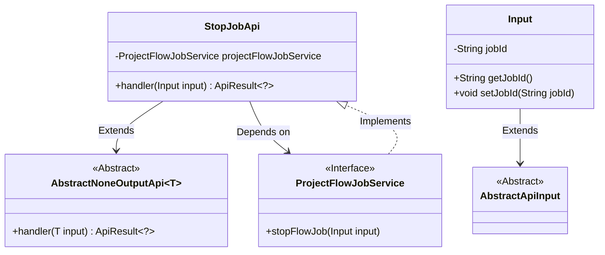
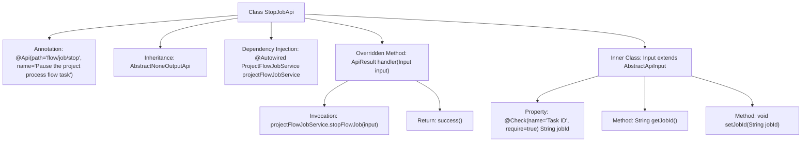

# Basic Information

|      |      |
|------|------|
| Name | StopJobApi |
| Language | .java |
| Code Path | WeFe/board/board-service/src/main/java/com/welab/wefe/board/service/api/project/job/StopJobApi.java |
| Package Name | com.welab.wefe.board.service.api.project.job |
| Dependencies | ['com.welab.wefe.board.service.service.ProjectFlowJobService', 'com.welab.wefe.common.exception.StatusCodeWithException', 'com.welab.wefe.common.fieldvalidate.annotation.Check', 'com.welab.wefe.common.web.api.base.AbstractNoneOutputApi', 'com.welab.wefe.common.web.api.base.Api', 'com.welab.wefe.common.web.dto.AbstractApiInput', 'com.welab.wefe.common.web.dto.ApiResult', 'org.springframework.beans.factory.annotation.Autowired'] |
| Brief Description | API for stopping project flow tasks, which takes the task ID as a required parameter and invokes the ProjectFlowJobService to handle the termination operation. |

# Description

The code defines an API class named `StopJobApi`, which is used to pause project workflow tasks. The API path is `flow/job/stop`, and the stop task request is processed through the `ProjectFlowJobService` service. The input parameter `Input` includes a required field `jobId` (task ID), which is validated to ensure it is not empty. The processing logic calls the `stopFlowJob` method and returns a success result. The entire class inherits from `AbstractNoneOutputApi` and does not return specific output data.

# Class Summary

| Name   | Type  | Description |
|-------|------|-------------|
| StopJobApi | class | API for stopping project workflow tasks, which accepts the task ID as a required parameter, invokes the service layer to terminate the specified task, and returns a success result. |

## Class StopJobApi

|      |      |
|------|------|
| Access Modifier | @Api(path = "flow/job/stop", name = "Pause the project process flow task");public |
| Type | class |
| Name | StopJobApi |
| Description | API for stopping project workflow tasks, which accepts the task ID as a required parameter, invokes the service layer to terminate the specified task, and returns a success result. |

### UML Class Diagram

This code demonstrates the implementation of an API for stopping project workflow jobs. The StopJobApi inherits from the generic abstract class AbstractNoneOutputApi, processes input parameters containing job IDs, and implements specific business logic through the ProjectFlowJobService interface. The Input class extends AbstractApiInput and includes essential job ID fields with validation annotations. The overall structure reflects clear hierarchical relationships and the use of dependency injection.

### Internal Method Call Graph

This code defines an API class named StopJobApi for pausing project process flow tasks. The class inherits from AbstractNoneOutputApi and injects ProjectFlowJobService via @Autowired. The core logic is implemented in the handler method, which invokes projectFlowJobService.stopFlowJob(input) to stop the task and returns a success result. The Input inner class contains a mandatory task ID field jobId with its getter/setter methods. The complete flow clearly demonstrates the full processing chain from API entry to service invocation.

### Field List

| Name  | Type  | Description |
|-------|-------|------|
| projectFlowJobService | ProjectFlowJobService | Use @Autowired to automatically inject an instance of the ProjectFlowJobService. |

### Method List

| Name  | Type  | Description |
|-------|-------|------|
| handler | ApiResult<?> | Rewrite the handler method to call projectFlowJobService to stop the process task and return the result upon success. |

