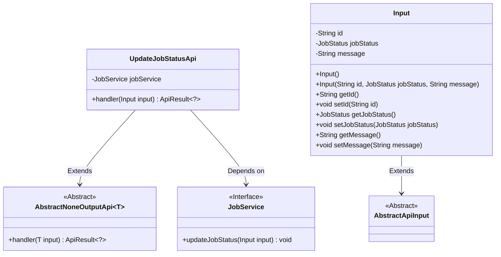

# Basic Information

|      |      |
|------|------|
| Name | UpdateJobStatusApi |
| Language | .java |
| Code Path | WeFe/board/board-service/src/main/java/com/welab/wefe/board/service/api/project/job/UpdateJobStatusApi.java |
| Package Name | com.welab.wefe.board.service.api.project.job |
| Dependencies | ['com.welab.wefe.board.service.service.JobService', 'com.welab.wefe.common.exception.StatusCodeWithException', 'com.welab.wefe.common.fieldvalidate.annotation.Check', 'com.welab.wefe.common.web.api.base.AbstractNoneOutputApi', 'com.welab.wefe.common.web.api.base.Api', 'com.welab.wefe.common.web.dto.AbstractApiInput', 'com.welab.wefe.common.web.dto.ApiResult', 'com.welab.wefe.common.wefe.enums.JobStatus', 'org.springframework.beans.factory.annotation.Autowired'] |
| Brief Description | API interface for updating task status, which receives task ID, status, and remarks, calls JobService to update the status, and returns a successful result. |

# Description

The code defines an API class named UpdateJobStatusApi, which is used to update job status. The API path is project/job/update/status, inheriting from AbstractNoneOutputApi, with the input type being the inner class Input. The Input class contains three fields: the mandatory id and jobStatus, along with an optional message. The API processes the input by invoking the updateJobStatus method of the injected JobService and returns an empty result upon success. All input fields are validated via annotations.

# Class Summary

| Name   | Type  | Description |
|-------|------|-------------|
| UpdateJobStatusApi | class | API for updating task status, which receives task ID, status, and remarks, calls JobService to update the status, and returns a successful result. |

## Class UpdateJobStatusApi

|      |      |
|------|------|
| Access Modifier | @Api(path = "project/job/update/status", name = "Update the status of the job");public |
| Type | class |
| Name | UpdateJobStatusApi |
| Description | API for updating task status, which receives task ID, status, and remarks, calls JobService to update the status, and returns a successful result. |

### UML Class Diagram

Class Diagram Description:
The diagram illustrates the structure of UpdateJobStatusApi and its related classes. UpdateJobStatusApi inherits from the generic class AbstractNoneOutputApi<Input> and depends on the JobService interface. The Input class, as an inner class, extends AbstractApiInput and contains three private fields (id, jobStatus, and message) along with their corresponding getter/setter methods. JobService serves as an interface providing the updateJobStatus method. The overall structure demonstrates the hierarchical and invocation relationships among components when updating job status via API.

### Internal Method Call Graph

```mermaid
graph TD
    A["Class UpdateJobStatusApi"]
    B["Annotation: @Api"]
    C["Inheritance: AbstractNoneOutputApi<Input>"]
    D["Dependency Injection: @Autowired JobService"]
    E["Overridden Method: handler(Input input)"]
    F["Inner Class: Input"]
    G["Constructor: Input()"]
    H["Constructor: Input(String id, JobStatus jobStatus, String message)"]
    I["Validation Annotation: @Check id"]
    J["Validation Annotation: @Check jobStatus"]
    K["Validation Annotation: @Check message"]
    L["Methods: getId/setId"]
    M["Methods: getJobStatus/setJobStatus"]
    N["Methods: getMessage/setMessage"]
    O["Invocation: jobService.updateJobStatus(input)"]
    P["Return: success()"]

    A --> B
    A --> C
    A --> D
    A --> E
    A --> F
    F --> G
    F --> H
    F --> I
    F --> J
    F --> K
    F --> L
    F --> M
    F --> N
    E --> O
    E --> P
```

This code defines an API class UpdateJobStatusApi for updating job status, which inherits from an abstract base class and implements request handling with input parameters. The core process involves updating job status via JobService. The inner class Input encapsulates job ID, status, and message fields, with parameter validation using @Check annotations. The flowchart illustrates the class structure, dependencies, and method call chain, highlighting the construction and validation of input parameters, as well as the processing path of actual business logic.

### Field List

| Name  | Type  | Description |
|-------|-------|------|
| jobService | JobService | Using @Autowired to automatically inject an instance of JobService. |

### Method List

| Name  | Type  | Description |
|-------|-------|------|
| handler | ApiResult<?> | Java method override, calling jobService to update task status, returns ApiResult upon success. |

