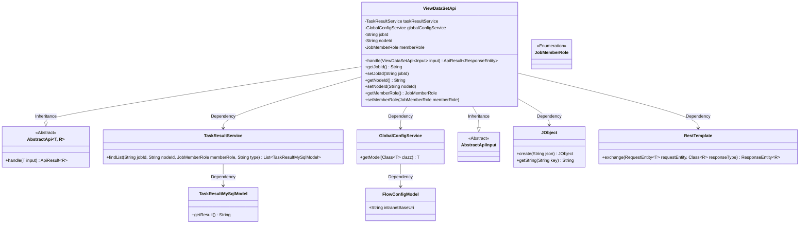
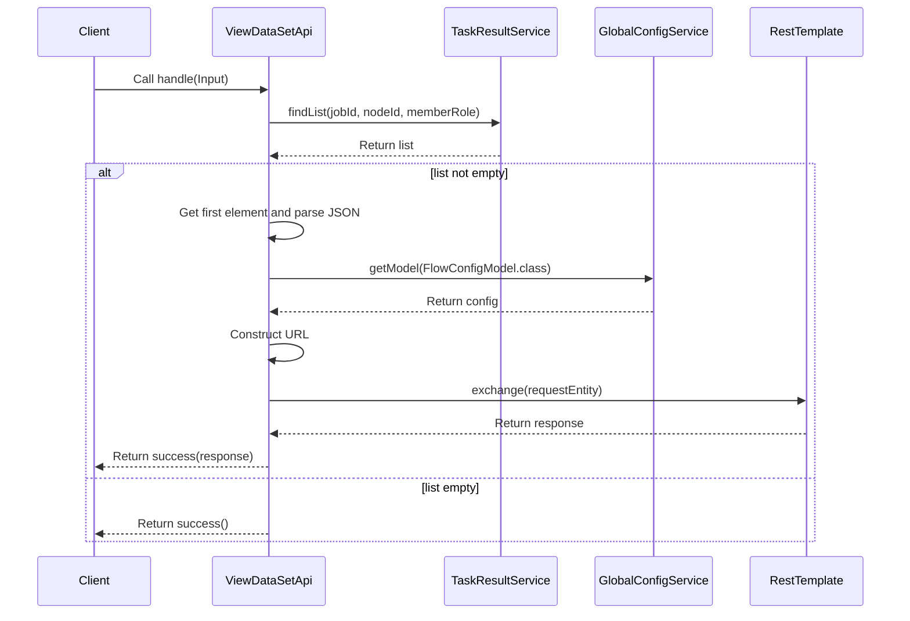

# Basic Information

|      |      |
|------|------|
| Name | ViewDataSetApi |
| Language | .java |
| Code Path | WeFe/board/board-service/src/main/java/com/welab/wefe/board/service/api/project/job/ViewDataSetApi.java |
| Package Name | com.welab.wefe.board.service.api.project.job |
| Dependencies | ['com.welab.wefe.board.service.database.entity.job.TaskResultMySqlModel', 'com.welab.wefe.board.service.service.TaskResultService', 'com.welab.wefe.board.service.service.globalconfig.GlobalConfigService', 'com.welab.wefe.common.exception.StatusCodeWithException', 'com.welab.wefe.common.fieldvalidate.annotation.Check', 'com.welab.wefe.common.util.JObject', 'com.welab.wefe.common.util.UrlUtil', 'com.welab.wefe.common.web.api.base.AbstractApi', 'com.welab.wefe.common.web.api.base.Api', 'com.welab.wefe.common.web.dto.AbstractApiInput', 'com.welab.wefe.common.web.dto.ApiResult', 'com.welab.wefe.common.wefe.dto.global_config.FlowConfigModel', 'com.welab.wefe.common.wefe.enums.JobMemberRole', 'org.springframework.beans.factory.annotation.Autowired', 'org.springframework.http.HttpMethod', 'org.springframework.http.RequestEntity', 'org.springframework.http.ResponseEntity', 'org.springframework.web.client.RestTemplate', 'java.util.List'] |
| Brief Description | The ViewDataSetApi class handles dataset viewing requests, retrieves data by task ID, node ID, and role, generates URLs, and invokes internal services to return results. |

# Description

The `ViewDataSetApi` class is an API that handles dataset view requests, inheriting from `AbstractApi`. It retrieves task results and global configurations via `taskResultService` and `globalConfigService`. Its primary functionality involves querying data based on input parameters such as `jobId`, `nodeId`, and `memberRole`, constructing a URL, and sending a GET request to fetch the dataset view. The input parameters include mandatory fields `jobId`, `nodeId`, and `memberRole`, which are accessed through getter/setter methods. Upon success, it returns a response entity; otherwise, it returns an empty success result.

# Class Summary

| Name   | Type  | Description |
|-------|------|-------------|
| ViewDataSetApi | class | The ViewDataSetApi class handles dataset viewing requests by retrieving data through task ID, node ID, and role, generating a URL, and invoking RestTemplate to return results. Input parameters include jobId, nodeId, and memberRole. |

## Class ViewDataSetApi

|      |      |
|------|------|
| Access Modifier | @Api(path = "job/data_set/view", name = "view data set data rows");public |
| Type | class |
| Name | ViewDataSetApi |
| Description | The ViewDataSetApi class handles dataset viewing requests by retrieving data through task ID, node ID, and role, generating a URL, and invoking RestTemplate to return results. Input parameters include jobId, nodeId, and memberRole. |

### UML Class Diagram

This code demonstrates a `ViewDataSetApi` class that inherits from `AbstractApi`, designed to handle dataset viewing requests. It relies on `TaskResultService` and `GlobalConfigService` to retrieve task results and global configuration information, and uses `RestTemplate` to initiate HTTP requests. Input parameters are encapsulated in the nested `Input` class, which inherits from `AbstractApiInput`. The code involves multiple service interactions and data processing, including JSON parsing and HTTP communication, with an overall design that adheres to layered architecture principles.

### Internal Method Call Graph

```mermaid
graph TD
    A["Class ViewDataSetApi"]
    B["Inheritance: AbstractApi<Input, ResponseEntity>"]
    C["Dependency: TaskResultService taskResultService"]
    D["Dependency: GlobalConfigService globalConfigService"]
    E["Overridden Method: handle(Input input)"]
    F["Static Inner Class: Input"]
    G["Field: String jobId"]
    H["Field: String nodeId"]
    I["Field: JobMemberRole memberRole"]
    J["Method: getter/setter"]

    A --> B
    A --> C
    A --> D
    A --> E
    A --> F
    F --> G
    F --> H
    F --> I
    F --> J

    subgraph handle Process
        E1["Call taskResultService.findList"]
        E2["Check if list is empty"]
        E3["Get first TaskResultMySqlModel"]
        E4["Parse JSON result"]
        E5["Extract table_name and table_namespace"]
        E6["Construct URL"]
        E7["Create RequestEntity"]
        E8["Call RestTemplate.exchange"]
        E9["Return success(response)"]
        E10["Return success()"]

        E --> E1
        E1 --> E2
        E2 --"Yes"--> E3
        E3 --> E4
        E4 --> E5
        E5 --> E6
        E6 --> E7
        E7 --> E8
        E8 --> E9
        E2 --"No"--> E10
    end
```

This code implements a data view API, whose main functionality is to query task results by task ID and node ID, parse the table name and namespace within them, then construct a URL to access the dataset service. The flowchart illustrates the class structure and core processing logic, while the sequence diagram details the interaction process of API calls. The code handles both empty and non-empty query results, implements cross-service calls via RestTemplate, and ultimately encapsulates the response for return.

### Field List

| Name  | Type  | Description |
|-------|-------|------|
| taskResultService | TaskResultService | The code snippet uses the @Autowired annotation to automatically inject an instance of TaskResultService. |
| globalConfigService | GlobalConfigService | Use @Autowired to automatically inject an instance of GlobalConfigService. |

### Method List

| Name  | Type  | Description |
|-------|-------|------|
| handle | ApiResult<ResponseEntity> | The method processes dataset view requests by querying the result list using the task ID and node ID. If results exist, it constructs a URL and calls an internal API to retrieve the data, ultimately returning either the response result or an empty success status. |

