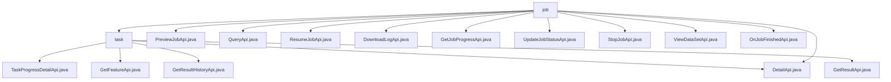

# Basic Information

|      |      |
|------|------|
| Name | job |
| Language | .java |
| Code Path | WeFe/board/board-service/src/main/java/com/welab/wefe/board/service/api/project/job |
| Package Name | docs.board.board-service.src.main.java.com.welab.wefe.board.service.api.project.job |
| Brief Description | The Task Management API module provides functionalities such as task progress query, detail viewing, and historical traceability. It adheres to REST specifications, relies on the Spring framework, and supports full lifecycle management, including operations like preview, query, recovery, log download, status update, and task termination. |

# Description

## Overview  
The core responsibility of this module is to implement full lifecycle management of tasks, providing functionalities such as creation, query, suspension, resumption, and progress monitoring, similar to the workflow tracking of a ticket system. The interface specifications uniformly adopt the REST style, with path prefixes `flow/job/` or `project/job/`, inheriting the `AbstractApi` base class. Both input and output are validated through annotations to ensure data integrity. Key data structures include `TaskProgressOuputModel`, `JobListOutputModel`, and `JobOutputModel`, which are implemented via service-layer components like `TaskService` for data mapping. External dependencies are primarily focused on the Spring framework and internal services (e.g., `ProjectFlowJobService`). For instance, `PreviewJobApi` optimizes flowchart preview performance through a caching mechanism.  

## Key Business Scenarios  
The module supports task creation (e.g., `PreviewJobApi` pre-generates flowcharts), state management (e.g., `StopJobApi` suspends tasks), result querying (e.g., `DetailApi` retrieves details), and log processing (e.g., `DownloadLogApi` downloads logs). The interaction mode is primarily synchronous HTTP, with API types covering GET queries (e.g., `QueryApi` for paginated retrieval) and POST operations (e.g., `ResumeJobApi` for task resumption). Typical scenarios include: users querying tasks precisely via composite conditions (e.g., `flowId+nodeId`); the system notifying task completion via callbacks like `OnJobFinishedApi`. For example, `GetJobProgressApi` supports both local/remote progress aggregation, enabling distributed monitoring.

### Package Internal Structure View

This flowchart illustrates the hierarchical structure of the project's task module. The top level is the job directory, which contains direct interface files such as PreviewJobApi.java, etc., as well as the subdirectory task. The task directory includes multiple task-related interface files, such as TaskProgressDetailApi.java, etc. The overall structure clearly demonstrates the organization of interface files within the project.

# File List

| Name   | Type  | Description |
|-------|------|-------------|
| [PreviewJobApi.java](PreviewJobApi.md) | file | API for previewing process execution. The input includes process ID, whether to use cache, and termination nodes. The output includes cache result statistics and a detailed list of nodes. |
| [QueryApi.java](QueryApi.md) | file | The QueryApi class is used to query process execution records, inheriting from AbstractApi. It takes inputs including process ID, task ID, name, and status, and outputs paginated results. It invokes flowJobService.query to handle the request. |
| [ResumeJobApi.java](ResumeJobApi.md) | file | This is an API class for job recovery, with the path "flow/job/resume". It processes the input parameter jobId through the ProjectFlowJobService to resume the specified job, returning an empty result upon success. |
| [DownloadLogApi.java](DownloadLogApi.md) | file | The DownloadLogApi class downloads task logs via a GET request, requiring the jobId parameter. It calls an internal API to retrieve log data and returns a byte array response. |
| [GetJobProgressApi.java](GetJobProgressApi.md) | file | API for Retrieving Task Execution Progress, supporting local and remote queries of member progress, returns a list of all member progress corresponding to the task ID. |
| [DetailApi.java](DetailApi.md) | file | API for retrieving task details, which queries task information including task lists and node details based on flowId and jobId, and supports on-demand return of task execution results. Input parameters must be validated to ensure flowId and jobId are not both empty. |
| [UpdateJobStatusApi.java](UpdateJobStatusApi.md) | file | API interface for updating task status, which receives task ID, status, and remarks, calls JobService to update the status, and returns a successful result. |
| [StopJobApi.java](StopJobApi.md) | file | API for stopping a project flow task, which accepts the task ID as a required parameter and invokes the ProjectFlowJobService to handle the termination operation. |
| [ViewDataSetApi.java](ViewDataSetApi.md) | file | The ViewDataSetApi class handles dataset viewing requests, retrieves data by task ID, node ID, and role, generates URLs, and invokes internal services to return results. |
| [OnJobFinishedApi.java](OnJobFinishedApi.md) | file | Defined an API class named OnJobFinishedApi with the path project/job/finished, used for job completion callback. Requires signed access, accepts the jobId parameter, and invokes ProjectFlowService to handle job completion logic. |
| [task](task/_module.md) | package | TaskProgressDetailApi retrieves task progress details, path task/progress/detail. GetFeatureApi fetches feature columns, path flow/job/task/feature. DetailApi queries task details and results, path flow/job/task/detail. GetResultHistoryApi obtains historical results, path flow/job/task/result_history. GetResultApi retrieves node execution results, path flow/job/task/result. |

