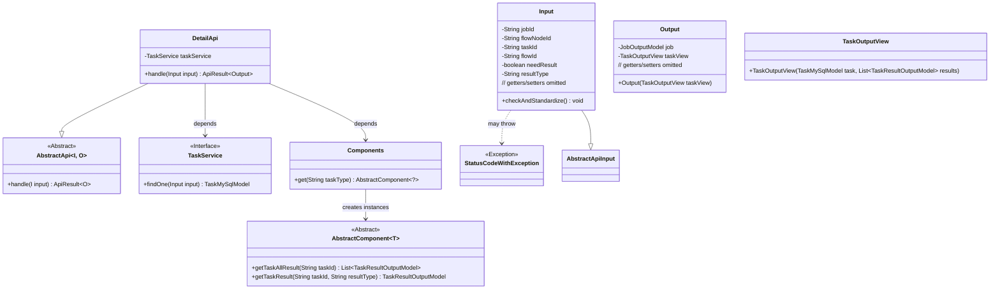
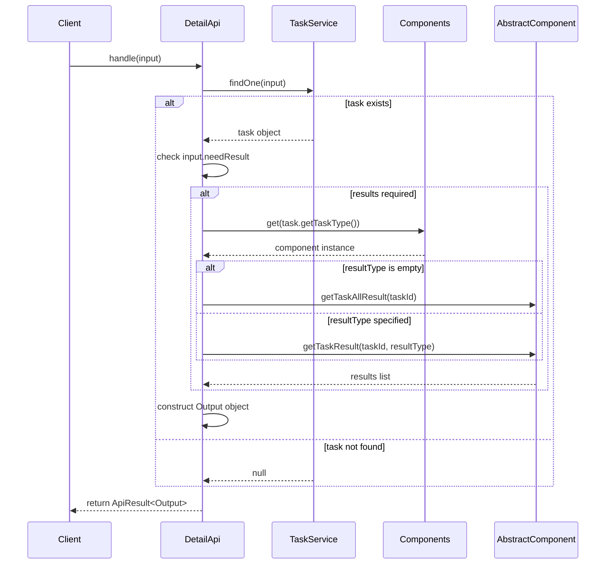

# Basic Information

|      |      |
|------|------|
| Name | DetailApi |
| Language | .java |
| Code Path | WeFe/board/board-service/src/main/java/com/welab/wefe/board/service/api/project/job/task/DetailApi.java |
| Package Name | com.welab.wefe.board.service.api.project.job.task |
| Dependencies | ['com.welab.wefe.board.service.component.Components', 'com.welab.wefe.board.service.component.base.AbstractComponent', 'com.welab.wefe.board.service.database.entity.job.TaskMySqlModel', 'com.welab.wefe.board.service.dto.entity.job.JobOutputModel', 'com.welab.wefe.board.service.dto.entity.job.TaskOutputView', 'com.welab.wefe.board.service.dto.entity.job.TaskResultOutputModel', 'com.welab.wefe.board.service.service.TaskService', 'com.welab.wefe.common.StatusCode', 'com.welab.wefe.common.exception.StatusCodeWithException', 'com.welab.wefe.common.fieldvalidate.annotation.Check', 'com.welab.wefe.common.util.StringUtil', 'com.welab.wefe.common.web.api.base.AbstractApi', 'com.welab.wefe.common.web.api.base.Api', 'com.welab.wefe.common.web.dto.AbstractApiInput', 'com.welab.wefe.common.web.dto.ApiResult', 'org.springframework.beans.factory.annotation.Autowired', 'java.util.Arrays', 'java.util.List'] |
| Brief Description | The DetailApi class is used to retrieve task details. It queries task information through the TaskService, determines whether to return the task results based on the input parameters, and encapsulates them into an Output. The input parameters include the task ID, among others, and mandatory fields must be validated. |

# Description

DetailApi is an API class designed for retrieving task details, inheriting from AbstractApi, and processing Input and Output. It queries task information through TaskService and returns an empty result if the task does not exist. When the input parameter `needResult` is set to `true`, it fetches the task result based on the task type and supports filtering by `resultType`. The input class `Input` includes parameters such as task ID and process node ID, with validation for parameter validity. The output class `Output` consists of the task view `TaskOutputView` and the task model `JobOutputModel`. The API endpoint is `/flow/job/task/detail`, and its primary function is to query task details and execution results.

# Class Summary

| Name   | Type  | Description |
|-------|------|-------------|
| DetailApi | class | API for retrieving task details, which queries task information based on input parameters and optionally returns execution results. The input must specify either a task ID or a process node ID, while the output includes a task view and an optional result list. |

## Class DetailApi

|      |      |
|------|------|
| Access Modifier | @Api(path = "flow/job/task/detail", name = "get task detail");public |
| Type | class |
| Name | DetailApi |
| Description | API for retrieving task details, which queries task information based on input parameters and optionally returns execution results. The input must specify either a task ID or a process node ID, while the output includes a task view and an optional result list. |

### UML Class Diagram

Class diagram description: This diagram illustrates the class structure of a task detail query API, with DetailApi inheriting from AbstractApi as the core component. It retrieves task data through TaskService and uses the Components factory to obtain specific components for result processing. The nested Input and Output classes handle parameter validation and task view packaging respectively. Exception handling is implemented via StatusCodeWithException, demonstrating clear responsibility division and dependency relationships.

### Internal Method Call Graph

```mermaid
graph TD
    A["DetailApi Class"]
    B["Inheritance: AbstractApi<Input, Output>"]
    C["Dependency Injection: TaskService taskService"]
    D["Main Method: handle(Input input)"]
    E["Call: taskService.findOne(input)"]
    F["Condition Check: task == null"]
    G["Return: success()"]
    H["Condition Check: input.needResult"]
    I["Call: Components.get(task.getTaskType())"]
    J["Condition Check: StringUtil.isEmpty(input.resultType)"]
    K["Call: component.getTaskAllResult(task.getTaskId())"]
    L["Call: component.getTaskResult(task.getTaskId(), input.resultType)"]
    M["Construct: Output(new TaskOutputView(task, results))"]
    N["Return: success(Output)"]
    O["Nested Class: Output"]
    P["Nested Class: Input"]

    A --> B
    A --> C
    A --> D
    D --> E
    E --> F
    F --Yes--> G
    F --No--> H
    H --Yes--> I
    I --> J
    J --Yes--> K
    J --No--> L
    H --No--> M
    K --> M
    L --> M
    M --> N
    A --> O
    A --> P
```

Flowchart Description: This flowchart illustrates the core processing logic of the DetailApi class, starting from receiving input parameters, querying task data through TaskService, determining whether to retrieve task results based on the needResult flag, and finally constructing and returning the output object. The nested classes Input and Output handle parameter validation and data encapsulation respectively, with the overall flow containing multiple conditional branches and external service calls.

Sequence Diagram Description: The sequence diagram clearly presents the interaction process between the client calling the handle method of DetailApi and components such as TaskService and Components, including key steps like task querying and result retrieval, ultimately returning the encapsulated API result. It demonstrates the calling sequence and data flow between modules.

### Field List

| Name  | Type  | Description |
|-------|-------|------|
| taskService | TaskService | Using @Autowired to automatically inject an instance of TaskService. |

### Method List

| Name  | Type  | Description |
|-------|-------|------|
| handle | ApiResult<Output> | Process the input and return the task results. If the task does not exist, return success; if results are required, retrieve all results or specified type results based on the task type, and finally return the output containing the task and results. |

