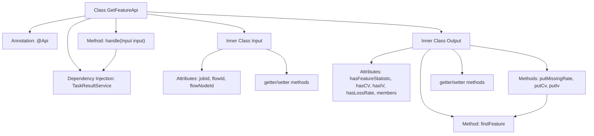

# Basic Information

|      |      |
|------|------|
| Name | GetFeatureApi |
| Language | .java |
| Code Path | WeFe/board/board-service/src/main/java/com/welab/wefe/board/service/api/project/job/task/GetFeatureApi.java |
| Package Name | com.welab.wefe.board.service.api.project.job.task |
| Dependencies | ['com.alibaba.fastjson.annotation.JSONField', 'com.welab.wefe.board.service.dto.entity.MemberFeatureInfoModel', 'com.welab.wefe.board.service.service.TaskResultService', 'com.welab.wefe.common.exception.StatusCodeWithException', 'com.welab.wefe.common.fieldvalidate.annotation.Check', 'com.welab.wefe.common.web.api.base.AbstractApi', 'com.welab.wefe.common.web.api.base.Api', 'com.welab.wefe.common.web.dto.AbstractApiInput', 'com.welab.wefe.common.web.dto.ApiResult', 'com.welab.wefe.common.wefe.enums.JobMemberRole', 'org.springframework.beans.factory.annotation.Autowired', 'java.math.BigDecimal', 'java.math.RoundingMode', 'java.util.List', 'java.util.function.Function'] |
| Brief Description | API for obtaining feature calculation results. The input requires a process ID and a node ID, and the output includes feature statistics, CV, IV, and other information. |

# Description

This API class is used to retrieve the feature columns from the feature computation output results, with the path being `flow/job/task/feature`. The input parameters include `jobId`, the mandatory `flowId`, and `flowNodeId`. The output contains feature statistics information flags, CV value flags, IV value flags, missing rate flags, and a list of member feature information. The member feature information supports setting the missing rate, CV value, and IV value, and locates the corresponding feature object via member ID, role, and feature name. The processing logic invokes the `getResultFeature` method of `TaskResultService` to obtain the results.

# Class Summary

| Name   | Type  | Description |
|-------|------|-------------|
| GetFeatureApi | class | API for retrieving feature list, requiring process ID and node ID as input, and outputting information including feature statistics, CV, IV, missing rate, etc. |


## Class GetFeatureApi

|      |      |
|------|------|
| Access Modifier | @Api(path = "flow/job/task/feature", name = "get feature list", desc = "Get the feature column in the output result of feature calculation in the parent node");public |
| Type | class |
| Name | GetFeatureApi |
| Description | API for retrieving feature list, requiring process ID and node ID as input, and outputting information including feature statistics, CV, IV, missing rate, etc. |


### UML Class Diagram

```mermaid
classDiagram
    class GetFeatureApi {
        -TaskResultService taskResultService
        +handle(Input input) ApiResult~Output~
    }
    
    class AbstractApi~I,O~ {
        <<Abstract>>
    }
    
    class AbstractApiInput {
        <<Abstract>>
    }
    
    class Input {
        -String jobId
        -String flowId
        -String flowNodeId
        +getJobId() String
        +setJobId(String jobId)
        +getFlowId() String
        +setFlowId(String flowId)
        +getFlowNodeId() String
        +setFlowNodeId(String flowNodeId)
    }
    
    class Output {
        -boolean hasFeatureStatistic
        -boolean hasCV
        -boolean hasIV
        -boolean hasLossRate
        -List~MemberFeatureInfoModel~ members
        +putMissingRate(String memberId, JobMemberRole role, String featureName, double missingValue)
        +putCv(String memberId, JobMemberRole role, String featureName, double cv)
        +putIv(String memberId, JobMemberRole role, String featureName, double iv)
        +findFeature(String memberId, JobMemberRole role, String featureName) MemberFeatureInfoModel.Feature
        +get/set methods omitted...
    }
    
    class MemberFeatureInfoModel {
        +getMemberId() String
        +getMemberRole() JobMemberRole
        +getFeatures() List~Feature~
    }
    
    class MemberFeatureInfoModel.Feature {
        -String name
        -double missingRate
        -double cv
        -double iv
        +getName() String
    }
    
    class TaskResultService {
        +getResultFeature(Input input) Output
    }
    
    AbstractApi~I,O~ <|-- GetFeatureApi : Inheritance
    AbstractApiInput <|-- Input : Inheritance
    GetFeatureApi --> TaskResultService : Dependency
    GetFeatureApi --> Input : Uses
    GetFeatureApi --> Output : Uses
    Output --> MemberFeatureInfoModel : Contains
    MemberFeatureInfoModel --> "Feature" : Contains
```

This code implements an API for retrieving feature lists. The core class GetFeatureApi inherits from the generic abstract class AbstractApi, processes Input parameters, and returns Output results. The Input class includes validation fields such as task ID, flow ID, and node ID. The Output class encapsulates feature statistics and member feature data, which are obtained through the TaskResultService. The MemberFeatureInfoModel and its inner class Feature form a nested structure for feature data, and the Output provides various methods to manipulate feature values. The overall design adopts a layered structure, adhering to object-oriented principles, and decouples business logic through service classes.


### Internal Method Call Graph



Flowchart Description: This flowchart illustrates the structure of the GetFeatureApi class, including the main class and its two inner classes Input and Output. The main class defines the API path via annotation, injects TaskResultService as a dependency, and implements the core processing method handle. The Input class contains three validation fields and their access methods, while the Output class manages feature statistics results, provides various put methods to update feature values, and locates specific features via the findFeature method. Arrows clearly depict the invocation relationships between classes and methods.

### Field List

| Name  | Type  | Description |
|-------|-------|------|
| taskResultService | TaskResultService | Automatically inject the TaskResultService service instance. |

### Method List

| Name  | Type  | Description |
|-------|-------|------|
| handle | ApiResult<Output> | Process the input and return the characteristic output of the task result service, encapsulated as ApiResult upon success. |


