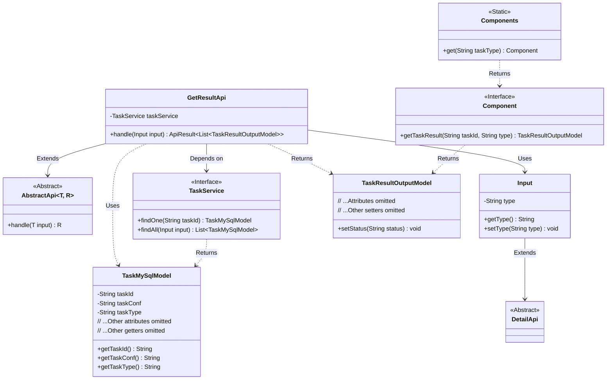
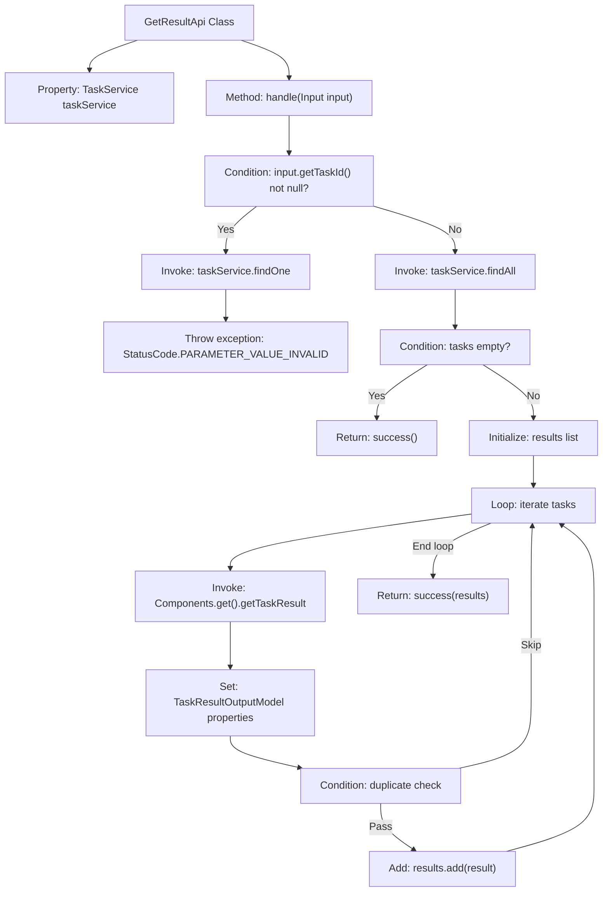

# Basic Information

|      |      |
|------|------|
| Name | GetResultApi |
| Language | .java |
| Code Path | WeFe/board/board-service/src/main/java/com/welab/wefe/board/service/api/project/job/task/GetResultApi.java |
| Package Name | com.welab.wefe.board.service.api.project.job.task |
| Dependencies | ['com.alibaba.fastjson.JSON', 'com.welab.wefe.board.service.component.Components', 'com.welab.wefe.board.service.database.entity.job.TaskMySqlModel', 'com.welab.wefe.board.service.dto.entity.job.TaskResultOutputModel', 'com.welab.wefe.board.service.service.TaskService', 'com.welab.wefe.common.StatusCode', 'com.welab.wefe.common.exception.StatusCodeWithException', 'com.welab.wefe.common.fieldvalidate.annotation.Check', 'com.welab.wefe.common.util.JObject', 'com.welab.wefe.common.util.StringUtil', 'com.welab.wefe.common.web.api.base.AbstractApi', 'com.welab.wefe.common.web.api.base.Api', 'com.welab.wefe.common.web.dto.ApiResult', 'com.welab.wefe.common.wefe.enums.ComponentType', 'com.welab.wefe.common.wefe.enums.JobMemberRole', 'org.springframework.beans.factory.annotation.Autowired', 'java.util'] |
| Brief Description | API for retrieving task execution results, which queries node execution results by taskId or flowId plus nodeId, returning a list containing task status, time, configuration, and other information. It processes input parameters, calls TaskService to fetch data, filters out duplicate results, and returns the final output. |

# Description

The code defines an API class named `GetResultApi`, which is used to retrieve node execution results via `taskId` or `flowId` plus `nodeId`. The API path is `flow/job/task/result`. The processing logic includes: querying task data based on input parameters—if `taskId` exists, it queries a single task; otherwise, it queries all matching tasks. If the query result is empty, an empty list is returned. Otherwise, it iterates through the task data, extracts task configuration and result information, constructs a `TaskResultOutputModel` object, and populates task details. To avoid duplicate results, deduplication is performed for specific task types. The input parameter `Input` inherits from `DetailApi.Input` and includes a result type field `type` along with its getter/setter methods. The final output is a list containing the task results.

# Class Summary

| Name   | Type  | Description |
|-------|------|-------------|
| GetResultApi | class | The GetResultApi class retrieves node execution results via taskId or flowId+nodeId, calls TaskService to query task data, converts it into a TaskResultOutputModel output list, and handles duplicate results and exceptional cases. |

## Class GetResultApi

|      |      |
|------|------|
| Access Modifier | @Api(path = "flow/job/task/result", name = "get task result", desc = "Use taskId or flowId + nodeId to get the node execution result.");public |
| Type | class |
| Name | GetResultApi |
| Description | The GetResultApi class retrieves node execution results via taskId or flowId+nodeId, calls TaskService to query task data, converts it into a TaskResultOutputModel output list, and handles duplicate results and exceptional cases. |

### UML Class Diagram

This code demonstrates a task result retrieval API class `GetResultApi`, which inherits from the generic abstract class `AbstractApi`. It queries task data through `TaskService` and converts `TaskMySqlModel` into `TaskResultOutputModel` for output. The class diagram clearly illustrates relationships between core classes: `GetResultApi` depends on the service layer interface `TaskService`, uses the nested class `Input` as parameters, and leverages the static class `Components` to obtain specific component implementations for generating results of different task types. The overall design reflects layered architecture and dependency inversion principle, isolating concrete implementations through interfaces.

### Internal Method Call Graph

Flowchart description: This flowchart illustrates the core processing logic of the GetResultApi class. Starting from receiving input parameters, it queries single or multiple task data based on whether taskId exists. After null checks, it processes each task by obtaining task results through Components and assembling the output model, followed by duplicate result filtering before returning the final result list. The entire process includes exception handling and data validation mechanisms.

### Field List

| Name  | Type  | Description |
|-------|-------|------|
| taskService | TaskService | Automatically inject the TaskService instance. |

### Method List

| Name  | Type  | Description |
|-------|-------|------|
| handle | ApiResult<List<TaskResultOutputModel>> | The method retrieves a list of tasks based on the input query, processes the task results, and returns them. If a taskId is specified, it queries a single task; otherwise, it queries all tasks. The results include task status, time, configuration, and other information, while avoiding duplicate results. |

