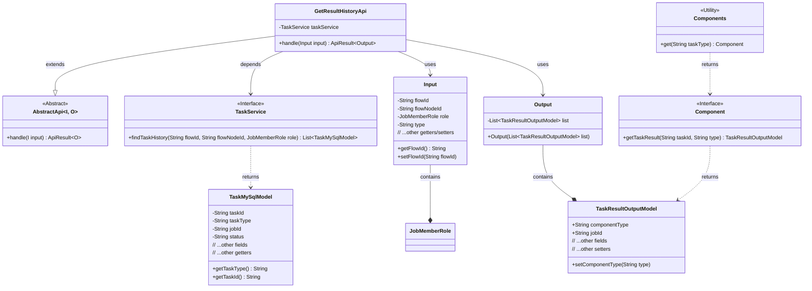
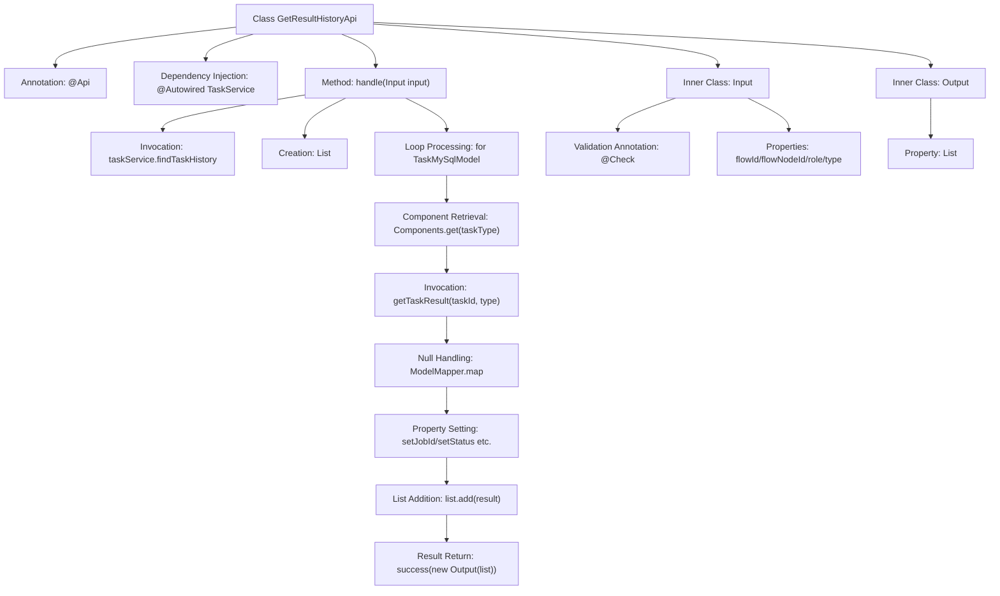

# Basic Information

|      |      |
|------|------|
| Name | GetResultHistoryApi |
| Language | .java |
| Code Path | WeFe/board/board-service/src/main/java/com/welab/wefe/board/service/api/project/job/task/GetResultHistoryApi.java |
| Package Name | com.welab.wefe.board.service.api.project.job.task |
| Dependencies | ['com.alibaba.fastjson.JSON', 'com.welab.wefe.board.service.component.Components', 'com.welab.wefe.board.service.database.entity.job.TaskMySqlModel', 'com.welab.wefe.board.service.dto.entity.job.TaskResultOutputModel', 'com.welab.wefe.board.service.service.TaskService', 'com.welab.wefe.common.exception.StatusCodeWithException', 'com.welab.wefe.common.fieldvalidate.annotation.Check', 'com.welab.wefe.common.web.api.base.AbstractApi', 'com.welab.wefe.common.web.api.base.Api', 'com.welab.wefe.common.web.dto.AbstractApiInput', 'com.welab.wefe.common.web.dto.ApiResult', 'com.welab.wefe.common.web.util.ModelMapper', 'com.welab.wefe.common.wefe.enums.JobMemberRole', 'org.springframework.beans.factory.annotation.Autowired', 'java.util.ArrayList', 'java.util.List'] |
| Brief Description | API for retrieving historical task execution results. It queries task history records by flowId, flowNodeId, and role, returning a list containing detailed task information. |

# Description

The `GetResultHistoryApi` class is an API interface designed to retrieve historical execution results of tasks, with the endpoint path `flow/job/task/result_history`. It inherits from `AbstractApi` and processes the input `Input` and output `Output`. By leveraging `TaskService`, it queries the historical task list for a specified flow ID, node ID, and role, then maps each task's result into a `TaskResultOutputModel` object, populating task details such as status, timestamps, and error messages. The input parameters include the mandatory `flowId`, `flowNodeId`, and `role`, along with the optional `type`, while the output is an `Output` object containing a list of task results.

# Class Summary

| Name   | Type  | Description |
|-------|------|-------------|
| GetResultHistoryApi | class | API for retrieving historical task execution results. The input includes process ID, node ID, role, and result type, while the output is a list of task results. It queries historical tasks via TaskService and maps them to the output model. |

## Class GetResultHistoryApi

|      |      |
|------|------|
| Access Modifier | @Api(path = "flow/job/task/result_history", name = "Get all historical execution results of task");public |
| Type | class |
| Name | GetResultHistoryApi |
| Description | API for retrieving historical task execution results. The input includes process ID, node ID, role, and result type, while the output is a list of task results. It queries historical tasks via TaskService and maps them to the output model. |

### UML Class Diagram

This code implements an API for retrieving historical task execution results. GetResultHistoryApi inherits from AbstractApi, queries historical task data through TaskService, and uses Components to obtain specific task type handlers for result generation. The Input class encapsulates query parameters such as flow ID and node ID, while the Output class wraps the returned task result list. The entire process involves task querying, result transformation, and data assembly, ultimately returning a unified API response format.

### Internal Method Call Graph

This code implements an API for retrieving historical task execution results. The main workflow involves: querying historical task lists via TaskService, iterating through each task to obtain its execution result, mapping basic information if the result is absent, and finally assembling all results for return. The Input class includes necessary parameter validations such as flow ID and node ID, while the Output class encapsulates the result list. The flowchart clearly illustrates the complete processing chain from parameter validation to result return.

### Field List

| Name  | Type  | Description |
|-------|-------|------|
| taskService | TaskService | Automatically inject the TaskService instance. |

### Method List

| Name  | Type  | Description |
|-------|-------|------|
| handle | ApiResult<Output> | This method queries the task history based on input parameters, iterates through the task list, and generates a result output model. If the result is empty, it maps the basic information, fills in the task details, and returns a successful response. |

