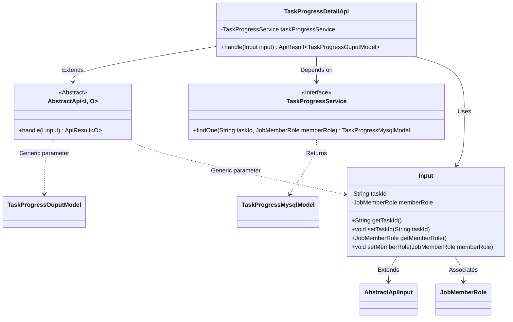

# Basic Information

|      |      |
|------|------|
| Name | TaskProgressDetailApi |
| Language | .java |
| Code Path | WeFe/board/board-service/src/main/java/com/welab/wefe/board/service/api/project/job/task/TaskProgressDetailApi.java |
| Package Name | com.welab.wefe.board.service.api.project.job.task |
| Dependencies | ['com.welab.wefe.board.service.database.entity.job.TaskProgressMysqlModel', 'com.welab.wefe.board.service.dto.entity.job.TaskProgressOuputModel', 'com.welab.wefe.board.service.service.TaskProgressService', 'com.welab.wefe.common.exception.StatusCodeWithException', 'com.welab.wefe.common.fieldvalidate.annotation.Check', 'com.welab.wefe.common.web.api.base.AbstractApi', 'com.welab.wefe.common.web.api.base.Api', 'com.welab.wefe.common.web.dto.AbstractApiInput', 'com.welab.wefe.common.web.dto.ApiResult', 'com.welab.wefe.common.web.util.ModelMapper', 'com.welab.wefe.common.wefe.enums.JobMemberRole', 'org.springframework.beans.factory.annotation.Autowired'] |
| Brief Description | Task progress details API class, which queries progress by task ID and role, and returns the mapped output model. The input requires validation of the task ID and role fields. |

# Description

The code defines an API class named `TaskProgressDetailApi`, which is used to retrieve task progress details. The API path is `task/progress/detail`, inheriting from `AbstractApi`, with the input type as the inner class `Input` and the output type as `TaskProgressOuputModel`. It queries the task progress information from the database via `TaskProgressService` and maps it to the output model for return. The input parameters include the mandatory task ID and member role, both validated as non-null through validation annotations. The processing logic is encapsulated in the `handle` method, which returns an `ApiResult` containing the output model upon success.

# Class Summary

| Name   | Type  | Description |
|-------|------|-------------|
| TaskProgressDetailApi | class | Task Progress Details API, which queries progress by task ID and role, returning the mapped output model. |

## Class TaskProgressDetailApi

|      |      |
|------|------|
| Access Modifier | @Api(path = "task/progress/detail", name = "task progress details");public |
| Type | class |
| Name | TaskProgressDetailApi |
| Description | Task Progress Details API, which queries progress by task ID and role, returning the mapped output model. |

### UML Class Diagram

This code illustrates the implementation structure of a task progress detail API. TaskProgressDetailApi inherits from the generic abstract class AbstractApi, processes Input parameters, and returns TaskProgressOuputModel results. The core business logic is implemented through the TaskProgressService interface, where the Input class encapsulates task ID and member role parameters with validation. The overall design adopts a layered architecture, achieving loose coupling through generics and dependency injection, aligning with modern Java API development best practices.

### Internal Method Call Graph

```mermaid
graph TD
    A["Class TaskProgressDetailApi"]
    B["Annotation: @Api"]
    C["Inheritance: AbstractApi<Input, TaskProgressOuputModel>"]
    D["Dependency Injection: @Autowired TaskProgressService"]
    E["Overridden Method: handle(Input input)"]
    F["Nested Class: Input"]
    G["Property: String taskId"]
    H["Property: JobMemberRole memberRole"]
    I["Methods: getTaskId/setTaskId"]
    J["Methods: getMemberRole/setMemberRole"]
    K["Process: taskProgressService.findOne"]
    L["Process: ModelMapper.map"]
    M["Process: return success(output)"]

    A --> B
    A --> C
    A --> D
    A --> E
    A --> F
    F --> G
    F --> H
    F --> I
    F --> J
    E --> K
    K --> L
    L --> M
```

This code defines a task progress detail API class that inherits from an abstract API template class, with interface paths configured via annotations. The core processing logic resides in the handle method: first querying database records by task ID and role, then converting them to an output model and returning a success response. The nested Input class defines the request parameter structure with validation rules, containing two mandatory fields: task ID and role enumeration. The flowchart clearly illustrates the class structure, dependencies, and main processing flow.

### Field List

| Name  | Type  | Description |
|-------|-------|------|
| taskProgressService | TaskProgressService | The code snippet uses @Autowired to automatically inject an instance of TaskProgressService. |

### Method List

| Name  | Type  | Description |
|-------|-------|------|
| handle | ApiResult<TaskProgressOuputModel> | Rewrite the method to query task progress based on input and map it to the output model, returning a successful result. |

